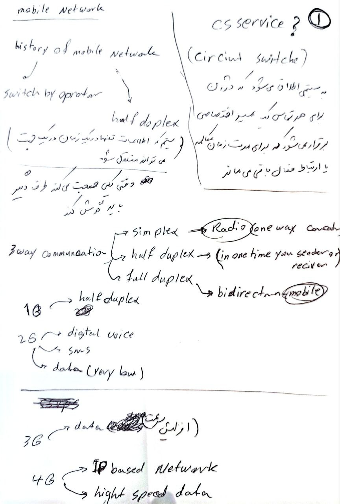
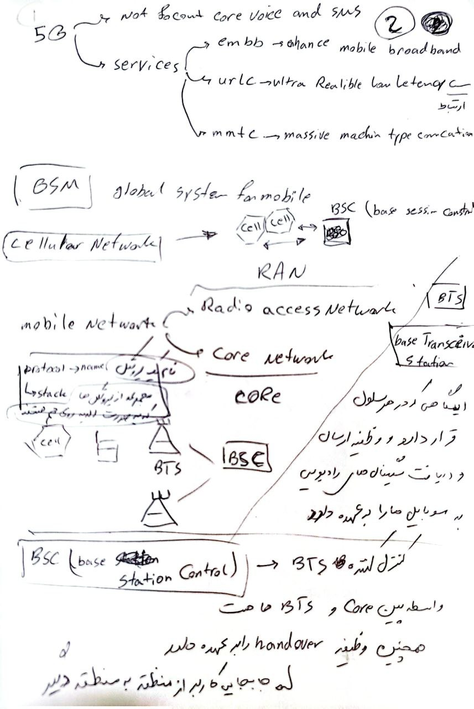
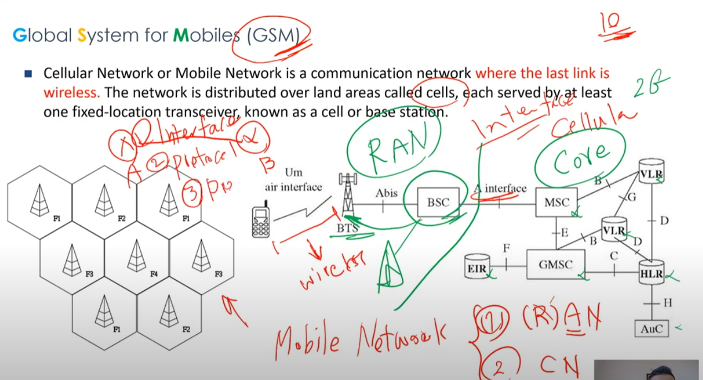

[course link](https://youtu.be/osCB35AMwJc?si=61inEQqvnCrMFSeW)

در شبکه‌های مخابراتی موبایل، مجموعه‌ای از کدها و شناسه‌ها برای شناسایی مکان‌ها و سلول‌ها، همچنین مدیریت جابجایی کاربران بین مناطق مختلف استفاده می‌شوند. این شناسه‌ها هرکدام کاربرد خاص خود را دارند و در شرایط مختلف برای مدیریت ارتباطات موبایلی به کار می‌آیند. در اینجا توضیحاتی درباره این شناسه‌ها آورده شده است:

### 1. **LAI (Location Area Identifier)**:
- **LAI** یک شناسه است که برای شناسایی منحصر به فرد یک منطقه جغرافیایی به‌نام **Location Area** (منطقه مکانی) استفاده می‌شود.
- **LAI** ترکیبی از **MCC** (کد کشور)، **MNC** (کد اپراتور موبایل) و **LAC** (کد منطقه مکانی) است. این شناسه برای مدیریت موقعیت مکانی کاربران در هنگام حرکت بین LA‌ها (مناطق مکانی) استفاده می‌شود.
- **ترکیب**: `MCC + MNC + LAC`

### 2. **CGI (Cell Global Identity)**:
- **CGI** یک شناسه منحصر به فرد برای شناسایی هر سلول رادیویی (Cell) در شبکه است.
- **CGI** معمولاً ترکیبی از **MCC**، **MNC**، **LAC** و **Cell ID** (شناسه سلول) است که به شبکه کمک می‌کند تا به‌طور دقیق هر سلول رادیویی را شناسایی و مدیریت کند.
- این شناسه برای تعیین موقعیت دقیق گوشی موبایل در سطح سلول استفاده می‌شود.

### 3. **SAI (Service Area Identifier)**:
- **SAI** برای شناسایی یک ناحیه خدماتی خاص در شبکه استفاده می‌شود. این شناسه مشابه به **LAI** است، اما معمولاً برای شبکه‌های جدیدتر یا سیستم‌های نسل 4G (LTE) و بالاتر کاربرد دارد.
- **SAI** یک شناسه منحصر به فرد است که معمولاً برای شناسایی موقعیت‌های دقیق‌تری مانند مناطق خدماتی در داخل یک شهر یا ناحیه خاص به‌کار می‌رود.
- این شناسه به شبکه کمک می‌کند تا بتواند به‌طور دقیق‌تر و بهینه‌تری کاربران را ردیابی کند.

### 4. **SAC (Service Area Code)**:
- **SAC** یک شناسه برای شناسایی منطقه خدماتی (Service Area) در شبکه‌های موبایلی است.
- این شناسه به‌طور خاص برای سیستم‌های جدیدتر و نسل‌های 3G و 4G برای مدیریت دقیق‌تر موقعیت کاربران و خدمات شبکه استفاده می‌شود.
- **SAC** به‌عنوان بخشی از پروتکل‌های جدید به کار می‌رود تا نیازهای مربوط به موقعیت‌یابی و جابجایی کاربران به‌طور دقیق‌تری پیگیری شود.

### 5. **TAI (Tracking Area Identifier)**:
- **TAI** یک شناسه است که برای شناسایی **Tracking Area** (منطقه ردیابی) در شبکه‌های نسل 4 (LTE) و 5G استفاده می‌شود.
- **TAI** به شبکه کمک می‌کند تا موقعیت کاربران را در سطح مناطق ردیابی پیگیری کند. این مناطق معمولاً شامل چندین سلول است.
- **TAI** به‌ویژه در شبکه‌های 4G و 5G برای مدیریت انتقال اطلاعات بین سلول‌ها و مناطق جغرافیایی بزرگ‌تر (در مقایسه با **LAC**) استفاده می‌شود.

### 6. **TAC (Tracking Area Code)**:
- **TAC** یکی از اجزای **TAI** است و برای شناسایی یک منطقه خاص که در آن منطقه ردیابی انجام می‌شود، استفاده می‌شود.
- هر TAC معمولاً به یک منطقه ردیابی در شبکه LTE یا 5G اشاره دارد که چندین سلول رادیویی را شامل می‌شود.
- این شناسه در موقعیت‌یابی و مدیریت انتقال داده‌ها در شبکه‌های جدیدتر به کار می‌رود.

---

### تفاوت‌ها و کاربردها:
- **LAI**، **SAI** و **TAC** به‌طور کلی برای شناسایی مناطق جغرافیایی و ردیابی کاربران در شبکه‌های مختلف طراحی شده‌اند.
- **CGI** به شناسایی دقیق سلول‌های رادیویی و موقعیت دقیق کاربر کمک می‌کند.
- **SAC** و **SAI** بیشتر برای شبکه‌های نسل‌های جدیدتر (مثل 4G و 5G) استفاده می‌شوند تا موقعیت کاربران در نواحی خدماتی دقیق‌تر شبیه به منطقه جغرافیایی خاص‌تر شناسایی شود.
- **TAI** و **TAC** در شبکه‌های LTE و 5G کاربرد دارند و برای ردیابی و انتقال کاربران در مناطق بزرگ‌تری استفاده می‌شوند.

### خلاصه کاربرد:
- این شناسه‌ها به شبکه کمک می‌کنند تا موقعیت کاربران را به‌طور دقیق شناسایی کرده و به بهینه‌ترین شکل ممکن منابع شبکه را مدیریت و تخصیص دهد.
- این سیستم‌ها در فرآیندهای مختلف شبکه از جمله **Location Update** (به‌روزرسانی مکان)، **handover** (انتقال) و **call routing** (مسیر یابی تماس‌ها) نقش مهمی دارند.

