# Voice Over IP
## Chapter 1
## Introduction 
تصمیمی که اکثر شرکت ها با آن روبرو هستند این نیست که آیا VoIP را به کار خواهند گرفت یا نه، بلکه این است که چه زمانی. نیاز به فارغ التحصیلان برنامه های ارتباطی و متخصصان شبکه وجود دارد که درک عمیقی از توپولوژی ها و پروتکل های صوتی مبتنی بر IP داشته باشند.

این VoIP نشان دهنده یک تغییر کامل در تقریباً همه چیز در مسیر ارتباطات است. در مورد تنها چیزی که ثابت می ماند اندازه و شکل تلفن رومیزی است. اکثر افرادی که با VoIP درگیر هستند موافق هستند که این تغییرات بسیار مثبت به خصوص برای مصرف کنندگان است.

در VoIP با عباراتی مانند اینترنت تلفن، تلفن کامپیوتر و حتی تلفن ویندوز نیز شناخته می شود. تلاش برای تعریف VoIP شامل توضیح نحوه اجرای تماس های تلفنی از طریق اینترنت مانند Vonage یا Skype است.

 زمانی که ارائه‌دهندگان خدمات اینترنت (ISP) به گزینه‌های پرسرعت مانند خطوط مشترک دیجیتال و کابل منتقل شدند. اما تلفن شما همچنان توسط شرکت  local exchange carrier ارائه شده است. با ظرفیت بیشتر برای اتصالات داده، شخصی به این ایده رسید که ممکن است امکان برقراری تماس تلفنی از طریق یک شبکه مبتنی بر پروتکل اینترنت (IP) وجود داشته باشد. 

 برخی از اولین تلاش ها شامل اتصالات point-to-point یا websites بود که به عنوان سرور تماس متمرکز کار می کردند
 
تماس‌هایی از این دست با مشکلات کیفیت و فقدان کامل پشتیبانی صنعتی مواجه بودند.

اما ایده از بین رفت. و چه ایده ای بود که تماس های تلفنی رایگان از طریق اینترنت بود؟ این یک رویای طلایی برای برخی (مصرف کنندگان) و یک کابوس برای برخی دیگر بود. یعنی ارائه دهندگان

از این گذشته، شرکت های تلفن بدون رقابت زیاد، پول زیادی به دست آوردند. مدت زیادی نگذشته بود که سرویس هایی مانند Vonage، Skype ظاهر شدند.

برخی از این services طرح های تماس را با کمتر از نصف قیمت traditional carriers ارائه می دهند برخی از آنها، به ویژه اسکایپ، یکی از اهداف خود را از کار انداختن شرکت های تلفن داشتند

کیفیت درک شده می تواند کمی متفاوت باشد، اما شکی نیست که انحصار شرکت های تلفن سنتی شکسته شده است و این صنعت به دنبال کارمندانی است که دانش VoIP را در مجموعه مهارت های خود داشته باشند.

## What Is VoIP?
برای شروع، VoIP دقیقاً همان چیزی است که نام آن نشان دهنده ارسال صدا (و ویدیو) از طریق یک شبکه مبتنی بر IP است

این کاملاً متفاوت از شبکه تلفن عمومی سوئیچ مدار است (circuit-switched public telephone network) که من با آن بزرگ شدم در circuit switching منابع را به هر تماس اختصاص می دهد.

شبکه های IP به صورت بسته سوئیچ می شوند و هر بسته ارسالی نیمه مستقل است، هدر IP خود را دارد و به طور جداگانه توسط روترها ارسال می شود. فصل های 3 تا 7 ما را با جزئیات فنی در مورد عملکرد یک سیستم VoIP آشنا می کند، اما معلوم می شود که درک VoIP و انگیزه آن اغلب به درک تأثیرات VoIP است که می تواند قابل توجه باشد.

### What is PSTN? 
**PSTN is short for Public Switched Telephone Network**. PSTN refers to the traditional telephone system used for voice-oriented communications. It consists of multiple interconnected carriers to reliably connect people through standard phone numbers. Public Switched Telephone Network
This telephone network is known as analog, landlines, Plain Old Telephone Service (POTS), or fixed lines. This system has been in general use since the late 1800s. Using underground copper wires and circuit-switching, this legacy service has provided businesses and households with a reliable means to communicate with anyone worldwide for generations.


### PSTN History & Background
The roots of PSTN can be traced back to the late 1800s when inventors like Alexander Graham Bell and Elisha Gray released the first usable telephone systems. These early phones used copper wires and could only communicate point-to-point.

Manual switchboards caught on in the late 1800s and early 1900s. These exchanges allowed operators to plug and unplug cords to connect calls manually.

A major change came in the late 20th century with automated switching, which eliminated the need for manual call handling. This is when the traditional PSTN came into play and later spread worldwide. Undersea cables and satellite communications further facilitated international voice communications


Despite all the innovations in PSTN, it remained an old, sluggish, and limited technology. The need for better communication, especially in the business environment, gave way to VoIP phones

PSTN phones are widely used and still accepted as a standard form of communication owing to their reliability and worldwide infrastructure. However, they’ve seen a steady decline over the last decade.

In fact, there are currently just 862 million fixed-line telephone subscriptions in use worldwide, the lowest this century. 

Many telecoms have gradually replaced outdated PSTN infrastructure with modern IP-based networks capable of handling both voice and data traffic.


### How PSTN Works Today
Think of a PSTN as a combination of worldwide telephone networks, including telephone lines, fiber optic cables, switching centers, cellular networks, satellites, and cable systems. PSTN helps telephones communicate with each other.

Put simply, when you dial a phone number, your call moves through the network to reach its destination – and two phones connect. To fully understand how Plain Old Telephone Service (POTS) works, consider what happens when you dial a number from your phone.

### From telephone handset to Central Office
Your telephone set converts your call (sound waves) into electrical signals and transmits them over network cables to a nearby exchange or terminal. The terminal collects these signals and determines where your voice (converted into electrical signals) goes next.

### Central Office call routing
The call next goes to a tandem office (a regional hub that routes calls to distant central offices) or to a central office (for local calls). The central office routes the call through a fiber optic cable that converts the electrical signals into light pulses.

### From the Central Office to the terminating number 
The relevant center office picks up the light pulses, converts them into electrical signals, and sends them to the target terminal. The destination terminal forwards the call through sound waves to the appropriate telephone number.

It’s natural to be confused about how PSTN works behind the scenes. Remember that it takes a few seconds for your call to reach its destination via fiber optic cables and a global network of switches. It’s like changing buses to reach your final destination, only faster.

Nationwide calling is the norm, thanks to interconnected telephone networks. But since the lines were installed, telecom providers have since become pioneers in data networks, which operate faster and carry VoIP and other communication technologies.

### PSTN Architecture
PSTNs are all about switching, which forms the backbone of traditional telephone networks. When a call is made, switches create a wired connection between two phones, maintaining it for as long as the call lasts.


Here are the four main elements that make up the PSTN architecture.

1. The local exchange: A local exchange – consisting of one or more exchanges – connects subscribers to a PSTN line. Also known as a central office or a switching exchange, a telephone exchange can have up to 10,000 lines. All phones are connected to the local exchange in a specific area. 

2. The exchange identifies the number dialed to route the call to the correct destination.

3. The tandem office: Also known as a junction network, a tandem office serves a large geographic area with multiple local exchanges while managing switches between local exchanges. Let’s say you dial the number of a client living in the same city but in another suburb. In this case, your call routes to a tandem office from your local exchange. The tandem office forwards the signal to the local exchange closest to your client’s location.

4. The toll office: Every national long-distance switching takes place here. A toll office is connected to all tandem offices. For instance, if you dial a branch of your office in another city, your call will go through a toll office.
The international gateway: International gateways manage international call switching, routing domestic calls to the appropriate countries.

### Private Branch Exchange (PBX)
Large companies with 40 or more employees typically opt for a Private Branch Exchange (PBX).

One of the types of PBX systems connects calls over the PSTN. Generally, PSTN is more used in residential applications and PBX systems in business environments. It offers call transfer, call conferencing, auto attendant, voicemail, call holding, and more business-specific features.

Since a PBX comes with hubs, switches, phone adapters, routers, and several telephone sets, it costs more. Most businesses use PBX phone systems because they’re easier to use. However, installing and managing them is expensive. Actual costs may vary depending on the number of features you want and the PBX’s complexity.

### ترجمه
می‌دانیم **PSTN مخفف عبارت Public Switched Telephone Network** است. PSTN به سیستم تلفن سنتی مورد استفاده برای ارتباطات صوتی اشاره دارد. این شامل چندین حامل متصل به هم است تا افراد را به طور قابل اعتماد از طریق شماره تلفن های استاندارد متصل کند. شبکه تلفن سوئیچ شده عمومی
این شبکه تلفنی با نام های آنالوگ، خطوط ثابت، خدمات تلفن قدیمی ساده (POTS) یا خطوط ثابت شناخته می شود. این سیستم از اواخر دهه 1800 مورد استفاده عمومی قرار گرفت. این سرویس قدیمی با استفاده از سیم‌های مسی زیرزمینی و سوئیچینگ مدار، ابزار قابل اعتمادی را برای کسب‌وکارها و خانوارها برای برقراری ارتباط با هر کسی در سراسر جهان برای نسل‌ها فراهم کرده است.

ریشه PSTN را می توان به اواخر دهه 1800 ردیابی کرد، زمانی که مخترعانی مانند الکساندر گراهام بل و الیشا گری اولین سیستم های تلفن قابل استفاده را منتشر کردند. این تلفن های اولیه از سیم های مسی استفاده می کردند و فقط می توانستند نقطه به نقطه ارتباط برقرار کنند.

تابلوهای دستی در اواخر دهه 1800 و اوایل دهه 1900 مورد استفاده قرار گرفتند. این مبادلات به اپراتورها اجازه می‌داد تا سیم‌ها را برای اتصال دستی تماس‌ها وصل و جدا کنند.

یک تغییر عمده در اواخر قرن بیستم با سوئیچینگ خودکار رخ داد که نیاز به مدیریت تماس دستی را از بین برد. این زمانی بود که PSTN سنتی وارد بازی شد و بعداً در سراسر جهان گسترش یافت. کابل های زیردریایی و ارتباطات ماهواره ای بیشتر ارتباطات صوتی بین المللی را تسهیل کردند

علیرغم تمام نوآوری ها در PSTN، این یک فناوری قدیمی، کند و محدود باقی ماند. نیاز به ارتباطات بهتر به خصوص در محیط کسب و کار جای خود را به تلفن های VoIP داد

تلفن‌های PSTN به دلیل قابلیت اطمینان و زیرساخت جهانی آن‌ها به‌طور گسترده مورد استفاده قرار می‌گیرند و همچنان به عنوان یک شکل استاندارد ارتباطی پذیرفته می‌شوند. با این حال، آنها در دهه گذشته شاهد کاهش مداوم بوده اند.

در واقع، در حال حاضر تنها 862 میلیون اشتراک تلفن ثابت در سراسر جهان در حال استفاده است که کمترین میزان در قرن حاضر است.

بسیاری از مخابرات به تدریج زیرساخت های قدیمی PSTN را با شبکه های مبتنی بر IP مدرن که قادر به مدیریت ترافیک صوتی و داده هستند، جایگزین کرده اند.

PSTN را به عنوان ترکیبی از شبکه های تلفن در سراسر جهان، از جمله خطوط تلفن، کابل های فیبر نوری، مراکز سوئیچینگ، شبکه های سلولی، ماهواره ها و سیستم های کابلی در نظر بگیرید. PSTN به تلفن ها کمک می کند تا با یکدیگر ارتباط برقرار کنند.

به زبان ساده، وقتی شماره تلفنی را شماره گیری می کنید، تماس شما از طریق شبکه حرکت می کند تا به مقصد برسد - و دو تلفن به هم متصل می شوند. برای درک کامل نحوه عملکرد سرویس تلفن قدیمی ساده (POTS)، در نظر بگیرید که وقتی شماره ای را از تلفن خود می گیرید چه اتفاقی می افتد.

مجموعه تلفن شما تماس شما (امواج صوتی) را به سیگنال های الکتریکی تبدیل می کند و آنها را از طریق کابل های شبکه به یک سانترال یا ترمینال نزدیک منتقل می کند. ترمینال این سیگنال‌ها را جمع‌آوری می‌کند و تعیین می‌کند که صدای شما (تبدیل به سیگنال‌های الکتریکی) به کجا برسد.

تماس بعدی به یک دفتر پشت سر هم (یک مرکز منطقه ای که تماس ها را به دفاتر مرکزی دوردست هدایت می کند) یا به یک دفتر مرکزی (برای تماس های محلی) می رود. دفتر مرکزی تماس را از طریق یک کابل فیبر نوری هدایت می کند که سیگنال های الکتریکی را به پالس های نور تبدیل می کند.

دفتر مرکز مربوطه پالس های نور را دریافت می کند، آنها را به سیگنال های الکتریکی تبدیل می کند و به ترمینال مورد نظر می فرستد. ترمینال مقصد تماس را از طریق امواج صوتی به شماره تلفن مناسب ارسال می کند.

طبیعی است که در مورد نحوه عملکرد PSTN در پشت صحنه سردرگم شوید. به یاد داشته باشید که چند ثانیه طول می کشد تا تماس شما از طریق کابل های فیبر نوری و شبکه جهانی سوئیچ ها به مقصد برسد. مانند تعویض اتوبوس برای رسیدن به مقصد نهایی، فقط سریعتر.

به لطف شبکه های تلفن متصل به هم، تماس در سراسر کشور عادی است. اما از زمانی که خطوط نصب شدند، ارائه دهندگان مخابراتی از آن زمان پیشگام در شبکه های داده شده اند که سریعتر کار می کنند و VoIP و سایر فناوری های ارتباطی را حمل می کنند.

PSTN ها همه در مورد سوئیچینگ هستند که ستون فقرات شبکه های تلفن سنتی را تشکیل می دهند. هنگامی که تماس برقرار می شود، سوئیچ ها یک اتصال سیمی بین دو تلفن ایجاد می کنند و آن را تا زمانی که تماس ادامه دارد حفظ می کنند.

در اینجا چهار عنصر اصلی تشکیل دهنده معماری PSTN آورده شده است.

صرافی محلی: یک صرافی محلی – متشکل از یک یا چند صرافی – مشترکین را به یک خط PSTN متصل می کند. یک مرکز تلفن که به عنوان دفتر مرکزی یا سانترال سوئیچینگ نیز شناخته می شود، می تواند تا 10000 خط داشته باشد. همه تلفن ها در یک منطقه خاص به صرافی محلی متصل هستند. صرافی شماره تماس گرفته شده را برای هدایت تماس به مقصد صحیح شناسایی می کند.

دفتر پشت سر هم: همچنین به عنوان یک شبکه اتصال شناخته می شود، یک دفتر پشت سر هم به یک منطقه جغرافیایی بزرگ با چندین صرافی محلی خدمات می دهد در حالی که سوئیچ ها را بین صرافی های محلی مدیریت می کند. فرض کنید شماره مشتری را که در همان شهر زندگی می کند اما در حومه دیگری زندگی می کند، شماره گیری می کنید. در این مورد، تماس شما از صرافی محلی شما به یک دفتر پشت سر هم می رسد. دفتر پشت سر هم سیگنال را به صرافی محلی نزدیک به محل مشتری شما ارسال می کند.

اداره عوارض: همه جابجایی مسافت های طولانی در اینجا انجام می شود. یک دفتر عوارض به تمام دفاتر پشت سر هم متصل است. به عنوان مثال، اگر با شعبه ای از دفتر خود در شهر دیگری تماس بگیرید، تماس شما از طریق دفتر عوارض انجام می شود.

دروازه بین المللی: دروازه های بین المللی سوئیچینگ تماس های بین المللی را مدیریت می کنند و تماس های داخلی را به کشورهای مناسب هدایت می کنند.

شرکت های بزرگ با 40 کارمند یا بیشتر معمولاً صرافی شعبه خصوصی (PBX) را انتخاب می کنند.

یکی از انواع سیستم های PBX تماس ها را از طریق PSTN متصل می کند. به طور کلی، PSTN بیشتر در برنامه های مسکونی و سیستم های PBX در محیط های تجاری استفاده می شود. این برنامه انتقال تماس، کنفرانس تماس، مهماندار خودکار، پست صوتی، برگزاری تماس و ویژگی‌های بیشتر کسب و کار را ارائه می‌دهد.

از آنجایی که یک PBX با هاب ها، سوئیچ ها، آداپتورهای تلفن، روترها و چندین دستگاه تلفن همراه است، هزینه بیشتری دارد. اکثر مشاغل از سیستم های تلفن PBX استفاده می کنند زیرا استفاده از آنها آسان تر است. با این حال، نصب و مدیریت آنها گران است. هزینه های واقعی ممکن است بسته به تعداد ویژگی هایی که می خواهید و پیچیدگی سانترال متفاوت باشد.


------------------------

## What Is VoIP?
سیستم های VoIP بومی بسیاری از آنچه که تلفن سنتی در نظر گرفته می شود را از بین می برند.
سیستمی مانند آنچه در شکل 1-1 نشان داده شده است شامل سیگنال های کنترلی زیادی برای انجام وظایف مختلف مورد نیاز است.
به عنوان مثال، شماره تلفن ها شماره گیری می شوند و آن شماره ها معنی دارند. صداها یا آهنگ هایی مانند مشغول و غیرفعال نیز پیام هایی هستند
جستجوی پایگاه داده برای شماره‌های 411 یا 800 به پیام‌های اضافی مانند خدماتی مانند شناسه تماس‌گیرنده، ویژگی‌های پیشرفته و مسیریابی تماس نیاز دارد. این سیگنال‌ها بین دستگاه‌هایی مانند سانترال خصوصی (PBX) قبل از هر گونه ارتباط انسانی ارسال می‌شوند.

در VoIP تمام این پیام های سیگنالینگ را می گیرد و آنها را در بسته های IP قرار می دهد. در حالی که تلفن های سنتی را می توان همراه با سیستم VoIP استفاده کرد، اغلب اینطور نیست. پس از یک پروژه آزمایشی، شرکت‌هایی که یک سیستم VoIP را پیاده‌سازی می‌کنند معمولاً مایلند مجموعه واحدی از تجهیزات را به منظور ساده‌سازی پشتیبانی و نگهداری راه‌اندازی کنند.
این نیز هزینه را کاهش می دهد. پس از این اتفاق، نقاط پایانی دیگر به عنوان تلفن نامیده نمی شوند، فقط تلفن های VoIP یا اترنت. نام PBX حفظ شده است، اگرچه در حال حاضر IP PBX نامیده می شود، که در واقع به این معنی است که سروری است که روی رایانه کار می کند.

همچنین شایان ذکر است که از آنجایی که پروتکل اینترنت می تواند تقریباً روی هر نوع معماری ارتباطی لایه پایین اجرا شود،

زبان های صحبت شده توسط دو سیستم کاملاً متفاوت است، سیستم های سنتی از سیستم سیگنالینگ 7 (SS7) و شبکه های VoIP از پروتکل کنترل انتقال/پروتکل اینترنت یا TCP/IP استفاده می کنند.

برای پایان دادن به این بخش، اجازه دهید نگاهی گذرا به مجموعه مهارت های مورد نیاز برای اجرای دو سیستم بیندازیم، مقایسه ای کنار هم از توپولوژی ها و فهرست کوتاهی از مهارت های اساسی مورد نیاز برای کار بر روی هر کدام را نشان می دهد. در نگاه اول، توپولوژی‌ها چندان متفاوت به نظر نمی‌رسند، به خصوص که ترسیم شده‌اند. اما، تجهیزات مورد استفاده در هر یک، در حالی که عملکردهای یکسانی را انجام می دهند، این عملکردها را متفاوت انجام می دهند و در واقع با استفاده از مجموعه ای کاملاً متفاوت از پروتکل ها عمل می کنند.

یک نمودار ون که مهارت‌ها را برای هر توپولوژی مقایسه می‌کند، تلاقی بسیار کمی پیدا می‌کند. با پیروی از این خط فکری نسبت به فعالیت‌های استخدام یا آموزش در یک سازمان، باید به این نتیجه برسیم که تقاضای متفاوتی برای فردی آگاه در موضوعات تلفن سنتی در مقایسه با شخصی که دارای پیشینه شبکه داده است وجود دارد. هنگامی که با نیاز به پشتیبانی از یک زیرساخت VoIP مواجه می شوید، این دو فرد باید چه چیزی یاد بگیرند؟ اگر استقرار معمولی را در سمت مصرف کننده در نظر بگیریم، شخص تلفن سنتی ممکن است اطلاعاتی در مورد برنامه های شماره گیری، مسیریابی تماس، T-1 ها و ویژگی ها داشته باشد اما عملکرد یک شبکه بی سیم سیمی مبتنی بر IP را درک نکند.

شخصی که دارای پیشینه شبکه داده (اترنت، 802.11، IP، TCP، UDP) باشد، متوجه می شود که VoIP به حوزه تخصص آنها مهاجرت کرده است. آنها دانشی در مورد عملکرد یک سیستم تلفنی ندارند. با این حال، بسیاری از مهارت های تلفنی لازم نیست. به عنوان مثال، جابجایی ها یا اضافه ها و تغییرات صرفاً مربوط به جابجایی تلفن و به دست آوردن یک آدرس IP جدید است. بحث بر سر اینکه کدام فردی برای انتقال زمان آسان تری خواهد داشت در هر دو طرف نکاتی دارد، اما شکی نیست که هر طرف چیزی را از دست داده است. این امر تا حدودی با گسترش خدمات صوتی و موقعیت مکانی مبتنی بر IP، مانند خدمات ارائه شده توسط Google، کاهش می یابد. به نظر می رسد که همه ما چه بلد باشیم چه ندانیم در حال تبدیل شدن به یک VoIP هستیم. 

## Real-time Versus Nonreal-time Data
زمانی که فایلی را دانلود می کنید، تاخیرها ناخوشایند و گاهی آزاردهنده هستند، اما به انتقال آسیب نمی رسانند یا مانع از آن نمی شوند. هنگام بازدید از یک وب سایت، اگر صفحه به کندی بارگیری می شود، مایلیم چند ثانیه قبل از حرکت به آن فرصت دهیم.
اگر برخی از تصاویر صفحه ظاهر شوند، ممکن است بیشتر منتظر بمانیم این مثال‌ها شامل انتقال داده‌های غیرهمزمان هستند از نقطه نظر پروتکل، پروتکل کنترل انتقال (TCP) برای مدیریت اتصال استفاده می‌شود و تمام بسته‌ها (یا حداقل بایت‌ها) از طریق شماره‌های دنباله مرتبط کنترل می‌شوند. داده های گم شده یا تأخیر برای اطمینان از اینکه گیرنده همه چیز را در اختیار دارد مجدداً ارسال می شود.

یک بسته TCP را با شماره های دنباله ای دایره شده به تصویر می کشد. دو نقطه پایانی در اتصال نه تنها با داده های ارسال شده (اعداد دنباله ای) ارتباط برقرار می کنند، بلکه با شماره تأیید، تکه بعدی داده مورد انتظار را نیز نشان می دهند.


حتی اگر بایت های ارسال شده از طریق شماره های دنباله ای به دقت نظارت می شوند، زمان لازم برای دریافت آنها نیست. بنابراین، بسته ها ممکن است با تاخیر یا حتی زودتر انجام شوند ایده مهم این است که کاربر و سیستم تا حدودی تاخیر را می بخشند، حداقل تا زمانی که تاخیر بسیار زیاد شود بسته گم شده در نظر گرفته می شود. با TCP، اتصال به شدت کنترل می شود و بدون مجموعه کاملی از بسته ها ادامه نمی یابد. اکثر برنامه های کاربردی مبتنی بر TCP no real time هستند. از دیدگاه کاربر، تاخیر در برنامه‌ها آزاردهنده است اما منع نمی‌کند. شکایت می کنیم اما منتظریم

داده های real-time دقیقا برعکس است. real-time به طور کلی به چیزی اشاره دارد که به زمان حساس است تاخیری که ممکن است برای داده‌های no real-time قابل قبول باشد، می‌تواند عملکرد و تجربه کاربر را تا حدی کاهش دهد که سرویس یا اتصال غیرقابل استفاده باشد. 

صدا یک مثال کامل است. یک مکالمه تلفنی را تصور کنید که در آن هر شرکت کننده باید قبل از دریافت پاسخ به اظهارات یا سوالات، یک یا دو ثانیه صبر کند. برخلاف انتقال فایل، ما نمی‌خواهیم کلمه گمشده برگردانده شود. اتصال با تأخیر بیشتر در انتظار بسته گم شده (از دست دادن بسته) یا ممکن است در مکان نامناسبی دوباره وارد مکالمه شود در نهایت، اگر بسته‌ها با نرخی متفاوت (jitter) وارد شوند، ممکن است منجر به عملکرد غیرقابل پیش‌بینی شود. بنابراین، میل این است که تأخیر، از دست دادن بسته‌ها و جیتر را در مقادیر بسیار پایین‌تری در اتصالات داده بلادرنگ حفظ کنیم.از نقطه نظر پروتکل، پروتکل دیتاگرام کاربر (UDP) معمولاً مستقر می شود زیرا ما نمی خواهیم ارسال مجدد یا بازگرداندن داده های از دست رفته را داشته باشیم. UDP مقادیر توالی یا تصدیق را پیگیری نمی کند.

نمونه ای از بسته UDP را ارائه می دهد. علاوه بر شماره پورت، هدر حاوی هیچ اطلاعاتی نیست که ممکن است برای اتصال مهم باشد در واقع، UDP گاهی اوقات به عنوان یک پروتکل آتش و فراموش در نظر گرفته می شود زیرا هنگامی که بسته از فرستنده خارج می شود، ما به هیچ چیز دیگری در مورد آن فکر نمی کنیم. اگر بسته گم شود، نیازی به پاسخگویی نیست. بسیاری از برنامه‌های بی‌درنگ مانند بازی‌ها و ویدیوها از UDP استفاده می‌کنند، زیرا توسعه‌دهندگان نمی‌خواهند خود را در مورد بسته‌های گمشده یا تأخیر نگران کنند. در صورت انجام این کار، ممکن است عملکرد برنامه آسیب ببیند. بسته در همچنین یک پیام پروتکل حمل و نقل بلادرنگ (RTP) را کپسوله می کند. RTP توسط استقرار VoIP برای انتقال داده های صوتی و تصویری استفاده می شود.

## Why Change to VoIP?
با وجود این همه اختلال، چرا باید به Voice over IP تغییر وضعیت دهیم؟ احتمالاً بزرگترین دلیل برای اتخاذ معماری مبتنی بر VoIP پول است مشتریان به جای پرداخت هزینه برای یک سری خطوط تلفن یا مدار، فقط باید برای اتصال داده پرداخت کنند. این به این دلیل است که ترافیک VoIP در بسته های IP منتقل می شود که می توانند اتصال داده را به اشتراک بگذارند علاوه بر این، بسته‌های IP می‌توانند به هر مقصدی که به اینترنت متصل است، جریان پیدا کنند و هزینه‌های عوارض بسیار کاهش می‌یابد معماری‌های VoIP می‌توانند هزینه‌های خود را در مدت زمان نسبتاً کوتاهی بپردازند و بازده سرمایه‌گذاری یا ROI خوبی را به شرکت بدهند.

چندین فرصت دیگر، کمتر آشکار، برای صرفه جویی در هزینه با راه حل VoIP مبتنی بر IP وجود دارد. شبکه‌هایی که VoIP را مستقر می‌کنند، اغلب شبکه‌های همگرا نامیده می‌شوند، زیرا آنها شبکه داده را به اشتراک می‌گذارند. پس از نصب شبکه داده، تمام دستگاه های دیگر به آن متصل می شوند. این در واقع به سیستم‌های دیگر مانند سیستم‌های گرمایش و سرمایش، امنیت و دوربین‌های ویدئویی نیز گسترش می‌یابد. تأثیر این تغییر به سختی قابل برآورد است:

این بدان معنا نیست که تغییر به VoIP اجزای تخصصی یا گران قیمت را حذف می کند. در واقع، برخی از ساختارهای قیمت گذاری یا هزینه های مجوز برای تلفن های VoIP یا PBX بسیار شبیه به همتایان سنتی خود هستند. تلفن های رومیزی VoIP ارزان نیستند و مدل های پیشرفته تر آن صدها دلار قیمت دارند. با این حال، یکی از مزیت‌ها، توانایی استقرار تلفن‌های نرم‌افزاری به جای واحدهای فیزیکی است. تلفن‌های نرم‌افزاری (نرم‌افزار تلفنی که روی لپ‌تاپ یا دستگاه دستی اجرا می‌شود) می‌تواند بسیار ارزان‌تر و مدیریت آن‌ها آسان‌تر باشد

مجموعه‌ای از مهارت‌های کارکنان ارزش یک نگاه دیگر را دارد. سیستم های VoIP روی شبکه داده اجرا می شوند اما سیستم های تلفنی هستند که به پروتکل های مبتنی بر IP تبدیل شده اند همانطور که قبلا ذکر شد، آنها ممکن است فاقد پیش زمینه در پروتکل ها و سخت افزار مرتبط با یک شبکه داده باشند. این کارمندان نیز کسانی هستند که جنبه تلفن را درک می کنند. از سوی دیگر، مدیران شبکه داده ممکن است دانش کمی از تلفن داشته باشند یا اصلاً اطلاعی نداشته باشند. بنابراین تبدیل به VoIP ممکن است به انواع مختلفی از آموزش نیاز داشته باشد: خاص فروشنده، شبکه اصلی و خاص VoIP. استفاده از هر دو گروه از کارکنان ممکن است بهترین نتیجه ممکن را برای استقرار فراهم کند.

## The Business Case
و این ما را به پرونده تجاری VoIP می رساند. توجیه VoIP اغلب بر اساس بازگشت سرمایه است. یعنی چقدر طول می کشد تا پول پول خودش را بدهد؟ چندین موقعیت وجود دارد که در آن VoIP ROI خوبی را نشان داده است. اینها شامل ارتقاء زیرساخت فعلی، جایگزینی برنامه ریزی شده تجهیزات خراب یا قدیمی، نصب جدید و بسیاری موارد دیگر است.

با این حال، مزایای غیر پولی دیگری نیز در هنگام تبدیل به VoIP وجود دارد. به عنوان مثال، از آنجا که تجهیزات VoIP بسیار شبیه به رایانه ها و تجهیزات شبکه است که قبلاً مستقر شده اند، کارکنان فنی با مسائل مربوط به اتصال به شبکه آشنا خواهند شد. بنابراین، عیب یابی ممکن است توسط کارکنان داخلی انجام شود. علاوه بر این، این تخصص محلی ممکن است میانگین زمان تعمیر (MTTR) و افزایش میانگین زمان بین خرابی ها (MTBF) را کاهش دهد.

کارمندانی که از نقاط پایانی VoIP استفاده می‌کنند، ممکن است در صورت پشتیبانی از تلفن‌های بی‌سیم، تحرک بیشتری را تجربه کنند، اما تلفن‌های نرم‌افزاری و امکان ورود به هر تلفن نیز ممکن است تحرک و بهره‌وری را افزایش دهد. کارشناسان اغلب به این مزایا و همچنین ادغام با سایر برنامه ها به عنوان دلایل غیر مالی برای تغییر به VoIP اشاره می کنند.

ارتباطات یکپارچه (UC) همچنین فرصت های فوق العاده ای برای تحقق پیشرفت ها از طریق یکپارچه سازی برنامه ها ارائه می دهد. سیستم‌های UC بر اساس یک هسته VoIP ساخته می‌شوند، اما برخلاف VoIP، مورد UC همیشه از طریق صرفه‌جویی در هزینه‌ها، بلکه از طریق افزایش بهره‌وری ایجاد نمی‌شود. توانایی همکاری، نشان دادن حضور، و استفاده از یک پلتفرم واحد برای ایمیل، پیام‌رسانی و متن می‌تواند راه درازی برای دستیابی به این مزایای نرم‌افزاری داشته باشد.

با این حال، همه موافق نیستند که تغییر به VoIP بهترین ایده است. شرکت هایی که زمان و پول زیادی را برای اطمینان از کیفیت بالای خدمات، خرابی کم و تخصص محلی در سیستم های تلفن فعلی خود سرمایه گذاری کرده اند، ممکن است تا چند سال دیگر از VoIP استفاده نکنند، زیرا سیستم دیجیتال ویژگی ها و خدمات را ارائه می دهد. آنها نیاز دارند

## VoIP and FCC Regulation
صنعت تلفن به شدت تحت نظارت است. آنچه در صورتحساب شما وجود دارد، لیست های «تماس نگیرید» و 911 همگی توسط کمیسیون ارتباطات فدرال کنترل می شوند. ساختار قیمت گذاری، قابلیت حمل اعداد و دسترسی نیز توسط این قوانین کنترل می شود. اما همه چیز در مورد اینترنت و خدماتی که روی آن اجرا می شود و قوانین نیز متفاوت است. در یکی دو سال اخیر، بحث های مستمری در مورد مقررات اینترنت وجود داشته است. از یک سو، کسانی هستند که معتقدند اینترنت باید مکانی آزاد باشد که در آن ایده‌ها و ارتباطات می‌توانند شکوفا شوند و هیچ محدودیتی برای استفاده‌کنندگان از آن اعمال نشود. برای اطلاعات بیشتر، بی طرفی شبکه را جستجو کنید. از سوی دیگر مردم نگران حمایت از مصرف کنندگان و جوانان هستند. به نظر می رسد مسائل مربوط به حریم خصوصی و تمایل وب سایت برای به اشتراک گذاری یا فروش اطلاعات شما نیاز به مقررات بیشتر و قوانین سختگیرانه تر دارد. البته کسانی هم هستند که نگران پول هستند. اگر قرار باشد همه به سمت تلفن رایگان بروند، مدل هزینه ای که توسط بسیاری از شرکت های تلفن استفاده می شود چه می شود؟ چگونه دولت می تواند همه آن درآمد مالیاتی را جایگزین کند؟

یک نگاه به قبض تلفن نشان می دهد که چقدر می تواند گیج کننده باشد. در واقع، یکی از اولین اسناد ارائه شده در وب سایت FCC، آنچه را که ممکن است در صورتحساب خود بیابید، روشن می کند. چیزی که به آن مربوط می شود این است که شما هزینه خدمات تلفن و مالیات فروش آن خدمات را پرداخت می کنید. تقریباً هر چیز دیگری که در صورتحساب است نیز مالیات یا هزینه است. در زمان نوشتن این مقاله، FCC بسیاری از بازار VoIP را تنظیم نمی کند. در واقع، تا ژوئن 2012، کمیسیونر FCC رابرت ام. مک داول اظهار داشت:

دولت‌ها باید در برابر وسوسه مقررات‌گذاری غیرضروری مقاومت کنند، از مسیر اینترنت خارج شوند و به آن اجازه دهند به گسترش رفاه و آزادی در سراسر جهان ادامه دهد. اتصال به اینترنت، به ویژه از طریق دستگاه های تلفن همراه، مانند هیچ نوآوری دیگری در تاریخ جهان، وضعیت انسان را بهبود می بخشد

## 911
تفاوت قابل توجهی بین عملکرد سرویس 911 در سیستم های تلفن سنتی و 911 در سیستم مبتنی بر IP وجود دارد. مشکل اساسی این است که وقتی یک تلفن با یک آدرس IP شناسایی می شود، موقعیت جغرافیایی بخشی از معادله نیست. در مقابل، یک تلفن سنتی به مداری متصل است که در یک مکان خاص خاتمه می یابد. در حالی که درست است که یک آدرس IP محدود به یک ISP است و یک تلفن سنتی را می توان جابجا کرد، تلفن های VoIP بیشتر از خطوط تلفن همراه در نظر گرفته می شوند. علاوه بر این مشکلاتی هستند که بخشی منظم از شبکه های داده هستند: قطع، ترجمه آدرس شبکه، جابجایی یا جایگزینی گره ها و غیره. همه این عناصر می توانند یافتن نقطه پایانی در تماس اضطراری را دشوارتر کنند. قطع برق همچنین می‌تواند مشکلاتی ایجاد کند، زیرا سرویس VoIP روی دستگاه‌های اینترنتی برق‌دار مانند دروازه‌های خانگی و مودم‌های کابلی یا خط مشترک دیجیتال اجرا می‌شود. در نهایت، یک سوال بسیار واقعی در مورد پاسخ به تماس ورودی 911 وجود دارد. سیستم های سنتی نقاط پاسخگویی ایمنی عمومی (PSAP) را برای رسیدگی به تماس و اتصال آن به نزدیکترین واحد پاسخ اضطراری ایجاد کرده اند. در حالی که ارائه دهندگان VoIP ملزم به ایجاد توانایی مکان یابی یک فرد قبل از ارائه خدمات هستند و باید 911 را به صورت غیر انصرافی ارائه کنند، چالش های مرتبط با مکان یابی یک گره پایانی یک نگرانی معتبر ایجاد می کند. بنابراین، پیدا کردن گوشی VoIP یا تلفن نرم افزاری برای برقراری تماس به یک مشکل بسیار عملی برای مدیر شبکه تبدیل می شود. وقتی بی سیم را به معادله اضافه کنیم، این کار دشوارتر می شود. بسیاری از فروشندگان شروع به ارائه قابلیت های مکان یابی کرده اند که به رفع این چالش کمک می کند.یکی دیگر از مشکلات بسیار کاربردی اضافه کردن 911 به طرح شماره گیری است. این به خصوص برای VoIP جدید نیست، اما قابل ذکر است، زیرا باید به آن پرداخته شود. هنگامی که کاربر 911 را شماره گیری می کند، انتظار پاسخ خاصی را دارد. اما اگر کاربر به خاطر بیاورد که برای خارج شدن از سایت شماره 9 را شماره گیری می کند، چه اتفاقی می افتد؟ در این صورت ممکن است در واقع "9911" را شماره گیری کنند و انتظار پاسخ اضطراری را داشته باشند

## A Note on Power
خدمات تلفن سنتی برق را از دفتر مرکزی به مشتریان ارائه می دهد. این بدان معناست که منبع تغذیه تلفن‌ها با برقی که به پریزها، چراغ‌ها و یخچال شما عرضه می‌شود، کاملاً متفاوت است. بنابراین، در قطع برق، تلفن ممکن است تنها چیزی باشد که هنوز کار می‌کند - مگر اینکه مشتری از تلفن‌های بی‌سیم استفاده کند که از پریز برق می‌گیرند. در راه حل VoIP، قطع برق نیز با خاموش کردن تجهیزات محل مشتری (CPE) سرویس VoIP را از بین می برد. به عنوان مثال، سانترال VoIP محلی احتمالاً با بقیه تجهیزات شبکه در کمد نصب می شود. تلفن های رومیزی معمولاً انرژی خود را از سوییچ های اترنت از طریق برق از طریق اترنت (PoE) دریافت می کنند، همانطور که نقاط دسترسی بی سیم نیز انجام می شود. منابع تغذیه پشتیبان ممکن است برای مدت زمان معینی برق را تامین کنند، اما این منابع برای فراهم کردن زمان کافی برای مدیریت خاموش کردن برازنده تجهیزات نصب شده اند. اما با کاهش هزینه های تلفن همراه و پاسخ آهسته شرکت های مخابراتی سنتی، بسیاری از مشتریان تلفن های همراه را انتخاب کردند. به لطف منبع تغذیه پشتیبان برای تجهیزات حامل تلفن همراه، معمولاً تلفن‌های همراه شارژ شده هنوز هم در صورت قطع برق، سرویس دارند. حتی اگر آنها یک راه حل VoIP داشته باشند، مشتریان به سادگی به تلفن همراه تغییر می کنند. بنابراین، استدلال powerloss آنقدر قوی نیست. البته، برخی از مردم هرگز از تلفن سیمی استفاده نمی کنند

## General VoIP Topologies
راه‌های متعددی برای ساختن یک راه‌حل VoIP وجود دارد. هر فروشنده دارای مجموعه‌ای از مدل‌هاست که می‌توانند راه‌حلی متناسب با نیازهای مشتری را فراهم کنند. اما به‌طور کلی، دو روش اصلی وجود دارد: سیستم را خودتان راه‌اندازی و مدیریت کنید (در محل)، یا به یک ارائه‌دهنده خارجی واگذار کنید که به عنوان یک راه‌حل میزبانی شده عمل کند. شکل 1-6 نمونه‌ای از روش اول را نشان می‌دهد.(hosted solution)

سمت چپ شکل 1-6 شبکه داخلی را نشان می‌دهد که سرورهای پشتیبانی کننده از گره‌های VoIP و خود تلفن‌های VoIP را در خود جای داده است. شرکت از طریق یک ارائه‌دهنده خدمات اینترنت (ISP) به دنیای خارج متصل است. قبل از VoIP، یک شرکت معمولاً یک شبکه صوتی جداگانه نیز داشت و این شبکه‌ها به حامل محلی (LEC) خارج از سایت متصل می‌شدند تا ارتباط با نقاط انتهایی تلفنی فراهم شود. اغلب اوقات ISP و LEC یکی هستند. نقاط انتهایی VoIP نیز باید به نقاط انتهایی تلفنی در خارج متصل شوند. ترافیک سیگنالینگ از سرور تماس داخلی و دروازه به دروازه خارجی جریان می‌یابد. باز هم ممکن است که وظایف ISP و دروازه VoIP توسط یک شرکت ارائه شوند. اما همیشه این‌طور نیست. به عنوان مثال، اگر Time Warner ارتباط خارج از سایت را از طریق کابل فراهم کند و به شما یک آدرس IP بدهد اما تلفن‌های شما توسط Vonage مدیریت شوند، ترافیک سیگنالینگ تلفنی از طریق شبکه ISP به حامل VoIP یا ارائه‌دهنده خط انتقال جریان می‌یابد.


شرکت‌هایی که تعداد کمی کارکنان یا گره‌های کوچک دارند یا به سادگی نمی‌خواهند سیستم‌های تلفن خود را مدیریت کنند، می‌توانند یک راه‌حل میزبانی شده را انتخاب کنند. در این سناریو، تجهیزات مورد نیاز در محل مشتری بسیار کم است. ممکن است فقط تلفن‌های رومیزی در داخل شرکت نصب شوند. تمامی خدمات مورد نیاز برای اجرای تلفن‌ها به صورت فیزیکی در نزد ارائه‌دهنده قرار دارند. ارائه‌دهنده ممکن است ISP باشد یا نباشد. این مورد در شکل 1-7 نشان داده شده است.

اگر تصمیم بگیرید که IP PBX خود را اجرا کنید، چندین مؤلفه پشتیبانی باید بخشی از شبکه باشند. مدل‌های استقرار به اندازه شبکه، تعداد کاربران، نیازهای کاربران و سطح مهارت محلی بستگی دارد. همچنین چندین راه‌حل برای دفاتر کوچک یا خانگی (SOHO) (several small office home office) وجود دارد که در آن یک دروازه یا PBX کوچک و کم‌هزینه ممکن است در محل مشتری مستقر شود. مشتری می‌تواند انتخاب کند که دستگاه را خود مدیریت کند یا یک قرارداد خدمات داشته باشد. برای داشتن دردسر کمتر، مشتری می‌تواند یک راه‌حل کاملاً میزبانی شده مانند شکل 1-7 را انتخاب کند، و تنها تجهیزات موجود در محل، تلفن‌ها خواهند بود.

راه‌حل‌ها از آنجا به مدل‌های کسب‌وکار کوچک و متوسط (SMB) تا استقرارهای بزرگ سازمانی با یکپارچگی گسترده، پایگاه داده‌های مشتری و برنامه‌های کاربردی گسترش می‌یابند. هر مدل استقراری که انتخاب شود، چندین مؤلفه باید حاضر باشند تا چندین کار استاندارد را مدیریت کنند. برای شروع، تمامی گره‌های VoIP باید با سرور تماس ثبت شوند. به این ترتیب، سرور تماس متوجه می‌شود که کدام گره‌ها نیاز به خدمات دارند. سرور تماس ممکن است به چندین سرور تماس دیگر یا به دنیای خارج متصل شود. خدماتی مانند فهرست راهنما یا مکان‌یابی نیز ممکن است مورد نیاز باشد. در زیر فهرستی از مؤلفه‌های استاندارد VoIP آورده شده است؛ اما همه آنها در هر استقراری لازم نیستند.

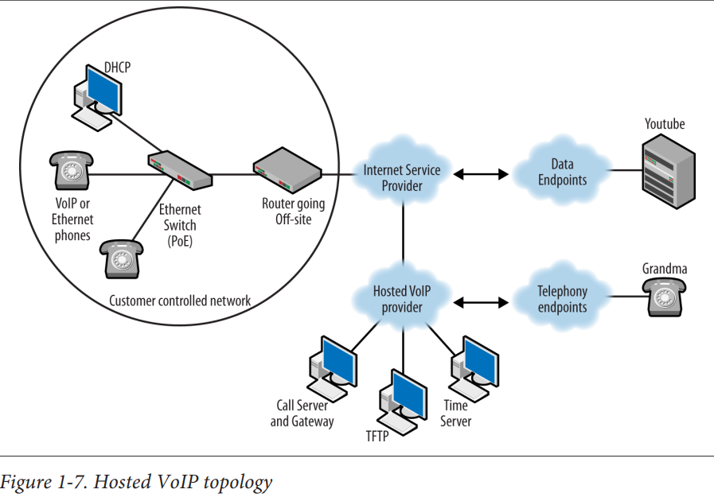
### **سرور تماس**
تلفن‌ها با سرور تماس ثبت‌نام می‌کنند. سرور تماس می‌تواند کنترل امنیت و پذیرش را هنگام اتصال تلفن‌ها مدیریت کند. داده‌های صوتی مکالمه، که معمولاً توسط پروتکل انتقال حمل می‌شود، ممکن است از طریق سرور تماس جریان داشته باشد یا نداشته باشد.

### **دروازه (Gateway)**
این دستگاه معمولاً برای اتصال یک شبکه داخلی به بقیه جهان یا حداقل یک سیستم دیگر استفاده می‌شود. سیستمی که به آن متصل می‌شوید ممکن است فناوری متفاوت یا مشابهی داشته باشد. به عنوان مثال، یک شبکه داخلی مبتنی بر VoIP ممکن است مستقیماً به PSTN متصل شود. PSTN هنوز تا حد زیادی توسط SS7 کنترل می‌شود. دروازه نقاط انتهایی در هر دو سمت را متصل می‌کند، بین دو سیستم ترجمه می‌کند یا ویژگی‌هایی فراهم می‌کند. از سوی دیگر، دروازه ممکن است به سادگی شرکت‌ها یا ارائه‌دهندگان را به هم متصل کند. در این حالت، گروه‌های متصل ممکن است از همان پروتکل سیگنالینگ استفاده کنند.

### **پروتکل‌های VoIP**
دو نوع پروتکل VoIP وجود دارد: سیگنالینگ و انتقال. پروتکل‌های سیگنالینگ تمامی عملکردهایی را که معمولاً توسط پروتکل‌های سنتی انجام می‌شوند، مانند پروتکل Q.931 در شبکه دیجیتال خدمات یکپارچه (ISDN)، مدیریت می‌کنند. پروتکل‌های سیگنالینگ استاندارد شده در ادامه این فصل توضیح داده می‌شوند و در جای دیگری از این کتاب به‌طور کامل بررسی می‌شوند. پروتکل انتقال برای کپسوله‌سازی یا حمل داده‌های صوتی واقعی استفاده می‌شود و تنها پروتکلی که به‌طور جهانی برای انتقال استفاده می‌شود، پروتکل انتقال بلادرنگ (RTP) است که در فصل 4 توضیح داده شده است. بسته‌های داده صوتی با یک کدک ایجاد می‌شوند و سپس در RTP کپسوله می‌شوند.

### **کدک‌ها (Codecs)**
کدک به معنای کدر-دیکدر است که برای تبدیل سیگنال صوتی آنالوگ به مجموعه‌ای از نمونه‌های دیجیتال در مبدا و سپس برگرداندن آن در گیرنده استفاده می‌شود. بنابراین، تلفن فرستنده داده‌های صوتی را با کدک خود کدگذاری می‌کند و گیرنده بسته صوتی را با کدک خود دیکد می‌کند. کدک‌ها در هر دو استقرار سنتی و VoIP حضور دارند. برای یک سیستم سنتی، کدک می‌تواند به صورت فیزیکی در تلفن یا در PBX باشد، بسته به نوع و مدل استقرار. تلفن‌های VoIP همیشه حاوی کدک هستند. کدک‌ها می‌توانند داده‌های صوتی را نیز فشرده کنند. در حالی که کدک‌های مختلفی وجود دارند، احتمالاً رایج‌ترین کدک‌های صوتی از سری G اتحادیه بین‌المللی مخابرات (ITU-T) هستند. سری H اتحادیه بین‌المللی مخابرات شامل کدک‌های ویدیویی محبوب است. در دسته‌های صوتی و ویدیویی، کدک‌ها به روش‌های مختلف کدگذاری و فشرده‌سازی را انجام می‌دهند، اگرچه بسیاری از آنها بر اساس اصول مشابهی هستند. فصل 5 جزئیات بیشتری درباره کدک‌ها فراهم می‌کند، اما یک فهرست کوتاه از این دو مجموعه شامل موارد زیر است:
* G.711—Pulse Code Modulation
* G.722 and G.723—Low bit-rate encoding
* G.726—Adaptive Differential Pulse Code Modulation
* G.729.1—Code Excited Linear Prediction variable bit-rate coder
* H.261—Early video codec for p x 64 Kbps
* H.263—Video coding for low bit-rate communication
* H.264—Advanced video coding for generic audiovisual services
* iSAC (Internet Speech Audio Codec)—a non-ITU-T audio codec developed
by Global IP Solutions, used by Google Talk

### **تلفن‌های رومیزی و نرم‌افزارهای تلفنی**
تلفن‌ها (که به عنوان نقاط انتهایی نیز شناخته می‌شوند) در یک توپولوژی VoIP همان خدماتی را ارائه می‌دهند که هر تلفن دیگری انجام می‌دهد، اگرچه به شکلی متفاوت. در اوایل تکامل VoIP، تلاش‌هایی برای حذف کامل تلفن به نفع برنامه‌های تلفنی نصب‌شده روی کامپیوترها وجود داشت. با این حال، مردم به طراحی سنتی تلفن عادت کرده بودند و تغییر را دوست نداشتند. برنامه‌ها نیز باید با هر چیزی که در آن زمان روی کامپیوتر اجرا می‌شد، رقابت می‌کردند. امروزه، ما ترکیبی از تلفن‌های رومیزی VoIP و برنامه‌های تلفنی یا نرم‌افزارهای تلفنی داریم.

### **اجزای غیر VoIP**
سیستم VoIP به تعداد زیادی از خدماتی که مخصوص VoIP نیستند، وابسته است. بسیاری از این خدمات، مانند پروتکل پیکربندی پویای میزبان (DHCP)، از قبل بخشی از معماری شبکه هستند و می‌توانند برای شامل کردن اجزای VoIP گسترش یابند. خدمات دیگر شامل پروتکل انتقال فایل ساده (TFTP)، سرویس نام دامنه (DNS) و پروتکل زمان شبکه (NTP) هستند. معمولاً مشاهده می‌شود که این اجزا در الزامات محصول VoIP فهرست شده‌اند، زیرا ممکن است بدون آنها اجرا نشوند. یک توپولوژی معمولی که شامل این عناصر است، ممکن است شبیه به آنچه در شکل 1-8 نشان داده شده است باشد.

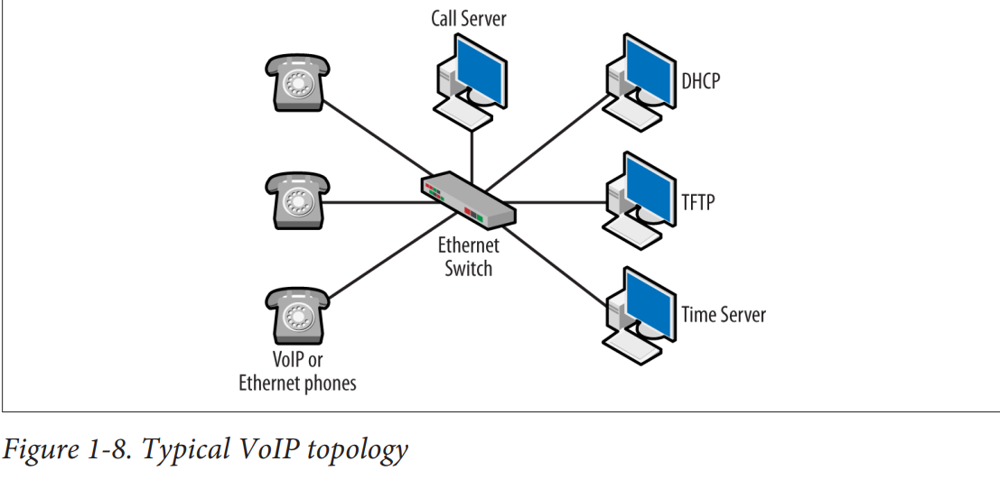


### Dynamic Host Configuration Protocol (DHCP)
Dynamic Host Configuration Protocol, is a network protocol used to automate the process of assigning IP addresses and other network configuration parameters to devices (such as computers, smartphones, and printers) on a network.

#### Key Features of DHCP
* Automatic IP Address Assignment: DHCP servers assign IP addresses to devices (clients) dynamically from a predefined range or pool of addresses.

* Lease Concept: IP addresses are assigned for a specific period called a lease. After the lease expires, the IP address can be reassigned to another device.

#### How DHCP Works
* DHCP Discovery: When a device connects to the network, it sends out a broadcast message (DHCPDISCOVER) to discover DHCP servers.

* DHCP Offer: Any DHCP server that receives the discovery message responds with a DHCPOFFER, which includes an available IP address and other configuration details.

* DHCP Request: The client selects one of the offers (if multiple are received) and responds with a DHCPREQUEST to the server, indicating its acceptance of the offered address.

* DHCP Acknowledgment: The server sends a DHCPACK message to the client, confirming the lease and finalizing the configuration. The client can now use the assigned IP address and other provided settings.


### Trivial File Transfer Protocol (TFTP)
Trivial File Transfer Protocol (TFTP) is a simple, lockstep, and lightweight file transfer protocol that operates over UDP (User Datagram Protocol). Unlike more complex protocols like FTP (File Transfer Protocol), TFTP provides a minimalistic way of transferring files, primarily used for simple and quick file transfers.

#### Key Features of TFTP
* Simplicity: TFTP is designed to be simple and easy to implement, lacking many of the features and commands found in more complex file transfer protocols.

* Connectionless: TFTP uses UDP for data transmission, which means it does not establish a connection before transferring data. This makes TFTP faster but less reliable than TCP-based protocols.

* Minimal Overhead: TFTP has minimal command structure and control overhead, making it suitable for environments where simplicity and low resource usage are crucial.

#### How TFTP Works
* Read Request (RRQ): A client sends a read request to the TFTP server to retrieve a file.

* Write Request (WRQ): A client sends a write request to the TFTP server to upload a file.

* Data Transfer: Data is transferred in blocks, typically 512 bytes each. Each block of data must be acknowledged by the receiver before the next block is sent.

* Acknowledgment (ACK): The receiving side sends an acknowledgment for each data block received.
Error Handling: If an error occurs, an error message (ERROR) is sent to the client or server, terminating the transfer.

### Domain Name Service (DNS)
The Domain Name System (DNS) is a hierarchical and decentralized naming system used to translate human-readable domain names into machine-readable IP addresses. This process is essential for the functioning of the internet, as it allows users to access websites and services using easy-to-remember domain names instead of numerical IP addresses.

### Network Time Protocol (NTP)
Network Time Protocol (NTP) is a networking protocol designed to synchronize the clocks of computers and devices over a network. It is one of the oldest internet protocols still in use and ensures that systems across different locations maintain accurate time, which is critical for various applications such as logging events, security, and scheduling tasks.


## Power over Ethernet
بخش دیگری از این زیرساخت که مختص VoIP نیست، توان بر روی اترنت (Power over Ethernet یا PoE) است. دستگاه‌هایی مانند نقاط دسترسی (Access Points) و تلفن‌های VoIP می‌توانند از طریق انژکتورها (Injectors) که بین آنها و شبکه قرار می‌گیرند، تغذیه شوند. با این حال، این انژکتورها نیاز به یک پریز برق دارند، همان‌طور که در شکل 1-9 نشان داده شده است.


این موضوع باعث محدودیت در استقرار این دستگاه‌ها می‌شود، زیرا باید نزدیک یک پریز برق باشند یا پریز جدیدی نصب شود. این امر به خصوص برای نقاط دسترسی که معمولاً روی سقف نصب می‌شوند، صادق است. راه‌حل‌های PoE که به صورت رک‌مونت (Rack-mounted) هستند می‌توانند کمک کنند، البته در صورتی که محیط و فاصله‌ها مناسب باشند. مهاجرت به VoIP می‌تواند صدها تلفن که نیاز به تغذیه دارند را معرفی کند. حتی اگر تلفن‌ها در دفاتر باشند، این به معنای مدیریت تعداد زیادی پریز و توان است. سوئیچ‌های PoE این مشکل را با تامین توان مستقیم به تلفن (یا نقطه دسترسی) بدون نیاز به انژکتور حل می‌کنند. سه روش PoE که معمولاً استفاده می‌شوند، وجود دارد که دو مورد از آنها استانداردهای IEEE هستند.

### IEEE 802.3af
استاندارد **Carrier Sense Multiple Access with Collision Detection (CSMA/CD) و مشخصات لایه فیزیکی، توان تجهیزات پایانه داده (Data Terminal Equipment یا DTE) از طریق رابط وابسته به رسانه (Media Dependent Interface یا MDI) بهبود یافته** است.

### IEEE 802.3at
تکمیل‌کننده استاندارد 802.3af است که توان بیشتری را برای دستگاه‌ها فراهم می‌کند.

این دو استاندارد روش‌هایی را برای تغذیه دستگاه‌های شبکه از طریق کابل‌های شبکه معمولی تعریف می‌کنند که به کاهش نیاز به پریزهای برق متعدد و مدیریت توان کمک می‌کند.


## PoE Basic Operation
این استاندارد دو انتهای اتصال را تعریف می‌کند. توان از طریق تجهیزات منبع تغذیه (Power Sourcing Equipment یا PSE) تأمین شده و به دستگاه تغذیه‌شونده (Powered Device یا PD) ارسال می‌شود. چندین پیکربندی مختلف برای اتصالات الکتریکی وجود دارد که PSE باید پشتیبانی کند. اتصالات اترنت هشت‌سیم دارای دو جفت داده (1 و 2، 3 و 6) هستند و با PoE، توان جریان مستقیم می‌تواند بر روی پین‌های 4، 5، 7 و 8 تأمین شود. جفت مثبت بر روی هادی‌های 4 و 5 قرار می‌گیرد و هادی‌های 7 و 8 جفت منفی را تشکیل می‌دهند. ایده این است که پس از اتصال دستگاهی که نیاز به توان دارد به سوئیچ، دستگاه شناسایی می‌شود و تنها پس از آن توان اعمال می‌شود. شناسایی از طریق یک امضای شناسایی PD در زمان اتصال صورت می‌گیرد. PSE در واقع دستگاه متصل را برای ویژگی‌های الکتریکی صحیح، همان‌طور که در استاندارد تعریف شده است، مورد بررسی قرار می‌دهد. این کار به عنوان طبقه‌بندی لایه فیزیکی شناخته می‌شود. دستگاه‌ها ممکن است از طبقه‌بندی لایه پیوند داده نیز پشتیبانی کنند که از پروتکل شبکه محلی استفاده می‌کند. زمانی که این طبقه‌بندی فعال باشد، اولویت با طبقه‌بندی لایه پیوند داده است.

در PSEها، لینک و PD به عنوان سیستمی که یا نوع I یا نوع II است در نظر گرفته می‌شوند؛ هر نوع دارای ویژگی‌های الکتریکی متفاوتی است، مانند محدودیت‌های جریان مستقیم، مقاومت و نوع کابل. نوع II جریان بیشتری حمل می‌کند و نیازمندی‌های کابل‌کشی بیشتری دارد. توان خروجی دستگاه‌ها تابعی از ولتاژ تأمین و جریان کشیده شده است. PSE باید وظایفی مانند شناسایی PDها، تأمین توان، نظارت بر توان ارائه شده و حذف توان زمانی که نیاز نیست را انجام دهد. همچنین این فرض وجود دارد که PSE به دستگاه غیر PoE توان ارائه ندهد. PDهای نوع I امضاهای طبقه‌بندی رویدادی 0، 1، 2 یا 3 را زمانی که مورد پرسش قرار می‌گیرند، تبلیغ می‌کنند. پیش‌فرض کلاس 0 است. نوع II پیچیده‌تر است اما از کلاس 4 و فرآیند انتخاب دو بخشی استفاده می‌کند. برخی PDها می‌توانند شناسایی متقابل انجام دهند، زیرا ممکن است به جای PSE نوع I به PSE نوع II نیاز داشته باشند. حداکثر توان کشیده شده تابعی از محدودیت‌های کلاس و ویژگی‌های الکتریکی است 

روش سوم PoE توسط شرکت سیسکو ارائه شده است. سیسکو قابلیت PoE را قبل از تصویب استانداردهای IEEE پیاده‌سازی کرد. روش سیسکو از لحاظ مذاکره، با استفاده از پروتکل کشف سیسکو (Cisco Discovery Protocol یا CDP) و سطح توان، با استاندارد IEEE تفاوت دارد. سیسکو همچنین از پالس لینک سریع برای شناسایی دستگاه متصل PoE استفاده می‌کند. در حالی که دستگاه‌های سیسکو ممکن است با استانداردهای IEEE سازگار باشند و از PoE سیسکو پشتیبانی کنند، این دو تکنیک با هم سازگار نیستند. دستگاه‌های فعلی سیسکو از یک یا هر دو استاندارد IEEE پشتیبانی می‌کنند.

مستندات سیسکو به یک مشکل جالب اشاره می‌کند که ممکن است زمانی که یک دستگاه PoE متصل می‌شود و نوع و کلاس آن قابل تعیین نیست، رخ دهد. در این حالت، سوئیچ توان کامل را برای دستگاه ناشناخته اختصاص می‌دهد، حتی اگر ممکن است مورد نیاز نباشد. نتیجه این است که توان مورد نیاز دستگاه‌های دیگر که به سوئیچ متصل هستند نمی‌تواند تامین شود و در نتیجه منجر به کاهش بودجه توان می‌شود.

از دیدگاه عملی، آگاهی از عملکرد PoE احتمالاً در اکثر مواقع ضروری نیست. یک مدیر ممکن است به سادگی به نیازهای توان دستگاه‌های متصل نگاه کند تا اطمینان حاصل کند که سوئیچ استاندارد مناسب را ارائه می‌دهد: 802.3af یا 802.3at. این باید بخشی از تصمیم‌گیری‌های خرید نیز باشد. البته، عیب‌یابی تقریباً همیشه با داشتن کمی دانش بیشتر در این حوزه آسان‌تر می‌شود. در مثال کاهش توان، جداسازی دستگاه‌ها و درک سیگنال‌دهی یا مشکلات احتمالی می‌تواند منجر به حل سریع مشکل شود.


## VoIP Protocols
همان‌طور که قبلاً ذکر شد، پروتکل‌های VoIP خاصی وجود دارند اما تنها به دو دسته تقسیم می‌شوند: **سیگنال‌دهی** و **حمل و نقل**. پروتکل‌های سیگنال‌دهی وظایف مربوط به معماری سیستم تلفنی را مدیریت می‌کنند و پروتکل‌های حمل و نقل بسته‌های صوتی تولید شده توسط کدک را حمل می‌کنند. تلفن‌ها از پروتکل سیگنال‌دهی برای ثبت‌نام در سرور تماس، برقراری و پایان دادن به تماس‌ها استفاده می‌کنند. پروتکل‌های سیگنال‌دهی همچنین برای ویژگی‌هایی مانند خدمات دایرکتوری و نمایشگرهای صفحه استفاده می‌شوند. هنگامی که یک تماس برقرار می‌شود، بسته‌های داده صوتی معمولاً مستقیماً بین تلفن‌ها با استفاده از انکپسولاسیون RTP ارسال می‌شوند، هرچند که استثنائاتی نیز وجود دارد. مسیرهای جریان داده در شکل 1-10 نشان داده شده است.

بسته‌های RTP که داده صوتی را حمل می‌کنند ممکن است همچنین از تلفن به سرور تماس و سپس به تلفن دیگر جریان یابند.

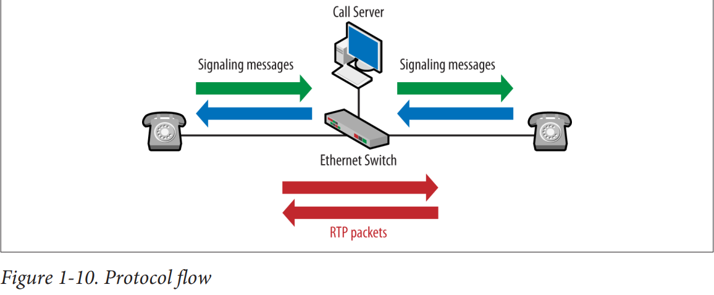

## Signaling Protocols
با وجود اینکه معماری VoIP کاملاً با معماری مورد استفاده در تلفن سنتی متفاوت است، ما هنوز نیاز اساسی به سیگنال‌دهی داریم. به هر حال، تلفن‌ها باید زنگ بخورند، شماره‌ها باید منتقل شوند و مسیرها باید تنظیم شوند، و این وظایف توسط پروتکل سیگنال‌دهی مدیریت می‌شوند. سه نوع رایج پروتکل‌های سیگنال‌دهی عبارتند از H.323، Skinny و پروتکل آغاز جلسه یا SIP.


## Session Initiation Protocol
پروتکل آغاز جلسه (SIP) یک استاندارد غیرانحصاری از گروه مهندسی اینترنت (IETF) است. فرمت پیام‌های SIP بسیار شبیه به بسته‌های پروتکل انتقال ابرمتن (HTTP) است و بنابراین برای افراد فعال در دنیای شبکه‌های داده آشنا است. SIP شروع کندی داشت اما به طور گسترده‌ای در سراسر جهان پذیرفته شده است. با اینکه RFC اولیه محدودیت‌هایی داشت، اکنون به پروتکل سیگنال‌دهی مورد استفاده اکثر شرکت‌ها تبدیل شده است، از جمله Vonage و Skype. حتی سیسکو نیز در حال انتقال از Skinny به SIP است. پوشش عمیق‌تر SIP در فصل 3 موجود است. یک نمونه بسته SIP در شکل 1-11 دیده می‌شود.

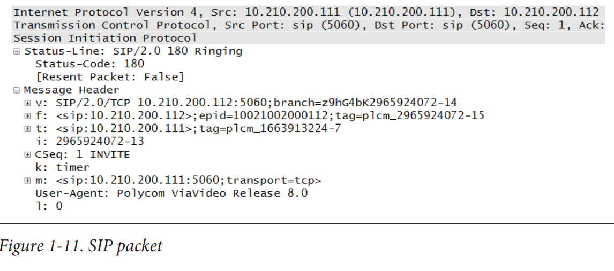

از شکل 1-11 می‌توان دید که بسته به راحتی قابل خواندن است، هدف مشخصی دارد و طرف‌های درگیر به وضوح تعریف شده‌اند. این ویژگی‌ها و یکپارچگی با بسیاری از اشکال آدرس‌دهی، از دلایل محبوبیت این پروتکل هستند.


## H.323
این در واقع یک مجموعه استانداردهای ITU-T است که بر روی ویدئو کنفرانس تمرکز دارد. این مجموعه استانداردها پیش از رقبای خود توسعه یافته و بنابراین به عنوان استانداردی غیررسمی در بسیاری از پیاده‌سازی‌ها مورد استفاده قرار می‌گرفت. این استاندارد از بسیاری از ایده‌های سیگنال‌دهی تلفن سنتی استفاده می‌کند و برخی ممکن است بگویند که به دلیل وابستگی به این روش‌های قدیمی دچار مشکلاتی شده است. در یک جلسه H.323 چندین زیرپروتکل وجود دارد، از جمله Q.931، H.225 و H.245. جزئیات بیشتر درباره H.323 را می‌توان در فصل 6 یافت. یک نمونه بسته H.225 در شکل 1-12 دیده می‌شود.


با بررسی بسته در شکل 1-12، نیازی نیست که خیلی جلو برویم تا تعداد زیرلایه‌ها و فیلدهای درگیر را ببینیم. در داخل بسته TCP سه زیرلایه (TPKT، Q.931 و H.225) وجود دارد قبل از اینکه به اطلاعات پیام واقعی برسیم. کمی جلوتر، بخش "fastStart" قرار دارد که شامل 36 آیتم است. این پیچیدگی ممکن است یکی از دلایل کاهش محبوبیت آن باشد. با این حال، برخی از کارشناسان VoIP اشاره می‌کنند که پیچیدگی SIP می‌تواند بسته به نقاط انتهایی و قابلیت‌های آنها افزایش یابد.


## Skinny Client Control Protocol
پروتکل کنترل مشتری سبک (SCCP)، یا Skinny، یک محصول سیسکو است. این پروتکل بسیار انحصاری است و بسیاری از عملیات‌های آن به طور قابل توجهی با آنچه که ممکن است یک پیاده‌سازی VoIP معمولی در نظر گرفته شود، متفاوت است. با این حال، سیسکو با محصولات VoIP خود موفقیت زیادی کسب کرده است و تعداد قابل توجهی از شبکه‌های سیسکو از Skinny استفاده می‌کنند. فصل 7 به بررسی Skinny می‌پردازد. یک نمونه بسته Skinny در شکل 1-13 دیده می‌شود.

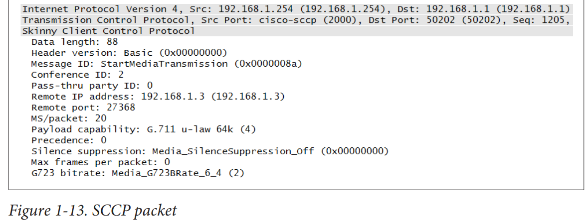

یکی از ویژگی‌های خوب پیام‌های Skinny این است که مانند SIP، بسیار آسان برای خواندن هستند، حداقل اگر نسخه‌های قدیمی‌تر یا جداسازهای اخیر را داشته باشید. اکثر پیام‌های Skinny کوتاه و به نکته هستند. با این حال، Skinny انحصاری است و برخی از رفتارهایی دارد که در جاهای دیگر دیده نمی‌شود، مانند استفاده محدود یا غیرموجود از پروتکل کنترل زمان واقعی (RTCP)، که پروتکل همراه RTP است.

## Transport Protocol
پروتکل انتقال زمان واقعی (RTP) بدون شک پروتکل مورد علاقه برای انتقال بسته‌های صوتی حاوی داده‌های صوتی است. در حالی که مکانیزم‌های دیگری نیز برای این کار به کار گرفته شده‌اند، RTP به طور گسترده‌ای پذیرفته شده است. RTP، که در RFC 3550 تعریف شده است، یک پروتکل ساده است که از شناسه‌های منبع برای جمع‌آوری بسته‌ها از یک منبع استفاده می‌کند و دارای یک فیلد است که نوع بار مفید (payload) را مشخص می‌کند تا گیرنده بتواند تشخیص دهد که کدام کدک برای ایجاد بسته صوتی استفاده شده است. یک بسته RTP در شکل 1-14 نشان داده شده است.

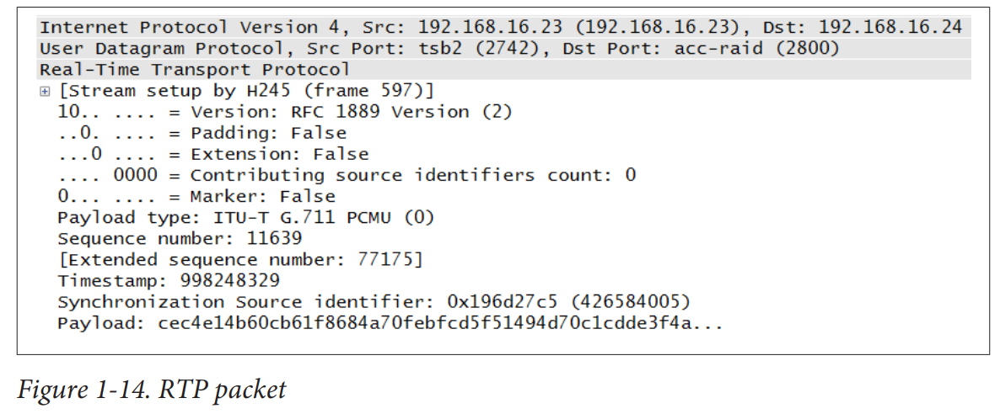

در RFC 3550 همچنین شامل پروتکل کنترل زمان واقعی (RTCP) است که اطلاعاتی درباره جریان بسته‌های RTP ارائه می‌دهد. استفاده اصلی آن ارائه بازخورد در مورد کیفیت جریان صوتی است. یک بسته RTCP در شکل 1-15 نشان داده شده است.


با مقایسه این بسته‌ها، می‌توان دید که بسته RTP نشانه‌ای از کدک استفاده شده برای ایجاد بسته صوتی، شناسه منبع و خود داده‌ها را فراهم می‌کند. بسته RTCP هیچ‌کدام از این‌ها را ندارد. در عوض، RTCP زمان‌بندی و بایت‌های ارسال شده بین نقاط انتهایی را پیگیری می‌کند. به این ترتیب، می‌توان ایده‌ای از عملکرد لینک به دست آورد. فصل 4 جزئیات بیشتری در مورد هر دو پروتکل RTP و RTCP ارائه می‌دهد.

RTP simple protocol that uses source IDs to collect packets from the same source, and it has a field that identifies the payload so that the receiver can determine which codec was used to create the voice packet. 

## VoIP Basic Operation
این کتاب شامل فصلی برای هر یک از پروتکل‌های سیگنال‌دهی است، و توپولوژی‌های استفاده‌شده برای توضیحات با استفاده از فروشندگان مختلف، از جمله Cisco، Avaya و Asterisk ساخته شده‌اند. در حین پیش‌روی، خواهیم دید که اکثر پیاده‌سازی‌های VoIP از یک قالب مشابه برای عملیات پیروی می‌کنند و تقریباً مجموعه‌ی یکسانی از اجزا را دارند. این بخش قالب عملیات را فراهم می‌کند و فصل‌ها جزئیات خاص مربوط به توپولوژی و پروتکل استفاده‌شده را ارائه می‌دهند. فعلاً، توپولوژی نشان‌داده‌شده در شکل 1-16 مبنای بحث ما خواهد بود.


فهرست بسته‌ها که در شکل 1-17 نشان داده شده است، بسته‌هایی را که هنگام روشن شدن تلفن تولید می‌شوند و سپس تماسی برقرار می‌کند، به تصویر می‌کشد. برای صرفه‌جویی در فضا، این فهرست ویرایش شده است تا مثال‌هایی نشان داده شود، نه کل سری مکالمات. این فهرست از یک اتصال غیر اختصاصی H.323 است. همانطور که مشاهده می‌شود، چندین قسمت وجود دارد که با پروتکل پیکربندی پویا میزبان (Dynamic Host Configuration Protocol یا DHCP) شروع می‌شود. بعد از DHCP، تلفن با یک سرور پروتکل انتقال فایل بی‌اهمیت (Trivial File Transfer Protocol یا TFTP) تماس می‌گیرد تا هرگونه به‌روزرسانی اخیر را دریافت کند و 

سپس به پیام‌رسانی خاص VoIP منتقل می‌شود.
برای سرگرمی، فهرست دیگری از معماری اختصاصی Cisco را نیز گنجانده‌ام تا بتوانیم ببینیم که هر دو فرمت مجموعه مشابهی از رویه‌ها را دنبال می‌کنند. بسته‌های نشان داده شده در شکل 1-18 نیز از DHCP به TFTP و سپس به پروتکل‌های خاص VoIP پیش می‌روند.

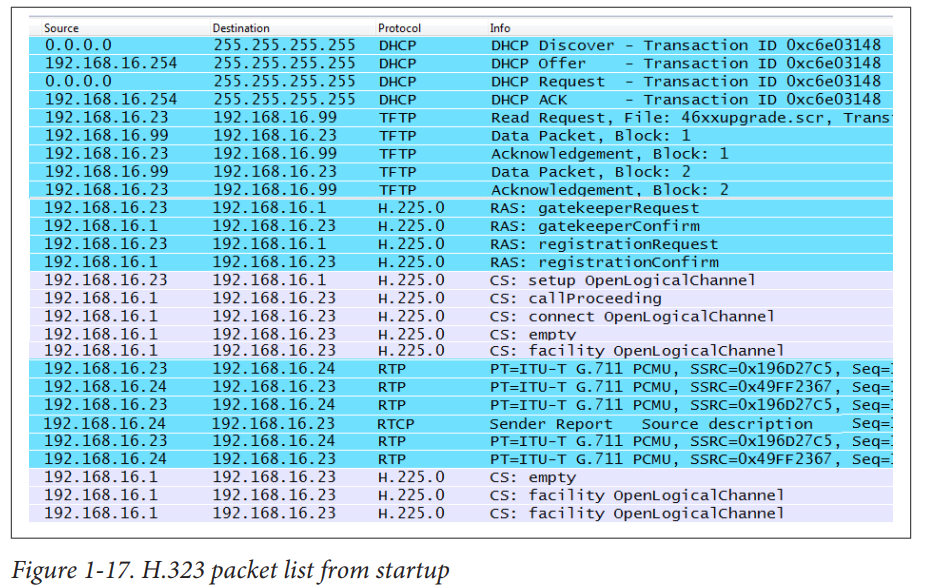
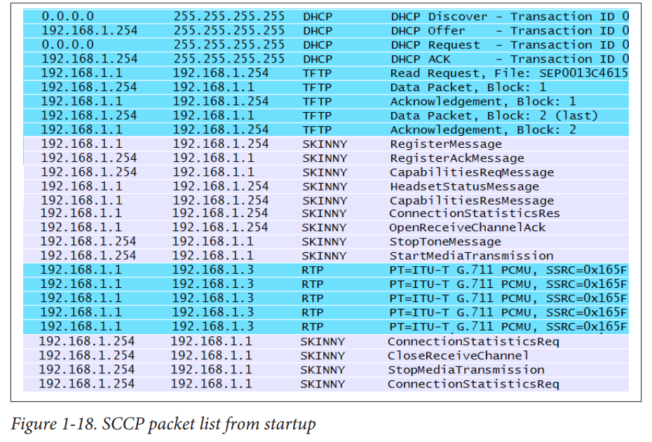

### پروتکل پیکربندی پویا میزبان (DHCP)
همان‌طور که در فهرست بسته‌های اختصاصی و غیر اختصاصی مشاهده کردیم، تقریباً تمام پیاده‌سازی‌های VoIP با DHCP شروع می‌شوند. علاوه بر آیتم‌های استانداردی مانند یک آدرس IP و دروازه پیش‌فرض، تلفن‌های VoIP به آدرس‌های سرور TFTP و سرور تماس نیاز دارند. از بین این دو آدرس، TFTP گام بعدی برای تلفن‌ها است، زیرا مکانیزم‌های مختلفی برای به‌دست آوردن آدرس سرور تماس استفاده می‌شود. به عنوان مثال، یک فایل پیکربندی می‌تواند روی سرور TFTP نصب شود. این فایل مقادیری مانند سرور تماس، زبان و ترتیب دکمه‌ها را فراهم خواهد کرد. در ادامه چند خط نمونه پیکربندی DHCP برای Cisco آمده است و چهار خط آخر روش‌های مختلفی برای ارائه آدرس TFTP یا سرور تماس را نشان می‌دهند.

```
ip dhcp pool voip
network 192.168.16.0 255.255.255.0
default-router 192.168.16.254
next-server 192.168.16.99
option 66 ip 192.168.16.99
option 150 ip 192.168.16.99
option 176 ascii "TFTPSRVR=192.168.16.99,
MCIPADD=192.168.16.1"
```

### پروتکل انتقال فایل بی‌اهمیت (TFTP)
همان‌طور که از نام آن پیداست، انتقال‌های TFTP بسیار ساده هستند؛ هیچ نام کاربری، رمز عبور، یا انواع انتقال پیچیده‌ای وجود ندارد. از یک سرور TFTP برای به‌روزرسانی فریم‌ور استفاده‌شده توسط تلفن و شاید ارائه یک فایل تنظیماتی که ممکن است شامل پارامترهای عملیاتی برای شبکه VoIP باشد، استفاده می‌شود. یک نمونه از فایل تنظیمات ممکن است به این شکل باشد:
```
SET MCIPADD 192.168.16.1
```
اما سرورهای TFTP همچنین برای ارائه فایل‌هایی که کدها یا تن‌هایی را که در یک منطقه خاص استفاده می‌شوند، توصیف می‌کنند نیز به کار می‌روند. به عنوان مثال، مجموعه وسیعی از فایل‌های قابل دانلود ممکن است هنگام پیکربندی پشتیبانی محلی سازی Cisco استفاده شوند. گرفتن تصویر نشان داده‌شده در شکل 1-17 از دید تلفن A است که آدرس IP 192.168.16.23 را دریافت می‌کند. با دنبال کردن مکالمه تا این نقطه، می‌توانیم توپولوژی را به‌صورت نشان‌داده‌شده در شکل 1-19 تغییر دهیم.

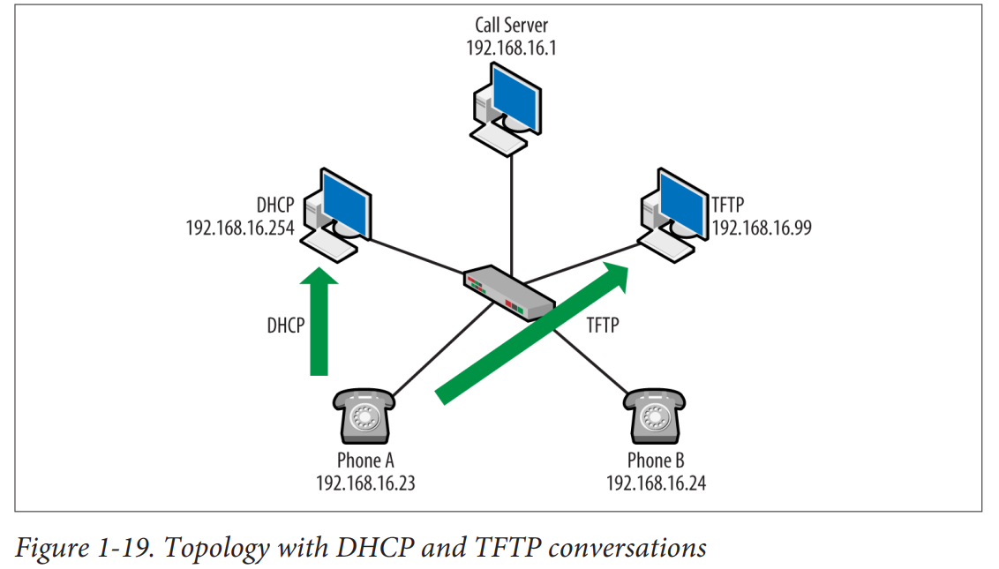

### ثبت‌نام تلفن
قبل از اینکه یک نقطه پایانی VoIP بتواند تماس برقرار کند، ابتدا باید با سرور تماس یا نگهبان ثبت‌نام کند. این فرآیند سرور تماس را از وجود تلفن آگاه می‌سازد و اطلاعاتی برای رابط کاربری تلفن فراهم می‌کند. با یک نصب یا ثبت‌نام جدید، کاربر با استفاده از شماره تلفنی که به او اختصاص داده شده است وارد تلفن می‌شود. در این نقطه، آدرس IP و MAC تلفن اکنون به آن تلفن یا شماره تماس خاص مرتبط شده‌اند.
ثبت‌نام از طریق پروتکل سیگنال‌دهی انجام می‌شود، و هر پروتکل سیگنال‌دهی از مجموعه‌ای از پیام‌ها برای انجام این کار استفاده می‌کند که کمی متفاوت است. از دو نمودار مکالمه، می‌بینیم که H.323 از پیام‌های RAS، یا ثبت‌نام، پذیرش و وضعیت استفاده می‌کند، در حالی که Skinny از یک پیام ثبت‌نام استفاده می‌کند. در هر دو حالت، به‌وضوح مشخص است که چه اتفاقی می‌افتد و تلفن‌ها این کار را قبل از هر چیز دیگری انجام می‌دهند.
شکل 1-20 برخی از تغییرات در پیام‌رسانی ثبت‌نام را نشان می‌دهد.


### راه‌اندازی تلفن
بسته به مدل تلفن، پیکربندی توپولوژی، و پروتکل سیگنال‌دهی، ممکن است چندین پیام H.323، Skinny، یا SIP بین سرور تماس و تلفن رد و بدل شود. این پیام‌ها ممکن است برای اطلاع‌رسانی به تلفن از رویدادها، ارائه پشتیبانی از ویژگی‌ها، یا پر کردن رابط کاربری استفاده شوند. هر یک از فصل‌های مربوط به سیگنال‌دهی جزئیات بیشتری را ارائه خواهند داد، اما برخی از این پیام‌ها را می‌توان در شکل 1-21 و شکل 1-22 مشاهده کرد.


این پیام‌ها روش‌های مجاز را تبادل می‌کنند (شکل 1-21) و دستورالعمل‌هایی را در مورد صفحه نمایش دریافت می‌کنند (شکل 1-22). هر دو پس از مرحله ثبت‌نام دریافت شدند.

### راه‌اندازی و اتصال تماس
در یک شبکه سنتی، برداشتن گوشی مدار را برای آماده‌سازی سیگنال صوتی می‌بندد. کاربران اعداد را شماره‌گیری می‌کنند و صداهایی تولید می‌شود که به سویچ تلفن ارسال می‌شوند. سویچ این صداها را از طریق کدک به اطلاعات دیجیتال تبدیل می‌کند. سویچ‌ها باید یک مدار انتها به انتها به مقصد برقرار کنند. هیچ‌کدام از این فرآیندها به صورت بسته‌بندی شده نیستند، به این معنی که بر اساس پروتکل‌های IP نیستند. برای VoIP، این فرآیند باید از پیام‌های سیستم سیگنالینگ 7 و فرکانس‌های تلفن (مانند فرکانس‌های ایجاد شده توسط نقاط انتهایی DTMF) به پیام‌هایی که در پروتکل‌هایی مانند آنچه در این بخش توضیح داده شده، کپسوله شده‌اند، تغییر کند.

پروتکل سیگنالینگ VoIP (مانند H.323، Skinny، SIP) پیام‌هایی به سرور تماس ارسال می‌کند که شماره شماره‌گیری شده را نشان می‌دهد، و سرور تماس باید با مقصد تماس بگیرد. در حالی که پروتکل‌ها روش‌شناسی‌های مختلفی دارند و در واقع ممکن است تفاوت‌های بیشتری توسط فروشندگان ایجاد شود، این پیام‌ها معمولاً درست قبل از شروع جریان RTP ظاهر می‌شوند. شکل 1-23 برخی از تغییرات در پیام‌هایی که اتصال را شروع می‌کنند، نشان می‌دهد.

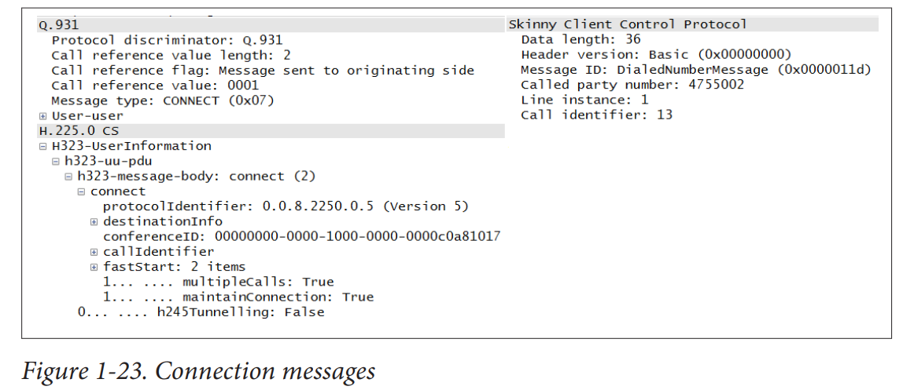

همانطور که از ردگیری ضبط شده در شکل 1-18 می‌توانیم ببینیم، پیام‌های ثبت‌نام، راه‌اندازی، و اتصال همگی به سمت سرور تماس در آدرس 192.168.16.1 جریان می‌یابند. با به‌روزرسانی نمودار توپولوژی خود، نتیجه‌ای که در شکل 1-24 نشان داده شده است، به دست می‌آید.


### گفتگوی RTP
وقتی RTP برای انتقال داده‌های صوتی استفاده می‌شود. وقتی که بسته‌های RTP جریان پیدا می‌کنند، تماس برقرار شده است. با این حال، RTP می‌تواند برای انتقال نمونه‌هایی که برای صداهای دیگر ایجاد شده‌اند نیز استفاده شود. به عنوان مثال، یک صدای شماره‌گیری می‌تواند در بسته‌های RTP ارسال شده از سرور تماس قرار گیرد و این بسته‌ها قبل از داده‌های صوتی تماس رخ خواهند داد - بنابراین به آدرس‌های IP توجه داشته باشید. بسته RTP حاوی یک شناسه بارگذاری است که کدک مورد استفاده را نشان می‌دهد. وقتی کاربر نهایی در گوشی صحبت می‌کند، کدک صدای آنالوگ را می‌گیرد و بسته‌های صوتی را ایجاد می‌کند که در جریان RTP ارسال می‌شوند. با گرفتن یک قطعه از گفتگوی H.323 در شکل 1-17، می‌توانیم ببینیم که بسته‌های RTP بین تلفن‌ها جریان دارند. نمودار در شکل 1-16 نشان می‌دهد که تلفن‌ها دارای آدرس‌های IP 192.168.16.23 و 192.168.16.24 هستند.

در سمت دریافت، بسته‌های صوتی دیکد شده و در گوشی پخش می‌شوند. توجه داشته باشید که مقادیر Synchronizing Source (SSRC) در این بسته‌ها ثابت هستند و اجازه می‌دهند که جریان در هر دو انتها بازسازی شود. از دو گفتگو در شکل‌های 1-17 و 1-18 می‌توان دید که هر دو معماری از RTP استفاده می‌کنند. پیاده‌سازی‌های SIP نیز از RTP استفاده می‌کنند. نگاه دیگری به گفتگوی RTP در شکل 1-25 نشان می‌دهد که یک بسته RTCP نیز وارد شده است.

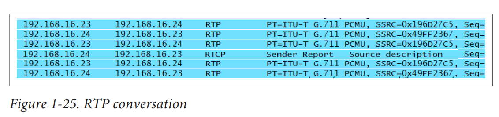

### RTCP
همانطور که قبلاً ذکر شد و در شکل 1-15 مشاهده می‌شود، بسته‌های RTCP اطلاعاتی درباره جریان RTP حمل می‌کنند که برای ارائه جزئیات درباره کیفیت یا عملکرد استفاده می‌شود. RFC 3550 بیان می‌کند که RTCP هر زمان که RTP استفاده شود، پیاده‌سازی خواهد شد. فهرست بسته‌ها این موضوع را تایید می‌کند. با این حال، هر پیاده‌سازی ممکن است قوانین را رعایت نکند. در حالی که فهرست بسته‌ها ویرایش شده‌اند، آنها به گونه‌ای ویرایش نشده‌اند که خواننده را گمراه کنند. بنابراین، اگر در بررسی توپولوژی Cisco متوجه شدید که بسته‌های RTCP وجود ندارند، چشمان شما فریب نخورده‌اند. Cisco از مکانیزم SCCP دیگری برای دستیابی به هدف RTCP استفاده می‌کند و این در شکل 1-26 نشان داده شده است.

اگر به توپولوژی خود نگاه دیگری بیندازیم، می‌بینیم که آدرس‌های IP نقطه انتهایی به طور مستقیم از طریق جریان RTP در حال ارتباط هستند، همانطور که در شکل 1-27 نشان داده شده است. توجه کنید که تمام دستگاه‌های دیگر در این نقطه از گفتگو خارج هستند.

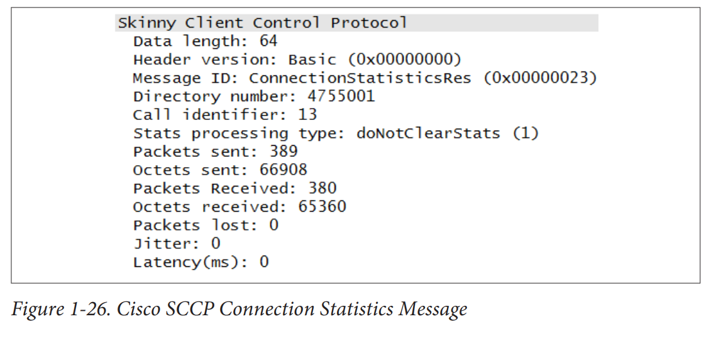   
   

### پایان تماس
در اکثر پیاده‌سازی‌های VoIP، تلاش می‌شود تا یک قطع ارتباط آرام و مرتب فراهم شود. این کار تضمین می‌کند که کانال یا جلسه خاموش شود، منابع بازیابی شوند، صورت‌حساب مشخص شود، و هیچ داده اتصالی دیگری برای آن Call-ID پذیرفته نشود. این روش در مقابل قطع ساده اتصال از یک نقطه انتهایی قرار دارد. با بررسی شکل 1-17، پروتکل سیگنالینگ در این نقطه دوباره به اتصال برمی‌گردد و پیام‌هایی را به طرف‌های درگیر ارائه می‌دهد تا مدار منطقی را تخریب کرده و منابع را بازیابی کند. تلفن‌ها دوباره به ارتباط با آدرس IP سرور تماس در 192.168.16.1 بازمی‌گردند.

### performance
با پروتکل‌هایی مانند RTCP یا پیام‌های Skinny، مانند آنچه در شکل 1-15 و شکل 1-24 نشان داده شده‌اند، توجه زیادی به شاخص‌های کیفیت برای جریان RTP می‌شود. این ممکن است شما را به این باور برساند که عملکرد VoIP اهمیت زیادی دارد. در واقع همین‌طور است. با تبدیل شدن بسیاری از سیستم‌ها به IP، به راحتی می‌توان تصور کرد که این‌ها فقط برنامه‌های اضافی هستند که روی شبکه اجرا می‌شوند و شبکه می‌تواند به پشتیبانی از این برنامه‌ها ادامه دهد. در حالی که برخی برنامه‌ها ممکن است در یک شبکه شلوغ زنده بمانند، صوت یک برنامه بسیار مهم و حساس است. انواع دیگر ترافیک (FTP، HTTP، ایمیل و غیره) معمولاً می‌توانند از یک قطعی یا مشکل خدماتی جان سالم به در ببرند. اما بدون ارتباط صوتی، مشکلات می‌توانند برای یک کسب‌وکار بسیار جدی شوند. اگر شما یک مدیر شبکه هستید، ممکن است در صورت عدم عملکرد ارتباطات صوتی، توجه نامطلوبی را جلب کنید. بنابراین، معمولاً سیستم‌های VoIP بودجه و نیروی انسانی اضافی دریافت می‌کنند. ما اغلب منابعی را تخصیص می‌دهیم تا اطمینان حاصل کنیم که سیستم نه تنها به کار خود ادامه می‌دهد بلکه دارای سطح بالایی از کیفیت نیز هست.

همانطور که قبلاً در این فصل ذکر شد، سه دشمن عملکرد VoIP تاخیر (latency)، نوسان (jitter) و از دست دادن بسته (packet loss) هستند. تقریباً هر شیء یا فرآیندی در مسیر تاخیر ایجاد می‌کند - از کدک مورد استفاده، جداول مسیریابی و سوئیچینگ در هر مرحله از مسیر، و رفتار ذاتی شبکه. نوسان یا تغییر در زمان رسیدن بسته‌ها منجر به عملکرد غیرقابل پیش‌بینی می‌شود. معمولاً مشکلات نوسان با بافرینگ مدیریت می‌شوند. اما با داده‌های بلادرنگ، امکان ارائه بافرینگ بسیار محدود است. از دست دادن بسته نیز یک مشکل مهم برای هر برنامه‌ای است، زیرا بازفرستی‌ها می‌توانند به شدت کیفیت تماس را کاهش دهند. جدول 1-2 شاخصی از کیفیت تماس‌ها را ارائه می‌دهد. اگرچه برخی از مقادیر ممکن است کمی متفاوت باشند، می‌بینیم که بیشتر فروشندگان و استانداردها به یکدیگر نزدیک هستند.


### خلاصه
صدا بر بستر IP (VoIP) به سرعت در حال تبدیل شدن به یکی از اجزای مرکزی شبکه‌ها، صرف نظر از اندازه یا نوع کسب‌وکار است. از مدیران سیستم و شبکه اغلب خواسته می‌شود تا VoIP را به صورت بومی پیاده‌سازی کنند یا سیستم‌های تلفنی سنتی را به راه‌حل‌های VoIP مهاجرت دهند. درک عملکرد پروتکل‌های VoIP و خدمات لازم برای ایجاد یک راه‌حل موفق بسیار مهم است. این فصل به بررسی یک توپولوژی استاندارد VoIP پرداخت که شامل اجزای غیر اختصاصی VoIP مانند پروتکل پیکربندی پویای میزبان (DHCP) و پروتکل انتقال فایل ابتدایی (TFTP) می‌شود. پروتکل‌های سیگنالینگ شامل H.323، SIP، و SCCP نیز مرور شدند، همچنین RTP که سرورها از آن برای انتقال داده‌های صوتی استفاده می‌کنند. جزئیات بیشتر را می‌توان در فصل‌های اختصاص داده شده به این پروتکل‌ها یافت. این فصل همچنین با فایل‌های ضبط موجود در وب‌سایت کتاب پشتیبانی می‌شود.

# Chapter 2
## Traditional Telephony

## Introduction
چه شما در حال تبدیل به VoIP (Voice over IP) باشید یا از قبل آن را دارید، مدیران شبکه موظف به مدیریت مجموعه‌ای از مسائل با ماهیت سنتی‌تر و اتصال به دنیای خارج هستند. بنابراین حتی اگر ما آینده را پذیرفته‌ایم، جدا شدن کامل از گذشته دشوار است. برای آینده قابل پیش‌بینی، درک فناوری مدار سوئیچ شده آنالوگ و دیجیتال، سیم‌کشی تلفن و روش‌های آزموده‌شده برای اتصال به ISPها (ارائه‌دهندگان خدمات اینترنت) ضروری است. به عنوان مثال، یکی از مدارهای پرفروش هنوز هم T-1 است. علاوه بر این، داده‌های اتحادیه بین‌المللی مخابرات نشان می‌دهد که در حالی که رشد استفاده از اینترنت و دستگاه‌های متصل به اینترنت قابل توجه است، این به معنای پایان خدمات ثابت سنتی نیست. این داده‌ها در شکل 2-1 نشان داده شده است.

ورود فارغ‌التحصیلان به نیروی کار با مدارک و گواهینامه‌های شبکه کاملاً معمول است، اما پس از استخدام به آن‌ها گفته می‌شود که وظایفشان شامل نگهداری و مدیریت یک سیستم PBX (تلفن سانترال) قدیمی یا دسته‌ای از سیم‌های آبی و سفید نیز می‌شود.

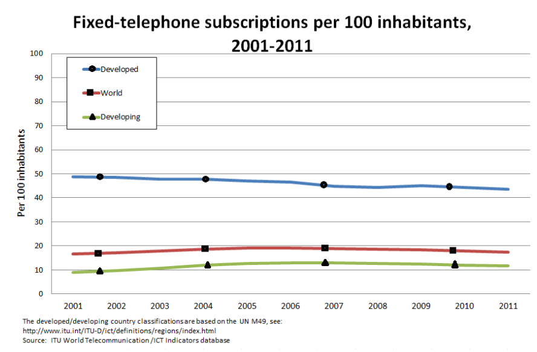
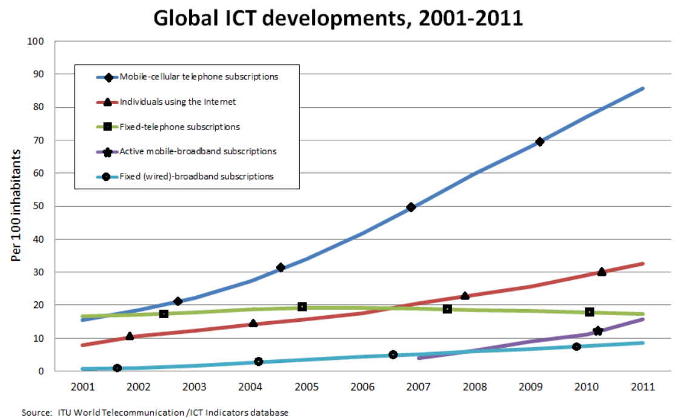

از آنجایی که شبکه تلفن سوئیچ عمومی (PSTN) بسیار بزرگ و پیچیده است، این فصل به بررسی بخش‌هایی که احتمالاً برای یک مدیر VoIP مفید است، می‌پردازد. این فصل اجزای یک استقرار کوچک و سنتی شامل PBX و تلفن‌ها را پوشش می‌دهد. بحث شامل سیم‌کشی و اتصالات مورد استفاده نیز می‌شود. این فصل همچنین اتصالاتی که برای اتصال سایت‌ها و سوئیچ‌ها استفاده می‌شود، مانند T-1ها را نیز پوشش می‌دهد.

## Overview
یک روش ساده‌شده برای درک این موضوع، حداقل برای شروع، این است که اینترنت و شبکه‌های تلفن قبلاً دو موجودیت کاملاً جداگانه بودند که استانداردها و قوانین متفاوتی داشتند، همان‌طور که در شکل 2-2 نشان داده شده است.


اینترنت بر روی مجموعه پروتکل‌های مدل TCP/IP (پروتکل کنترل انتقال/پروتکل اینترنت) اجرا می‌شود. شبکه تلفن عمومی (PSTN) بر روی چیزی به نام سیستم سیگنال‌دهی ۷ (SS7) اجرا می‌شود. جالب است بدانید که در روزهای دسترسی دیال-آپ، شما از طریق PSTN به ارائه‌دهنده خدمات اینترنتی (ISP) خود متصل می‌شدید. علاوه بر این، بیشتر شرکت‌هایی که خدمات PSTN را ارائه می‌دهند، همان شرکت‌هایی هستند که به عنوان ISP فعالیت می‌کنند. این امر به ویژه اگر به تکامل این اتصالات از سال ۱۹۹۶ به بعد نگاه کنیم، درست است. بنابراین از دیدگاه کامپیوتری با یک مودم، توپولوژی واقعی ممکن است بیشتر شبیه به شکل 2-3 به نظر برسد.


در این حالت، ارائه‌دهنده محلی تبادل (local exchange provider) مودم شما (مدولاتور-دمولاتور) را با استخر مودم در ISP متصل می‌کند وقتی که شماره تلفن ISP را شماره‌گیری می‌کنید. هنگامی که ارتباط برقرار شد، این اتصال اساساً به عنوان یک سیم مستقیم بین دو دستگاه عمل می‌کند. همه مودم‌ها یک موج حامل را مدوله می‌کنند تا مقادیر باینری که نیاز به انتقال دارند را نشان دهند. چه اطلاعات صوتی باشد چه یک موج حامل مدوله شده، رفتار تجهیزات ارائه‌دهنده محلی تبادل یکسان است.

با یک اتصال اینترنتی کابلی پرسرعت، ارائه‌دهنده محلی تبادل اصلاً لازم نیست. خطوط مشترک دیجیتال (DSL) هنوز از سیم‌کشی حلقه محلی استفاده می‌کنند، اما دفتر برای مدیریت اجزای سیگنال اضافی و پهنای باند مورد نیاز برای DSL تنظیم شده است. حلقه محلی در جزئیات بیشتری در ادامه این فصل پوشش داده شده است.

## Organizations
در طول این فصل (و فصول دیگر) به چندین نهاد اشاره خواهد شد. این نهادها مسئول استانداردها یا مقرراتی هستند که بر اساس آن‌ها سیستم‌های ارتباطی خود را بنا کرده‌ایم.

## **اتحادیه بین‌المللی مخابرات-تله‌کام (ITU-T)**
این نهاد که در سال ۱۸۶۵ تأسیس شد، هدف اصلی‌اش ایجاد استانداردهای ارتباطات اطلاعاتی پذیرفته‌شده جهانی است. در سال ۱۹۴۷ به یک آژانس سازمان ملل متحد تبدیل شد. ITU-T همچنین با توسعه مخابرات در سراسر جهان به‌ویژه در کشورهای جهان سوم نیز مرتبط است. در ایالات متحده، این به معنی تلفن و داده است. ITU-T توصیه‌نامه‌هایی صادر می‌کند که در واقع به عنوان استاندارد در نظر گرفته می‌شوند. بیشتر قوانین شبکه PSTN که در شکل ۲-۳ نشان داده شده است (کدک‌ها، سیم‌کشی، سیگنال‌دهی و غیره) از ITU-T می‌آیند. شماره تلفن در توصیه‌نامه ITU-T E.164 توصیف شده است و به عنوان طرح شماره‌گذاری عمومی بین‌المللی مخابرات شناخته می‌شود. در آمریکای شمالی، ما از طرح شماره‌گذاری آمریکای شمالی (NANP) استفاده می‌کنیم که با E.164 مطابقت دارد. فرمت در جدول ۲-۱ نشان داده شده است. در این جدول، N یک رقم از ۲ تا ۹ است و x یک رقم از ۰ تا ۹ است. کد منطقه یک تخصیص جغرافیایی است، کد دفتر تخصیص سوئیچ محلی یا کلاس ۵ است و کد ایستگاه تخصیص پورت یا مدار است. ممکن است بیش از یک کد دفتر به یک سوئیچ محلی خاص اختصاص داده شود.


## E164 number format
The E.164 format is an international telephone numbering plan used to ensure that phone numbers are globally unique and standardized. It defines how to format and dial phone numbers internationally. Here’s a simple explanation with an example:

### Key Features of E.164:
1. **Country Code:** A number that represents the country (1-3 digits).
2. **National Destination Code (NDC):** This includes area codes or service provider codes (optional, 1-4 digits).
3. **Subscriber Number:** The actual phone number of the person or service (up to 12 digits).

### Example Breakdown:
Let's take a phone number from the United States: **+1 234-567-8901**

1. **Country Code (+1):** The country code for the United States is "1".
2. **National Destination Code (234):** This could be an area code.
3. **Subscriber Number (567-8901):** The local phone number.

### Formatting Rules:
- Always starts with a plus sign (+).
- Followed by the country code.
- Then the NDC (if applicable).
- Finally, the subscriber number.

### Examples in E.164 Format:
- United States: `+12345678901`
  - Country code: 1
  - NDC: 234
  - Subscriber number: 5678901
- United Kingdom: `+442071838750`
  - Country code: 44
  - NDC: 2071
  - Subscriber number: 838750
- India: `+919876543210`
  - Country code: 91
  - NDC: 98
  - Subscriber number: 76543210

### Why Use E.164?
- **Consistency:** Ensures a standardized way of formatting numbers globally.
- **Interoperability:** Facilitates smooth international communication.
- **Clarity:** Removes ambiguity when dialing internationally.

### How to Dial:
1. **From your country:** Dial the international access code (often 00 or +) followed by the E.164 formatted number.
2. **Within the same country:** Dial as usual, often omitting the country code.

For example, to call the UK number `+442071838750` from the US:
- Dial `011` (US international access code), followed by `44` (UK country code), and then `2071838750` (local number). So, dial `011442071838750`.

Using the E.164 format ensures that everyone around the world understands and dials the number correctly.


Sure! Let's break down these telecom concepts in very simple terms with examples.

### Area Codes
**Area Codes** are the first few digits of a phone number that designate a specific geographic region. They help route calls to the right area.

- **Example:** In the phone number (415) 555-1234, "415" is the area code. It tells you that the call is going to San Francisco, California.

### Local Exchange
**Local Exchange** refers to a specific central office or switching system that connects calls within a local area.

- **Example:** For the number (415) 555-1234, "555" could be the local exchange code. This means it routes the call within a smaller area of San Francisco.

### Local Access and Transport Areas (LATAs)
**Local Access and Transport Areas (LATAs)** are regions that define where a phone company can provide local or long-distance services.

- **Example:** California might be divided into several LATAs. A call within a LATA is usually considered local, while a call between LATAs might be considered long-distance.

### Local Exchange Carriers (LECs)
**Local Exchange Carriers (LECs)** are companies that provide local telephone service. There are two types:

1. **Incumbent Local Exchange Carriers (ILECs):** These are the traditional phone companies that existed before the market was opened to competition.

   - **Example:** AT&T and Verizon are ILECs in many parts of the United States.

2. **Competitive Local Exchange Carriers (CLECs):** These are newer companies that compete with the incumbent carriers to offer local telephone service.

   - **Example:** Comcast and Vonage are CLECs offering local phone services in various regions.

### Inter-Exchange Carriers (IXCs)
**Inter-Exchange Carriers (IXCs)** are companies that provide long-distance telephone services between different LATAs or regions.

- **Example:** If you're in San Francisco (LATA 1) and you call someone in Los Angeles (LATA 2), the call might be handled by an IXC like Sprint or AT&T Long Distance.

### Putting It All Together
1. **Area Code:** Helps identify the region (e.g., 415 for San Francisco).
2. **Local Exchange:** Routes calls within the local area (e.g., 555).
3. **LATAs:** Defines the geographic region for local vs. long-distance (e.g., San Francisco and Los Angeles are different LATAs).
4. **LECs:** Provide local phone service.
   - **ILECs:** Traditional providers (e.g., AT&T).
   - **CLECs:** New competitors (e.g., Comcast).
5. **IXCs:** Handle long-distance calls between LATAs (e.g., Sprint).

### Example Phone Call:
- **You** (in San Francisco, CA, area code 415) call your friend in Los Angeles, CA, area code 213.
- **Area Code 415** tells the network you're in San Francisco.
- **Local Exchange 555** directs the call within your area.
- **LATA** identifies whether it's a local or long-distance call.
- **LEC** (like AT&T) connects your call locally.
- **IXC** (like Sprint) may handle the long-distance part of the call from San Francisco to Los Angeles.

Sure! Let's break down these telecom concepts into simple and detailed explanations with examples.

### 1. Local Access and Transport Areas (LATAs)

**LATA**:
- **Definition**: A geographic region used to determine local and long-distance telephone services.
- **Purpose**: To organize the delivery of phone services into manageable areas.

**Example**:
- **LATA 722** might cover Northern California, including San Francisco.
- **LATA 730** might cover Southern California, including Los Angeles.

A call within the same LATA (e.g., from San Francisco to another town in Northern California) is a local call. A call between different LATAs (e.g., from San Francisco to Los Angeles) is a long-distance call.

### 2. Local Exchange Carriers (LECs)

**LEC**:
- **Definition**: Companies that provide local telephone services.
- **Types**:
  1. **Incumbent Local Exchange Carriers (ILECs)**:
     - Traditional, established companies.
     - Example: AT&T, Verizon.
  2. **Competitive Local Exchange Carriers (CLECs)**:
     - Newer companies that compete with ILECs.
     - Example: Comcast, Vonage.

**Purpose**: To connect calls within the same LATA and provide local phone services.

**Example**:
- If you live in San Francisco and have a landline from AT&T, AT&T is your LEC.

### 3. Area Codes

**Area Code**:
- **Definition**: The first three digits of a phone number that designate a specific geographic region.
- **Purpose**: To help route calls to the correct region.

**Example**:
- In the phone number **(415) 555-1234**:
  - **415** is the area code for San Francisco, California.

### 4. Inter-Exchange Carriers (IXCs)

**IXC**:
- **Definition**: Companies that provide long-distance telephone services between different LATAs.
- **Purpose**: To handle calls that travel across LATAs, ensuring they reach the correct destination.

**Example**:
- If you call from San Francisco (LATA 722) to Los Angeles (LATA 730), a company like Sprint or AT&T Long Distance would handle the call as the IXC.

### Putting It All Together

#### Example Phone Call:

1. **You** are in San Francisco (area code 415) and want to call your friend in Los Angeles (area code 213).

2. **Area Code**:
   - **415** identifies your call as coming from San Francisco.
   - **213** identifies the call destination as Los Angeles.

3. **Local Exchange**:
   - Your local exchange (e.g., 555) within San Francisco routes the call locally.

4. **LATA**:
   - Your call is identified as traveling from LATA 722 (San Francisco) to LATA 730 (Los Angeles), marking it as a long-distance call.

5. **LEC**:
   - Your local LEC (e.g., AT&T in San Francisco) handles the initial routing of your call.

6. **IXC**:
   - The IXC (e.g., Sprint) takes over the long-distance portion of the call from San Francisco to Los Angeles.

7. **Receiving LEC**:
   - The LEC in Los Angeles (e.g., Verizon) receives the call and routes it to the final local exchange (e.g., 555) to connect with your friend's number.

### Summary
- **LATA**: Defines regions for local and long-distance calls.
- **LEC**: Provides local phone services within a LATA.
  - **ILEC**: Established traditional companies (e.g., AT&T).
  - **CLEC**: Newer competitors (e.g., Comcast).
- **Area Code**: The initial digits of a phone number that identify the geographic region (e.g., 415 for San Francisco).
- **IXC**: Handles long-distance calls between different LATAs (e.g., Sprint for calls from San Francisco to Los Angeles).

By understanding these concepts, you can see how calls are routed and managed across different regions and service providers.

## **کمیسیون ارتباطات فدرال (FCC)**
FCC یک نهاد نظارتی ایالات متحده است که با قانون ارتباطات سال ۱۹۳۴ تشکیل شده و به کنگره پاسخگو است. به نقل از سایت FCC، این آژانس:
ارتباطات بین‌المللی و بین‌المللی را از طریق رادیو، تلویزیون، سیم، ماهواره و کابل در تمام ۵۰ ایالت، ناحیه کلمبیا و مناطق ایالات متحده تنظیم می‌کند.
FCC قیمت‌ها را برای تلفن، داده و ویدئو بین‌المللی تعیین می‌کند، تخصیص طیف بی‌سیم را مدیریت می‌کند، تعیین می‌کند که کدام فروشندگان مجاز به ورود به بازارهای مختلف هستند و در توسعه استانداردهای الکتریکی و فیزیکی مشارکت دارد. FCC همچنین یک سازمان تحقیقاتی است که به شکایات و حفاظت از مصرف‌کننده رسیدگی می‌کند.

## **کمیسیون خدمات عمومی (PUC) و کمیسیون خدمات عمومی (PSC)**
همانطور که از نامش پیداست، این دو نهاد (که معمولاً یکی هستند، زیرا ایالت‌ها از این اصطلاحات به صورت جایگزین استفاده می‌کنند) با تمام خدمات در مرزهای ایالتی، مانند برق، گاز، بخار، آب و مخابرات مرتبط هستند. این‌ها سازمان‌های ایالتی هستند که می‌توانند محدودیت‌هایی اعمال کرده و نظارت در حوزه قضایی خود فراهم کنند.


## Connecting to the Traditional World
## **اتصال به دنیای سنتی**
شبکه تلفن سوئیچ عمومی (PSTN) توپولوژی جهانی است که همه تلفن‌ها را به یکدیگر متصل می‌کند. بنابراین، زمانی که تلفن خانگی شما از طریق شرکت تلفن شما متصل شد، خط تلفن شما و تمامی خطوط تلفن دیگر، از جمله آن‌هایی که شرکت‌های تلفن را به یکدیگر متصل می‌کنند، بخشی از PSTN هستند. حلقه محلی و تلفن‌های متصل برخی از آخرین بخش‌های آنالوگ باقی‌مانده هستند. برخی شرکت‌ها نیز خطوط آنالوگ داخلی دارند، اما به طور کلی، کل شبکه PSTN دیجیتال است. PSTN به عنوان یک شبکه سوئیچ مدار توصیف می‌شود که در آن اتصالات بر اساس نیاز تنظیم و قطع می‌شوند. سوئیچینگ مداری دو انتها را در سراسر شبکه با اختصاص منابع به خطوط در حال استفاده متصل می‌کند، بر خلاف ارسال ساده بسته‌ها به شبکه (سوئیچینگ بسته‌ای) برای تحویل به بهترین شکل ممکن. به همین دلیل، PSTN به دلیل ارائه کیفیت بالای خدمات برای مشتریان شهرت دارد.

PSTN از دو شبکه تشکیل شده است: شبکه حمل ترافیک و شبکه سیگنال‌دهی. ما از طریق شبکه حمل ترافیک صحبت کرده و اطلاعات ارسال می‌کنیم. این اتصالات توسط شبکه سیگنال‌دهی کنترل می‌شوند. شبکه سیگنال‌دهی دارای معماری و پروتکل مخصوص به خود است. شبکه سیگنال‌دهی می‌تواند ترافیک داده را نیز حمل کند. ما درباره این موضوع زمانی که شبکه دیجیتال خدمات یکپارچه (ISDN) را پوشش می‌دهیم صحبت خواهیم کرد. زبان شبکه سیگنال‌دهی PSTN سیستم سیگنال‌دهی ۷ (SS7) است، در حالی که زبان اینترنت مبتنی بر TCP/IP است. حتی با اینکه PSTN و اینترنت زبان‌های مختلفی دارند، اما بسیاری از نگرانی‌های مشترک مانند اتصال نقطه‌های پایانی و مسیریابی تماس‌ها، پیگیری استفاده، آدرس‌دهی و اجرای کنترل منابع را دارند. در ایالات متحده، PSTN اغلب به عنوان شبکه AT&T یا سیستم بل شناخته می‌شد.

از نظر ساختاری، PSTN از کدهای منطقه، نواحی تبادل محلی و حمل‌ونقل، حامل‌های تبادل محلی (ساکن و رقابتی) و حامل‌های بین‌المللی تشکیل شده است. این شبکه به شکلی بسیار جغرافیایی سازماندهی شده و از نظر هزینه، خدمات و رقابت تنظیم شده است. به‌روزرسانی نمودارمان با استفاده از تعاریف آینده، توپولوژی را به شکل تصویر ۲-۴ نشان می‌دهد.

برخی تعاریف مفید دیگر در این زمینه عبارتند از:

## **نواحی دسترسی و حمل‌ونقل محلی (LATA)**
کشور به ۱۹۶ ناحیه دسترسی و حمل‌ونقل محلی یا LATA تقسیم شده است. یک LATA یک ناحیه جغرافیایی را تعریف می‌کند که در آن یک حامل تبادل محلی (LEC) می‌تواند خدمات ارائه دهد. حامل تبادل محلی همچنین به عنوان شرکت تلفن محلی شما شناخته می‌شود. LATAs و کدهای منطقه به طور غیرمستقیم مرتبط هستند، زیرا تراکم جمعیت می‌تواند بر تعداد کدهای منطقه مورد نیاز در یک منطقه خاص تأثیر بگذارد. شماره‌گذاری LATA یک مقدار سه‌رقمی است که با کد منطقه آغاز می‌شود. در مثال ما، تمامی LATAs در منطقه جنوب مرکزی با "۵" شروع می‌شوند. مقایسه بین LATAs و کدهای منطقه در شکل ۲-۵ دیده می‌شود.

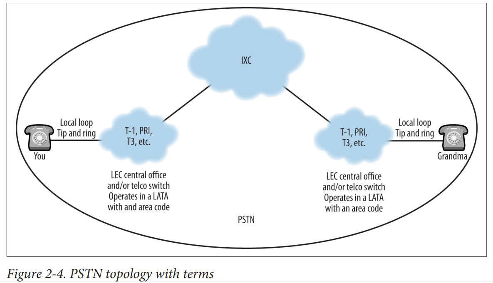


کانزاس انتخاب شد زیرا تراکم جمعیت آن چندان زیاد نیست و در نتیجه ایالت برای مقایسه ساده‌تر است. همان‌طور که در این نقشه‌ها دیده می‌شود، کانزاس دارای دو LATA و چهار کد منطقه است. این بدان معناست که شماره‌های تلفن مانند 785-111-2222 و 913-333-4444 در کدهای منطقه‌ای مختلفی هستند و بنابراین احتمالاً یک تماس راه دور محسوب می‌شوند. با این حال، از آنجایی که آن‌ها در یک LATA قرار دارند، ممکن است این تماس‌ها راه دور نباشند، بسته به پوشش شرکت تبادل محلی (LEC).

## **حامل‌های بین‌المللی (IXCs)**
حامل‌های بین‌المللی حامل‌های راه دور یا بین LATA هستند. این شرکت‌ها مانند AT&T، اسپرینت (که از راه‌آهن جنوب اقیانوس آرام - SPRint سرچشمه گرفته است) و MCI قدیمی بودند. برخی از IXCها اکنون می‌توانند به عنوان حامل‌های تبادل محلی رقابتی (CLEC) عمل کنند.

## Telecommunication Companies
### تجزیه و تحلیل

تقریباً هر کتابی درباره مخابرات بخشی برای حکم مالی تعدیل شده علیه AT&T دارد. این بخش برای ارائه دیدگاهی کمی به مجموعه‌ای بسیار پیچیده از شرکت‌ها گنجانده شده است. ابتدا باید بدانیم که شبکه تلفن دهه‌هاست وجود دارد و به زمانی بازمی‌گردد که اپراتور در پشت میز کلیدزنی نشسته و به صورت دستی تماس‌ها را متصل می‌کرد. اینترنت بسیار جوان‌تر است، و بیشتر مردم موافقند که آغاز آن به اوایل دهه ۱۹۹۰ بازمی‌گردد، هرچند خالص‌نگران به فعالیت‌های اولیه‌تری اشاره خواهند کرد. این دو شبکه متفاوت هستند و زبان‌های مختلفی صحبت می‌کنند. چیزی که تصویر را پیچیده‌تر می‌کند این است که بسیاری از شرکت‌های مشابه هر دو شبکه را اداره می‌کنند.

### پیش‌زمینه تاریخی

برای ارائه زمینه بیشتر، باید به قبل از سال ۱۹۸۲ بازگردیم، زمانی که شرکت آمریکایی تلفن و تلگراف (AT&T) انحصار کامل بر سیستم تلفن داشت. این شرکت می‌توانست قیمت‌ها را تعیین کند و دسترسی‌ها را کنترل کند. در سال ۱۹۸۲، وزارت دادگستری حکم داد که از تاریخ ۳۰ دسامبر ۱۹۸۳، AT&T باید به هفت شرکت عملیاتی منطقه‌ای بل (RBOCs) تقسیم شود. این یک سازماندهی مجدد از ۲۲ شرکت تلفن بل بود که در آن زمان وجود داشتند. RBOCs باید خدمات تبادل محلی را ارائه می‌دادند و AT&T خدمات راه دور را ارائه می‌داد. این باعث شد که RBOCs به عنوان حامل‌های تبادل محلی (LECs) و AT&T به عنوان حامل تبادل بین‌المللی (IXC) شناخته شوند. RBOCs اجازه نداشتند خدمات راه دور ارائه دهند و AT&T اجازه نداشت خدمات محلی ارائه دهد. با این حال، AT&T همیشه زیرکانه بود و حق ارائه خدمات داده‌ها را حفظ کرد.

### قانون مخابرات ۱۹۹۶

قانون مخابرات ۱۹۹۶ قوانین را تغییر داد تا رقابت بیشتری در بازار ایجاد کند. شرکت‌های تلفنی جدید ظهور کردند و محدودیت‌ها در ارائه خدمات کاهش یافت. از تاریخی که این قانون اجرایی شد، RBOCs به عنوان حامل‌های تبادل محلی موجود (ILECs) شناخته شدند و حامل‌های تبادل محلی رقابتی (CLECs) وارد عرصه مخابرات شدند. به نقل از این قانون، بخشی از اهداف آن به شرح زیر است:
"برای ترویج رقابت و کاهش مقررات به منظور تضمین قیمت‌های پایین‌تر و کیفیت خدمات بالاتر برای مصرف‌کنندگان مخابرات آمریکایی و تشویق به استقرار سریع فناوری‌های جدید مخابراتی."

### وضعیت امروزی

امروزه شرکت‌های تلفنی از شرکت‌های اینترنتی یا خدمات داده‌محور قابل تشخیص نیستند. هنگامی که این را با تبدیل نمونه‌های صوتی به بسته‌های داده صوتی ترکیب می‌کنیم، می‌توان آینده‌ای را تصور کرد که در آن اتصالات مدار سوئیچ دیگر بخشی از شبکه نباشند. ارائه‌دهندگان در حال تبدیل زیرساخت‌ها و مدل‌های کاربردی خود هستند تا به تقاضای خدمات مبتنی بر IP پاسخ دهند.

### نکته جالب

یک نکته جالب دیگر قدرت بالای این شرکت‌ها است. در روزهای اولیه اینترنت، ساختار آن بر اساس نقاط دسترسی شبکه (NAP) بود. در ابتدا چهار NAP وجود داشت که در کالیفرنیا، نیوجرسی، میشیگان و واشنگتن دی‌سی قرار داشتند. ایده این بود که همه کسانی که می‌خواستند به شبکه داده جهانی متصل شوند، از طریق NAP‌ها به هم متصل شوند. طولی نکشید که شرکت‌های بزرگ متوجه شدند اگر جدول‌های مسیریابی خود را نگه دارند، شرکت‌های کوچک نمی‌توانند به مشتریان خود اتصال کامل ارائه دهند مگر با کمک آنها. به هر حال، چه مزایایی برای یک ISP جهانی در اشتراک‌گذاری وجود دارد؟ ISP‌های بزرگ توافقنامه‌های پییرینگ و نقاط پییرینگ خصوصی (PPP) ایجاد کردند تا ترافیک داده را مبادله کنند. سرنوشت یک ISP کوچک معمولاً این بود که خریداری شود، از ISP‌های بزرگ‌تر خدمات بگیرد یا از کسب و کار خارج شود؛ ادامه دادن به کسب درآمد از فروش خدمات دایل‌آپ دشوار بود.


### مرکز تلفن (CO)
مرکز تلفن محلی سوئیچ محلی را در خود جای می‌دهد. به طور سنتی، پیش‌شماره یک شماره تلفن (تبادل) یک سوئیچ محلی مرکز تلفن خاص را شناسایی می‌کند. یک سوئیچ محلی مرکز تلفن می‌تواند به گونه‌ای برنامه‌ریزی شود که بیش از یک تبادل محلی داشته باشد.

### مرکز تلفن خصوصی (PBX)
این دستگاه تقریباً تمامی ویژگی‌ها و عملکردهای مرکز تلفن یا سوئیچ تلفن را مدیریت می‌کند. تلفن‌های داخلی به PBX متصل می‌شوند که به نوبه خود به شبکه ارائه‌دهنده خارجی متصل است. یک PBX می‌تواند به تمامی انواع تلفن‌ها، از جمله VoIP، سرویس ارائه دهد. یک PBX از نوع Avaya در شکل 2-6 نشان داده شده است. فلش‌ها کارت‌های نصب شده برای پشتیبانی از تلفن‌های آنالوگ و دیجیتال را نشان می‌دهند. فلش سمت چپ به پورت‌های اترنت در پایین شاسی اشاره دارد. بنابراین، PBX می‌تواند به شبکه داده متصل شود تا از تلفن‌های VoIP پشتیبانی کند. 

تلفن‌های آنالوگ و دیجیتال از طریق کابل‌های پچ یا بلوک‌های پانچ به PBX متصل می‌شوند. نمونه‌هایی از بلوک‌های پانچ در شکل 2-7 دیده می‌شوند. این‌ها نمونه‌هایی از بلوک‌های BIX (اتصال متقاطع صنعت ساختمان) و بلوک‌های 66 هستند. هر دو قابلیت خاتمه دادن به کابل‌های 25 جفتی مانند آنچه در شکل 2-8 نشان داده شده است را دارند.


### قاب‌های توزیع شبکه تلفن عمومی (PSTN)
این‌ها نقاط اتصال متقاطع با چگالی بالا هستند که در اطراف مرکز تلفن (CO) پراکنده شده‌اند تا به منظور فراهم کردن اتصال و خدمات به مناطق اطراف از طریق خطوط محلی استفاده شوند. کابل‌ها در این نقطه می‌توانند چگالی‌هایی از 50 تا 800 جفت یا خانوار داشته باشند.

### قاب‌های توزیع اصلی
این مناطق معمولاً برق‌دار هستند و دارای تجهیزات سوئیچینگ یا کدگذاری می‌باشند. آن‌ها می‌توانند کاربران را ترکیب یا تجمیع کرده و به فیدهای با چگالی بسیار بالا، مانند فیبر نوری، برای اتصال به مرکز تلفن (CO) تبدیل کنند. یک چینش قاب‌های توزیع در شکل 2-9 دیده می‌شود.

### حلقه محلی
این اصطلاح برای تعریف چیزی است که در خارج از مرکز تلفن قرار دارد. حلقه محلی شامل تجهیزات و سیم‌کشی‌های فراوانی از تجهیزات بیرونی (OSP) است که دسترسی و اتصال به ارائه‌دهنده خدمات آن منطقه را فراهم می‌کند. خطوط POTS (خدمات تلفن ساده) از خانه‌ها یا دفاتر کوچک با استفاده از این تجهیزات کشیده شده و به سوئیچ تلفنی که به آن حلقه محلی سرویس می‌دهد متصل می‌شوند. این خطوط در داخل کابل‌های بزرگتری که معمولاً دفن شده‌اند، کشیده می‌شوند. هر خط تلفن از یک جفت سیم به نام‌های "تیپ" و "رینگ" تشکیل شده است. در محل مشتری، سیم رینگ قرمز و سیم تیپ سبز است. اگر خط دومی وجود داشته باشد، جفت دوم سیم‌ها می‌تواند به ترتیب از سیم‌های سیاه و زرد برای تیپ و رینگ استفاده کند.

### POTS and the Local Loop
برای خانوارها و کسب‌وکارهای کوچک، اتصالات حلقه محلی همچنان عموماً آنالوگ هستند، در حالی که اتصالات بین سوئیچ‌ها یا دفاتر دیجیتال می‌باشند. به دلیل پهنای باند کم و آنالوگ بودن، اتصال POTS به یک خانه تا حدودی محدود است. این محدودیت به این دلیل است که ویژگی‌ها باید در همین پهنای باند کوچک پیاده‌سازی شوند. خدماتی که به کاربران حلقه محلی ارائه می‌شود، خدمات تلفن معمولی (POTS) نامیده می‌شود. به صورت الکتریکی، این یک حلقه الکتریکی ساده دو سیم (یک جفت) با ظرفیت حمل اطلاعات پایین است. هر اتصال آنالوگ حدود 4000 هرتز پهنای باند اختصاص داده می‌شود زیرا بیشتر صداهایی که هنگام صحبت کردن تولید می‌کنیم در این محدوده فرکانسی قرار دارند.

برای دقیق‌تر بودن، ساختار الکتریکی اتصال حلقه محلی در توصیه ITU-T Rec G.107 شرح داده شده است که مدل E باریک‌باند را توصیف می‌کند. مدل E کانال 3.1 کیلوهرتزی برای خطوط مشترکین از 300 تا 3400 هرتز را مشخص می‌کند. این مدل بعدها به مدل E پهن‌باند که از 50 تا 7000 هرتز گسترش می‌یابد، اصلاح شد. این همچنین به این معناست که تمامی سیگنال‌های شماره‌گیری (شماره‌ها، صدای شماره‌گیری، و غیره) باید در این محدوده 3.1 کیلوهرتزی قرار بگیرند. این سیگنال‌ها نه تنها از همان محدوده فرکانسی بلکه از همان مسیر فیزیکی که صدای انسان عبور می‌کند، استفاده می‌کنند. این روش، سیگنال‌دهی درون باند (in-band signaling) نامیده می‌شود. خود صداها در توصیه ITU-T Rec E.180 (Q.35) مشخص شده‌اند. به عنوان مثال، صدای شماره‌گیری باید بین 400-450 هرتز باشد اگر یک صدای تک استفاده شود. صدای اشغال نیز برای همین محدوده توصیه شده است، اما در زمان متفاوتی استفاده می‌شود و دارای بازه زمانی مرتبط است. صداها یا فرکانس‌های استفاده شده هنگام شماره‌گیری یک تلفن نیز در همین محدوده 3.1 کیلوهرتزی قرار دارند. به بخش فرکانس چندتنی (DTMF) در ادامه این فصل مراجعه کنید.

سیم‌های "تیپ" و "رینگ" سیم‌های مداری هستند که از شرکت مخابراتی محلی (LEC) به آن مکان اختصاص داده شده‌اند. بنابراین، این سیم‌ها را می‌توان تا یک پورت خاص بر روی یک سوئیچ تلفن یا PBX ردیابی کرد. کارت دارای اتصالات از یک PBX آسترکیس در شکل 2-14 نشان داده شده است. آسترکیس یک پروژه منبع باز است که می‌تواند اتصالات برای نقاط انتهایی سنتی و VoIP فراهم کند. در این حالت، جعبه آسترکیس دارای یک کارت آنالوگ و یک رابط اترنت برای اتصال به شبکه است.

هر یک از این پورت‌ها یک مدار است که به یک تلفن آنالوگ از طریق جفت سیم‌های تیپ و رینگ متصل می‌شود. توجه داشته باشید که رنگ سیم‌ها بر عملکرد تلفن آنالوگ تأثیری ندارد. در اینجا جفت‌های سیم بر اساس رنگ زرد نشان داده شده‌اند. آسترکیس پورت‌ها را به عنوان FXO یا FXS متمایز می‌کند. پورت‌های FXS و FXO نام دو واسطی هستند که برای اتصال مشتریان و شبکه استفاده می‌شوند. FXS به معنی ایستگاه خارجی است و FXO به معنی دفتر خارجی است.


به یاد داشته باشید از جدول 2-1 (E.164) که یک شماره تلفن دارای یک کد ایستگاه یا مدار برای چهار رقم آخر است. این خطوط از خانه یا دفتر به تیر تلفن و سپس به یک قاب توزیع (گاهی در حیاط همسایه‌تان دیده می‌شود) یا فضای OSP تلفن مرکزی جریان می‌یابند. این به عنوان یک نقطه تجمیع شناخته می‌شود. خطوط نهایتاً به یک سوئیچ تلفن خاتمه می‌یابند. یکی از رایج‌ترین سوئیچ‌های تلفن به نام سوئیچ کلاس 5 یا 5ESS شناخته می‌شود. این سوئیچ شامل کارت‌های خطوط مشترک است که به عنوان نقطه پایانی فیزیکی برای خطوط تلفن عمل می‌کنند. بنابراین، کل یک محله به تسهیلات توزیع محلی به روشی مشابه دسترسی پیدا می‌کنند.

تمام این خطوط در نقطه تجمیع به یک سیم یا کابل بزرگ‌تر بسته‌بندی می‌شوند. یک کابل رایج که در سیستم‌های سیم‌کشی ساختمان‌ها استفاده می‌شود، یک کابل 25 جفتی است که در شکل 2-8 نشان داده شده است. این کابل کمی سخت‌تر از یک جفت تکی است و اغلب با یک پوشش عایق خاکستری پوشیده می‌شود.

در مرکز تصویر، جفت‌های فردی به یک بلوک قابل جدا شدن خاتمه می‌یابند. سر دیگر با یک اتصال AMP Champ ختم می‌شود که امکان اتصالات ساده به اکثر تجهیزات تلفن را فراهم می‌کند.

برای نگه داشتن همه مدارها از یکدیگر، خط 25 جفتی دارای کد رنگی سختگیرانه‌ای است. به این ترتیب، خطوط محله به خروجی تلفن متصل می‌شوند و سپس دوباره تقسیم می‌شوند تا به مدارهای فردی خود متصل شوند، همان‌طور که در شکل 2-15 نشان داده شده است.

وقتی تماس‌های تلفنی برقرار یا دریافت می‌شوند، سیگنال‌ها یا به تلفن ارسال می‌شوند یا از آن دریافت می‌شوند. اتصال نهایی بین دو تلفن توسط شبکه SS7 کنترل می‌شود. شماره‌گیری یک شماره تلفن به سوئیچ خدمات‌دهنده مدار مقصدی که می‌خواهید در انتهای دیگر را فراهم می‌کند. وقتی کسی با شما تماس می‌گیرد، سیگنال‌هایی باید ارسال شوند تا شما را از یک تماس ورودی مطلع کنند (زنگ خوردن) و سپس به سوئیچ اطلاع دهند زمانی که شخص تلفن را قطع می‌کند (قطع اتصال).

در این مرحله، ما به یک مشکل اساسی می‌رسیم: تبدیل آنالوگ به دیجیتال. هسته PSTN دیجیتال است. یعنی سیگنال‌ها و پیام‌های ارسال شده بین گره‌های شبکه باینری (یک‌ها و صفرها) هستند. حلقه محلی یکی از آخرین بخش‌های شبکه سیمی است که هنوز آنالوگ است. هنگامی که یک شماره تلفن را شماره‌گیری می‌کنید، سیگنال‌هایی که ارسال می‌کنید در واقع تن‌ها یا امواج آنالوگ با فرکانس پایین هستند. در واقع، تلفن‌های آنالوگی که در بسیاری از خانه‌های آمریکایی وجود دارند به عنوان تلفن‌های چند فرکانسی (DTMF) شناخته می‌شوند. این تلفن‌ها با هر کلید فشرده شده یک جفت فرکانس ارسال می‌کنند. این تن‌ها باید پس از رسیدن به سوئیچ تلفن خدمات‌دهنده به سیگنال‌های دیجیتال تبدیل شوند. این معمولاً در کارت خط مشترک انجام می‌شود و از طریق استفاده از کدک (coder/decoder) انجام می‌شود. فصل 5 به تفصیل کدک‌ها را توصیف می‌کند، اما توضیح مختصری در پی می‌آید.

روش رایجی که توسط PSTN برای انجام این تبدیل استفاده می‌شود، مدولاسیون کد پالس (PCM) نامیده می‌شود. PCM در توصیه ITU-T G.711 توصیف شده است. G.711 نیز به طور گسترده با VoIP مستقر می‌شود. G.711 با نمونه‌برداری (گرفتن یک لحظه) از موج ورودی و ایجاد یک مقدار دیجیتال برای آن نمونه کار می‌کند. هدف این است که با نرخ بیشتری یا برابر با دو برابر پهنای باند سیگنال اصلی نمونه‌برداری شود. کار منجر به این نرخ نمونه‌برداری توسط هری نیکویست در دهه 1930 آغاز شد. مکالمات تلفنی با نرخ 8000 بار در ثانیه نمونه‌برداری می‌شوند و هر نمونه 8 بیت برای مقدار خود اختصاص داده می‌شود. به یاد داشته باشید که پهنای باند اختصاص داده شده به یک اتصال حلقه محلی حدود 4000 هرتز است. هر نمونه باید یک مقدار داده شود. برای G.711، 8 بیت برای هر نمونه اختصاص داده می‌شود. بنابراین مدار استاندارد تلفن دارای نیاز پهنای باند 64 کیلوبیت در ثانیه است.

64,000 = 8 بیت/نمونه x 8000 نمونه/ثانیه

این همچنین به عنوان یک سیگنال دیجیتال سطح 0 یا DS-0 شناخته می‌شود. این معمولاً به صورت DS-0 نوشته می‌شود.

## Basic Telephone-Call Operation
همان‌طور که قبلاً بحث کردیم، زبان کنترل شبکه PSTN (شبکه تلفن عمومی سوئیچ شده) سیستم سیگنال‌دهی شماره 7 (SS7) است. اگرچه پیچیده است، اما این معماری برای مدیریت ترافیک در شبکه تلفن و همچنین برخی از نیازهای ترافیک داده مبتنی بر IP بسیار موثر بوده است. همان‌طور که اینترنت دارای روترها و سوئیچ‌ها است، PSTN نیز عناصر مشابهی برای انجام وظایف مشابه دارد. برای افرادی که به فکر لایه‌ها و مدل‌ها هستند، معماری SS7 به همان شیوه مدل‌های Open Systems Interconnect (OSI) و Transmission Control Protocol/Internet Protocol (TCP/IP) ساخته شده است. لایه‌های پایین‌تر به ویژگی‌های الکتریکی و فیزیکی لینک می‌پردازند، در حالی که لایه‌های بالاتر با پیام‌رسانی و برنامه‌ها سروکار دارند. یک منبع خوب برای شروع، توصیه ITU-T Rec Q.700 است که نمای کلی از SS7 را ارائه می‌دهد. Q.700 در واقع تکامل معماری SS7 را از سال 1984 بر اساس مدل OSI توصیف می‌کند.

اطلاعات از همه نوع (نه فقط تماس‌های تلفنی) به طور مداوم از طریق شبکه جریان می‌یابند، زیرا پایگاه‌های داده به‌روزرسانی می‌شوند، اطلاعات مربوط به لینک‌ها منتقل می‌شود و تراکنش‌های داده حسابداری رخ می‌دهند. بر اساس Q.700، شبکه مجموعه‌ای از گره‌ها است که از طریق لینک‌ها با استفاده از سیگنال‌دهی کانال مشترک به هم متصل شده‌اند، و این گره‌ها بخشی از SS7 را پیاده‌سازی می‌کنند و به نقاط سیگنال‌دهی تبدیل می‌شوند. مثال‌هایی از نقاط سیگنال‌دهی شامل مبادلات، نقاط کنترل خدمات، نقاط انتقال سیگنال و گره‌هایی است که به اداره، عملیات و نگهداری می‌پردازند. نوع لینک بین گره‌های سیگنال‌دهی بستگی به رابطه آن‌ها دارد. به عنوان مثال، مبادلاتی که داده‌های تماس کاربر را منتقل می‌کنند، رابطه‌ای متفاوت با همدیگر دارند نسبت به یک گره‌ای که برای جستجوی پایگاه داده دسترسی پیدا می‌کند.

### نقطه سوئیچینگ خدمات (SSP)

نقاط سیگنال‌دهی مبدأ و مقصد، سوئیچ‌هایی هستند که تماس‌ها را آغاز یا خاتمه می‌دهند. به طور معمول، SSP‌ها انواع مختلفی از سیگنال‌دهی و رابط‌ها را درک می‌کنند. این‌ها سوئیچ‌های تبادل محلی هستند که قادر به پشتیبانی از SS7 هستند و می‌توانند با STP‌ها و دیگر SSP‌های شبکه SS7 ارتباط برقرار کنند.

### نقطه انتقال سیگنال (STP)

این گره‌ها تمامی پیام‌های سیگنال‌دهی را در شبکه SS7 مسیریابی می‌کنند و اتصال را از یک لینک به لینک دیگر انتقال می‌دهند. به عبارت دیگر، این‌ها منابع و مقصدهای گره‌ها نیستند، بلکه ستون فقرات شبکه SS7 را تشکیل می‌دهند.

### نقطه کنترل خدمات (SCP)

این گره‌ها دسترسی به پایگاه داده را برای مسیریابی اضافی و ارائه برنامه‌ها فراهم می‌کنند.

در نهایت، گره‌های سیگنال‌دهی دارای یک سلسله مراتب از نظر عملکرد هستند، به طوری که برخی گره‌ها به عنوان دروازه‌ها یا با قابلیت دسترسی منطقه‌ای، ملی یا بین‌المللی عمل می‌کنند. توصیه ITU-T Rec. Q.724 توضیحات دقیقی از روش‌های مختلفی که در هنگام برقراری یک تماس درگیر هستند ارائه می‌دهد، اما ما سعی خواهیم کرد در پاراگراف‌های بعدی کمی آن را ساده‌تر بیان کنیم.

به یاد بیاورید که در بحث قبلی ما، یک تلفن آنالوگ که بر روی یک حلقه محلی برای خدمات تلفن ساده (POTS) کار می‌کند، سیگنال‌ها را از شبکه تلفن محلی یا سوئیچ دریافت و به آن ارسال می‌کند. بنابراین، وقتی گوشی را برمی‌دارید، از همان سوئیچ صدای زنگ دریافت می‌کنید. وقتی شماره تلفن را شماره‌گیری می‌کنید، سیگنال‌های آنالوگ را به سوئیچ تلفن ارسال می‌کنید. این سیگنال‌ها همچنین به عنوان تن‌ها شناخته می‌شوند، زیرا قابل شنیدن هستند. برای شماره تلفن یا آدرس، تلفن‌های سیگنال‌دهی در واقع یک جفت تن ارسال می‌کنند، یکی برای ستون شماره و دیگری برای ردیف شماره. این به عنوان تن‌های چند فرکانسی دوگانه (DTMF) شناخته می‌شود. ما همچنین از این سیگنال‌ها برای تعامل با سیستم‌هایی که تماس می‌گیریم، مانند منوها، استفاده می‌کنیم. توزیع فرکانس در جدول 2-3 نشان داده شده است.

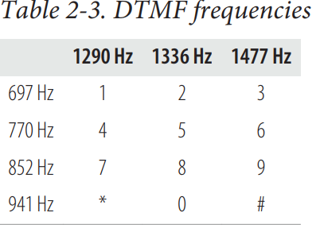

سیگنال‌های شبکه تلفن به طور مشابهی ساختار یافته‌اند. به عنوان مثال، سیگنال اشغال ترکیبی از فرکانس‌های 480 و 620 هرتز است. کارت خط مشترک اعداد شماره‌گیری شده را در مرکز تلفن یا سوئیچ تلفن تبدیل می‌کند تا آدرس مقصد را فراهم کند. این نقطه سوئیچینگ خدمات یا سیگنال‌دهی اعداد شماره‌گیری شده را دریافت کرده و اتصال را آغاز می‌کند و پیام‌ها را به دیگر گره‌های سیگنال‌دهی ارسال می‌کند. بر اساس موقعیت مقصد، سوئیچ‌های واسطه با هم ارتباط برقرار می‌کنند تا منابع لازم برای تماس را تخصیص دهند. یکی از این مذاکرات، کانالی در T-1 است که برای آن تماس استفاده خواهد شد. نقاط سیگنال‌دهی از جداول مسیریابی خود برای تعیین گروه خروجی و مدار مورد نیاز استفاده می‌کنند. نقطه سوئیچینگ خدمات مبدأ (SSP) پیام تنظیم را به SSP مقصد از طریق STP‌ها ارسال می‌کند و درخواست اتصال در مدار مشخص شده را می‌دهد. پس از تأیید، مدار تخصیص داده می‌شود.

در این میان، ممکن است پیام‌های دیگری مانند پاک‌سازی، پاسخ و ازدحام نیز وجود داشته باشد. یک نمونه از پیکربندی مدار را می‌توان در شکل 2-19 مشاهده کرد. بخشی که نشان داده شده است یک سوئیچ مرکزی را با چندین خط چندگانه در حال ورود و یک خط در حال خروج نشان می‌دهد. در سمت چپ، کاربران با استفاده از تکنیک چندگانه‌سازی تقسیم زمانی (TDM) در کانال‌های خود تقسیم می‌شوند، اما با رسیدن به سوئیچ بعدی، ممکن است به دلیل مقصد یا دسترسی به منابع، کانال‌ها نیاز به تغییر داشته باشند.


### برقراری مدار
پس از تنظیم مدار، مقصد از حامل تبادل محلی ولتاژ زنگ دریافت می‌کند. این یک سیگنال 75-90 ولت AC است که باعث زنگ زدن تلفن می‌شود. هنگامی که مقصد گوشی را برمی‌دارد و مشتریان شروع به مکالمه می‌کنند، کدک‌ها در سوئیچ‌های هر دو انتها تبدیل‌های مدولاسیون کد پالس (PCM) را همان‌طور که قبلاً در این فصل توضیح داده شده و در فصل 5 به تفصیل شرح داده شده است، انجام می‌دهند. در مبدا، صدا به نمونه‌های دیجیتال تبدیل می‌شود و در مقصد، فرآیند معکوس انجام می‌شود. بنابراین، هنگامی که صدای طرف مقابل را می‌شنوید، در واقع یک بازسازی معقول از صداهای واقعی تولید شده توسط شخص در طرف دیگر است.

### گذار به سیستم‌های تلفنی جدید
همان‌طور که از یک نوع سیستم تلفن به دیگری انتقال می‌یابیم و حتی به VoIP منتقل می‌شویم، ایده‌های اساسی توصیف‌شده در اینجا همچنان صادق است. با این حال، حتی اگر همان فرآیندها و عملکردها ادامه داشته باشند، چگونگی و مکان وقوع آن‌ها به طور کامل تغییر می‌کند. به عنوان مثال، صدای زنگ ممکن است به صورت محلی تولید شود و یک کدک می‌تواند در خود تلفن وجود داشته باشد.

### خلاصه
شرکت‌ها و سازمان‌ها با نرخ‌های فزاینده‌ای به VoIP (صدا از طریق پروتکل اینترنت) و ارتباطات یکپارچه روی می‌آورند. برخی از این سیستم‌ها را قبلاً پیاده‌سازی کرده‌اند یا در حال مهاجرت هستند. بدون توجه به وضعیت فعلی پیاده‌سازی، مدیران VoIP نمی‌توانند از اتصالات و ایده‌های تلفنی سنتی چشم‌پوشی کنند. حتی اگر سیستم در حال حاضر به صورت بومی VoIP اجرا شود، در نهایت باید به PSTN و معماری SS7 متصل شود.

ایده‌های مرکزی شامل سیم‌کشی تلفن از تلفن به PBX و اتصالات به ارائه‌دهنده است. در میان این اتصالات، استفاده از حامل‌های T خارج از سایت و ISDN همچنان محبوب است. این فصل پوششی از این زمینه‌ها و توضیح پردازش تماس همراه با اجزا، معماری و سازمان‌های مرتبط ارائه می‌دهد.

In the context of telephone call operations within the Signaling System No. 7 (SS7) network, an SSP (Service Switching Point) plays a crucial role. Here’s a detailed explanation:

### Service Switching Point (SSP) in Telephone Call Operation

1. **Definition and Function**:
    - An SSP is a type of switch that initiates or terminates telephone calls. It is capable of understanding and handling various signaling types and interfaces.
    - It is essentially a local exchange switch that is SS7-capable, allowing it to communicate with other SS7 components such as Signal Transfer Points (STPs) and other SSPs.

2. **Role in Call Setup**:
    - **Dialed Number Interpretation**: When a user dials a number, the SSP interprets these digits to determine the destination address.
    - **Connection Initiation**: The SSP starts the call setup process by sending signaling messages to other nodes in the SS7 network, including STPs and possibly other SSPs.
    - **Resource Allocation**: It negotiates the allocation of resources necessary for the call, such as determining the appropriate trunk group and circuit needed to route the call.

3. **Communication with Other Nodes**:
    - **Signaling Messages**: The SSP sends a setup message to the destination SSP via the STPs. This message requests a connection on a specified circuit.
    - **Routing Decisions**: Using its routing tables, the SSP identifies the outgoing trunk group and circuits required to route the call efficiently.

4. **Circuit Establishment**:
    - Once the destination SSP acknowledges the setup message, the circuit is allocated, and the call can proceed.
    - Additional messages such as clearing, answer, and congestion control are exchanged to manage the call's lifecycle.

5. **Ring Voltage and Conversation**:
    - Upon successful circuit setup, the destination SSP sends a ringing voltage to the called party’s telephone, causing it to ring.
    - When the called party answers, the conversation begins, and the SSP manages the conversion of analog voice signals to digital form (and vice versa) using codecs. This conversion process ensures that voice communication is effectively transmitted over the network.

### Example Scenario
1. **Call Initiation**:
    - A user picks up their telephone and dials a number. The local SSP receives the dialed digits.
2. **Setup Message**:
    - The SSP interprets the digits, identifies the destination SSP, and sends a setup message via the STP network.
3. **Resource Allocation**:
    - The originating SSP and destination SSP negotiate the allocation of necessary resources, such as determining the specific channel in the T-1 line for the call.
4. **Call Ringing**:
    - The destination SSP sends a ringing voltage to the destination telephone, causing it to ring.
5. **Conversation**:
    - Once the destination party answers, the codecs in the SSPs at both ends handle the conversion between analog voice and digital signals, allowing the conversation to take place.

### Importance of SSP
- The SSP is crucial for ensuring that calls are correctly routed, resources are efficiently used, and that the call setup, management, and teardown processes are handled smoothly.
- It is a key component in both traditional PSTN networks and modern VoIP systems, bridging the gap between different types of telecommunication technologies.

In summary, the SSP is an essential switch in the SS7 network that manages the initiation, routing, and termination of telephone calls, ensuring seamless communication across the network.


------------

The passage describes the process of how traditional analog telephones, operating on a local loop provisioned for Plain Old Telephone Service (POTS), interact with the local telephone network or switch. Here is an explanation of the key points:

### Analog Telephones on a Local Loop

1. **Local Loop and POTS**:
    - The **local loop** is the physical connection between the subscriber's telephone and the local telephone exchange (or switch).
    - **POTS (Plain Old Telephone Service)** is the traditional analog telephone service that has been in use for many decades. It uses the local loop to connect telephones to the public switched telephone network (PSTN).

2. **Receiving a Dial Tone**:
    - When you pick up the receiver of an analog telephone, you hear a **dial tone**. This dial tone is generated by the local telephone switch and indicates that the switch is ready to accept a telephone number for dialing.

3. **Dialing a Number**:
    - When you dial a telephone number, the telephone converts the dialed digits into **analog signals** and sends them to the local telephone switch. These signals are **audible tones**, meaning you can hear them if you listen on the line.

4. **Dual-Tone Multifrequency (DTMF)**:
    - The signaling method used by analog telephones to send the dialed number to the switch is called **Dual-Tone Multifrequency (DTMF)**.
    - DTMF works by sending a pair of tones for each digit dialed. One tone represents the row and another represents the column of the digit on the keypad. Each digit on the telephone keypad is associated with a unique pair of tones.
    - For example, pressing the digit '1' on the keypad sends two specific frequencies corresponding to the row and column of '1' on the DTMF keypad.

5. **Interacting with Systems**:
    - DTMF tones are also used to interact with automated systems, such as voicemail menus, customer service menus, and other interactive voice response (IVR) systems. By pressing keys on the telephone keypad, users can navigate through these systems by sending DTMF signals.

### Detailed Explanation

- **Local Loop and POTS**: The local loop is the physical pair of wires that connects the user's home telephone to the local central office (telephone exchange). POTS uses these wires to carry analog voice signals.
  
- **Dial Tone**: When the receiver is lifted, the switch detects this action and sends a continuous dial tone to the telephone, indicating readiness to receive dialed numbers. This tone is generated by the local exchange switch and is a standard feature of POTS.

- **Dialing Process**:
  - As the user dials a number, each press of a keypad button generates a specific pair of frequencies (a high and a low frequency), which together form a unique tone for each digit.
  - These tones are sent through the local loop to the central office switch.

- **DTMF Signaling**:
  - **Frequency Pairs**: Each button on the phone's keypad is mapped to a pair of specific frequencies:
    - Low-frequency group: 697 Hz, 770 Hz, 852 Hz, 941 Hz
    - High-frequency group: 1209 Hz, 1336 Hz, 1477 Hz, 1633 Hz
  - For example, pressing '5' generates a combination of 770 Hz and 1336 Hz tones.

- **Interaction with Systems**: In addition to dialing telephone numbers, DTMF tones allow users to interact with automated phone systems by pressing buttons to navigate menus. This capability makes it possible to access services like voicemail, banking systems, and customer support lines without human intervention.

### Summary

The process described shows how traditional analog telephones communicate with the telephone network using DTMF tones. When a user dials a number, the telephone generates a pair of specific frequencies for each digit, sending these audible tones to the local exchange switch. This mechanism enables both dialing telephone numbers and interacting with automated systems through key presses.

### Dual-Tone Multifrequency (DTMF)

DTMF is a signaling system used for telecommunication signaling over analog telephone lines in the voice-frequency band between telephone handsets and other communication devices and the switching center. It is commonly known as "touch-tone" dialing.

### How DTMF Works

The DTMF system uses a matrix of 16 distinct tones, each associated with a key on the telephone keypad. The tones are generated in pairs: one from a set of low frequencies and one from a set of high frequencies. When a key is pressed, the corresponding pair of frequencies is sent over the telephone line.

### Frequency Table

Here's a table showing the frequency pairs used in DTMF:

|      | 1209 Hz | 1336 Hz | 1477 Hz | 1633 Hz |
|------|---------|---------|---------|---------|
| 697 Hz |   1    |    2    |    3    |    A    |
| 770 Hz |   4    |    5    |    6    |    B    |
| 852 Hz |   7    |    8    |    9    |    C    |
| 941 Hz |   *    |    0    |    #    |    D    |

### Example of DTMF

#### Pressing the Number "5"

- **Frequencies Involved**: 
  - Low frequency: 770 Hz
  - High frequency: 1336 Hz

When you press the "5" key on the keypad, the phone generates a tone composed of both 770 Hz and 1336 Hz frequencies simultaneously. This unique combination identifies the digit "5" to the telephone network.

#### Pressing the Number "9"

- **Frequencies Involved**: 
  - Low frequency: 852 Hz
  - High frequency: 1477 Hz

When you press the "9" key on the keypad, the phone generates a tone composed of both 852 Hz and 1477 Hz frequencies simultaneously. This combination uniquely identifies the digit "9".

### DTMF Tone Generation

To illustrate how DTMF works with another example, consider the process of dialing the number "123":

1. **Press "1"**:
   - Low frequency: 697 Hz
   - High frequency: 1209 Hz

2. **Press "2"**:
   - Low frequency: 697 Hz
   - High frequency: 1336 Hz

3. **Press "3"**:
   - Low frequency: 697 Hz
   - High frequency: 1477 Hz

Each time a key is pressed, the telephone generates the corresponding pair of frequencies, which are then sent down the line to the telephone switch. The switch decodes these frequencies to understand which numbers were dialed.

### Interacting with Automated Systems

DTMF is also used for interacting with automated voice response systems. For example, when calling a customer service line, you might hear an automated message saying, "Press 1 for English, Press 2 for Spanish." When you press "1," your phone sends the 697 Hz and 1209 Hz tones to the system, which interprets it as a request for English language support.

### Summary

DTMF is a method used by telephones to communicate dialed numbers and commands to the telephone network. It works by generating pairs of audible tones for each key pressed on the phone keypad. These tones are recognized and interpreted by the telephone exchange to route calls and interact with automated systems.

-----------

### T-1 Line Overview

A T-1 line is a type of high-speed digital communication line used to transmit voice and data between locations. It is one of the standards in the family of T-carrier systems developed by Bell Labs and is primarily used in North America and Japan.

### Specifications and Structure

- **Data Rate**: A T-1 line has a data rate of 1.544 megabits per second (Mbps).
- **Channels**: It is divided into 24 individual channels, each capable of carrying 64 kilobits per second (Kbps).
- **Framing**: The most common framing format for T-1 is called D4 or Superframe (SF), which groups 12 frames into a superframe. Another common format is Extended Superframe (ESF), which groups 24 frames and provides additional features.

### How T-1 Works

1. **Multiplexing**:
    - **Time Division Multiplexing (TDM)**: T-1 lines use TDM to divide the 1.544 Mbps into 24 separate channels. Each channel is assigned a specific time slot in a repeating sequence.
    - **Voice and Data**: Each channel can carry a voice call or data. For voice, each channel uses Pulse Code Modulation (PCM) to convert analog voice signals into digital form.

2. **Signaling**:
    - **Robbed-bit Signaling**: In traditional telephony, one bit from each channel's 8-bit byte is "robbed" for signaling purposes, reducing the effective data rate slightly but allowing for call setup and teardown signals.

### Example Use Case

#### Scenario: Connecting Two Offices

Imagine two offices, Office A and Office B, need to communicate regularly. They can use a T-1 line to connect their private branch exchanges (PBXs), allowing for multiple simultaneous phone calls and data transfer between the offices.

1. **Installation**:
    - The T-1 line is installed by the telecommunications provider, connecting Office A and Office B.
    - Each office has a T-1 CSU/DSU (Channel Service Unit/Data Service Unit) that interfaces between the T-1 line and the office’s network equipment.

2. **Voice Communication**:
    - Office A has a PBX that routes internal and external phone calls.
    - When a call is made from Office A to Office B, the PBX sends the call over one of the 24 channels on the T-1 line.
    - The TDM technique ensures that each channel is allocated a specific time slot, allowing multiple calls to be carried simultaneously without interference.

3. **Data Communication**:
    - In addition to voice, the offices can use the T-1 line for data communication.
    - For instance, Office A can send large files or run a video conference over the T-1 line using the available channels not in use for voice calls.

### Technical Details

1. **Physical Medium**:
    - T-1 lines typically use twisted-pair copper wires, though they can also be delivered over fiber optics or microwave radio links.

2. **Line Coding**:
    - **Bipolar with Eight-Zero Substitution (B8ZS)**: This is a common line coding method used to ensure a sufficient number of transitions to maintain synchronization.

3. **Framing**:
    - **D4 Framing**: Divides the data into frames of 192 bits, with each frame containing 24 channels of 8 bits each, plus an additional framing bit.
    - **Extended Superframe (ESF)**: Enhances D4 by providing 24 frames in a superframe, adding improved error detection and additional data channels.

### Benefits

- **Reliability**: T-1 lines are known for their reliability and dedicated bandwidth.
- **Scalability**: Businesses can combine multiple T-1 lines to increase bandwidth (e.g., a T-3 line, which is equivalent to 28 T-1 lines).
- **Consistency**: Unlike some internet connections, T-1 lines provide consistent and guaranteed bandwidth.

### Summary
A T-1 line is a digital transmission link capable of carrying 24 separate channels of voice or data at a total data rate of 1.544 Mbps. It uses TDM to allocate bandwidth and can be used for both voice and data communication, making it a versatile and reliable solution for businesses needing consistent and high-capacity connections.


# Introduction
به نظر می‌رسد که رقابت همیشه بخشی از پروتکل‌های شبکه بوده است، همان‌طور که فروشندگان، محصولات یا پروتکل‌ها برای برتری در بازار به رقابت می‌پردازند. Appletalk در برابر TCP/IP و 802.11g در برابر 802.11a مثال‌هایی از این رقابت‌ها هستند. پروتکل‌های شبکه محلی مانند Token Ring، Ethernet و Fiber Distributed Data Interchange نیز برای مدتی طولانی با یکدیگر به رقابت پرداختند. نمونه‌های کوچک‌تر، مانند انتخاب پروتکل trunking، در فرآیندهای تصمیم‌گیری ما پراکنده شده‌اند. معمولاً این رقابت‌ها ادامه پیدا می‌کند تا اینکه یکی به استاندارد دِفَکتو (غیررسمی ولی پذیرفته‌شده) تبدیل شود یا از میدان خارج گردد.

در Voice over IP (VoIP) نیز متفاوت نیست. این کتاب چندین پروتکل سیگنالینگ مختلف را پوشش می‌دهد که همگی یک مجموعه از وظایف را انجام می‌دهند. اما کدام یک انتخاب صحیح است؟ چند سال پیش، به دلیل تنوع تجهیزات مورد استفاده، فروشندگان و تجهیزات قدیمی، انتخاب واضح نبود. امروزه، بیشتر حرفه‌ای‌ها توافق دارند که پروتکل Session Initialization Protocol (SIP) انتخاب صحیح برای آینده خواهد بود.

در SIP یک پروتکل مهندسی شده توسط Internet Engineering Task Force است که در RFC 3261 استاندارد شده است، اگرچه چندین RFC همراه نیز وجود دارند. این یک پروتکل سیگنالینگ غیر مالکیتی است که اکنون توسط تقریباً تمامی فروشندگان در صنعت VoIP پشتیبانی می‌شود. اگرچه یک پایه نصب‌شده قابل توجه از سیستم‌های با پروتکل‌های Skinny و H.323 وجود دارد، ساختارهای شبکه جدیدتر احتمالاً SIP را بر دیگر پروتکل‌ها ترجیح خواهند داد. همانند دیگر پروتکل‌های سیگنالینگ، SIP نیز به پروتکل RealTime Transport Protocol (RTP) برای انتقال بسته‌های صوتی بین منبع و مقصد متکی است. علاوه بر این، RFC 3261 نشان می‌دهد که سایر پروتکل‌های پشتیبانی (مانند MEGACO برای کنترل عملکردهای دروازه به شبکه PSTN) می‌توانند بخشی از یک پیاده‌سازی SIP باشند. SIP همچنین دارای نسخه امن بوده و به طور گسترده‌ای برای trunking بین سیستم‌ها استفاده می‌شود.

# Protocol Description
کار اولیه روی پروتکل SIP به سال 1999 و RFC 2543 برمی‌گردد. SIP در لایه کاربرد عمل می‌کند و هدف آن آغاز جلسات کاربری برای انتقال چندرسانه‌ای مانند صدا، ویدئو، چت، بازی و واقعیت مجازی است. این جلسات می‌توانند به صورت تک‌پخشی (unicast) یا چندپخشی (multicast) باشند و می‌توانند با یا بدون سرور تماس یا دروازه (gateway) عمل کنند. طبق RFC، یک جلسه تبادل داده بین شرکت‌کنندگان است. SIP از خدمات نقشه‌برداری نام و هدایت پشتیبانی می‌کند، ویژگی‌هایی که اجازه می‌دهند کاربران از مکان‌های مختلف قابل دسترسی باشند یا داده‌ها را انتقال دهند.

برای کسانی که با اصطلاحات RFC راحت نیستند، این به معنای آن است که وقتی گره‌های VoIP به یکدیگر متصل می‌شوند، باید مکانیسمی برای تنظیم ارتباط و تعیین برخی قوانین وجود داشته باشد. SIP و پروتکل توصیف جلسه (SDP) این کار را انجام می‌دهند.

از آنجا که SIP مجموعه‌ای از ویژگی‌ها و کدک‌های مشابه را پشتیبانی می‌کند، گاهی همراه با H.323 یا Skinny به منظور ارائه برنامه‌ها یا ویژگی‌های جدیدتر به کار می‌رود. اغلب گفته می‌شود که خواندن و استفاده از SIP بسیار آسان‌تر از دیگر پروتکل‌های سیگنالینگ غیر مالکیتی است. این ممکن است به این دلیل باشد که ساختار SIP بسیار شبیه به پروتکل انتقال ابرمتن (HTTP) است. ما خواهیم دید که این ادعا تا حدی صحیح است. SIP همه چیزهایی را که H.323 سنگین ارائه می‌دهد، انجام نمی‌دهد (که در فصل 6 توضیح داده شده است). این پروتکل فقط برای تنظیم و قطع جلسات رسانه‌ای طراحی شده است. وظایف دیگر شامل مکان‌یابی کاربر و قابلیت‌ها، در دسترس بودن و اطلاعات مربوط به مدیریت جلسه می‌شود. اگر فصل مربوط به H.323 را خوانده باشید، ممکن است متوجه شده باشید که H.323 بسیار پیچیده است و اغلب سعی می‌کند اطلاعاتی را مذاکره کند یا ارائه دهد که ممکن است استفاده نشود.

از آنجا که SIP همه چیز را مدیریت نمی‌کند، پیاده‌سازی‌ها از پروتکل دیگری به نام پروتکل توصیف جلسه (SDP) برای مذاکره در مورد پارامترهای اتصال چندرسانه‌ای استفاده می‌کنند. فراتر از این، توپولوژی‌های SIP به همان شیوه‌ای که هر پیکربندی VoIP دیگر عمل می‌کنند. وظیفه ما در این فصل این است که بفهمیم چگونه این کار انجام می‌شود. شکل 1-16 در فصل 1 یک استقرار معمولی VoIP را نشان داد. ما از یک توپولوژی مشابه که در شکل 3-1 دیده می‌شود، برای این فصل استفاده خواهیم کرد.

شبکه با یک PBX VoIP (مبادله شعبه خصوصی) به شکل یک جعبه Asterisk، یک سرور پروتکل انتقال فایل ساده (TFTP)، یک سرور پروتکل پیکربندی پویای میزبان (DHCP) و یک سوئیچ که توان را از طریق اترنت (PoE) فراهم می‌کند، تجهیز شده است. سوئیچ همچنین با پورت‌های آینه‌دار برای گرفتن بسته‌های داده پیکربندی شده است.

```
???
Local area network protocols such as Token Ring, Ethernet, and Fiber Distributed Data Interchange battled it out for quite some time. Smaller examples, such as the selection of a trunking protocol, are sprinkled throughout our decision processes. Usually the competition goes on until one becomes the de facto standard or drops out of the race.
???
```

```
???
Additionally, RFC 3261 indicates that other supporting protocols (such as MEGACO for controlling gateway functions to the PSTN) may be part of a SIP deployment.
???
```

# Components
When reading about SIP, it is helpful to understand a couple of SIP-specific terms. The following components are the most common.

## User Agent (UA)
Logical portion that initiates or responds to SIP transactions. The UA can be a client or server and is stateful, so it maintains the session.

بخش منطقی که تراکنش‌های SIP را آغاز یا به آن‌ها پاسخ می‌دهد. UA می‌تواند یک کلاینت یا سرور باشد و حالت‌مند است، بنابراین جلسه را حفظ می‌کند.

## User Agent Client (UAC)
Initiates requests and accepts responses. Typically, it is the SIP phone initiating the call.

## User Agent Server (UAS)
Accepts requests and sends back responses.


## پراکسی
یک مؤلفه واسط که درخواست‌ها را از UAC به UAS یا یک پراکسی دیگر فوروارد می‌کند. این کار عمدتاً برای مسیریابی انجام می‌شود، اما می‌تواند سیاست‌هایی مانند احراز هویت را اعمال کند. یک نمونه از استقرار استاندارد، پراکسی وب است. کلاینت‌ها درخواست‌های وب را به پراکسی ارسال می‌کنند و پراکسی درخواست‌ها را به سرورهای وب ارسال می‌کند. بنابراین، کلاینت‌ها هرگز مستقیماً با سرور وب ارتباط برقرار نمی‌کنند.

## سرور هدایت‌کننده
درخواست‌ها را از UAC به مجموعه‌ای دیگر از شناسه‌های منبع یکنواخت (URIs) ارسال می‌کند.

## سرور ثبت‌کننده
UAS که پیام‌های REGISTER را قبول می‌کند و مکان را به‌روزرسانی می‌کند.

این توپولوژی اکنون شامل عامل‌های SIP سمت کلاینت و سرور است. در حال حاضر برچسبی برای سایر مؤلفه‌ها ندارد زیرا یک سیستم تلفنی ایزوله است که به خارج تماس نمی‌گیرد.


## Addressing
مکالمات SIP می‌توانند با تماس با یک آدرس IP یا نام کاربری آغاز شوند تا به UAC اجازه دهند با کاربر یا منبع دیگری در شبکه ارتباط برقرار کند. آدرس‌دهی استاندارد SIP مشابه ایمیل است و به یکی از اشکال زیر صورت می‌گیرد (پورت اختیاری است و اگر مشخص نشود، 5060 استفاده می‌شود):

- sip:user@domain:port
- sip:user@host:port
- sip:phone number@domain

مثال دیگری از آدرس‌دهی SIP در شکل 3-3 نشان داده شده است. فرمت آن، شناسه منبع یکنواخت یا URI است. طبق RFC، آدرس SIP یا هویت شما همان URI SIP شما است. از RFC 3261:

آلیس با استفاده از هویت SIP باب، که نوعی شناسه منبع یکنواخت (URI) به نام SIP URI است، با او تماس می‌گیرد. SIP URI‌ها در بخش 19.1 تعریف شده‌اند. آنها فرمی مشابه یک آدرس ایمیل دارند و معمولاً شامل نام کاربری و نام میزبان می‌شوند. در این مورد، آن sip:bob@biloxi.com است، جایی که biloxi.com دامنه ارائه‌دهنده خدمات SIP باب است. آلیس یک SIP URI به شکل sip:alice@atlanta.com دارد. آلیس ممکن است URI باب را تایپ کرده باشد یا شاید روی یک لینک کلیک کرده باشد یا ورودی‌ای در دفترچه آدرس باشد. SIP همچنین یک URI امن به نام SIPS URI فراهم می‌کند. یک مثال sips:bob@biloxi.com خواهد بود.

URI معمولاً آدرس IP یا نام دامنه کاملاً واجد شرایط (FQDN) میزبان است. به جای sip، URI می‌تواند با sips شروع شود، که نشان‌دهنده یک URI SIP امن است که از پورت 5061 استفاده می‌کند. نوع آدرس‌دهی به توپولوژی شبکه و خدمات پیاده‌سازی شده بستگی دارد. برای مثال، توپولوژی مورد استفاده در این فصل ایمیل یا سرور نام دامنه ندارد.

RFC 3261 توصیه می‌کند از نام‌های دامنه کاملاً واجد شرایط (FQDN) برای آدرس‌دهی استفاده شود، اگرچه به دلیل سادگی در اینجا استفاده نشده‌اند. بنابراین، پیاده‌سازی‌های SIP معمولاً با سیستم‌های نام دامنه، یا DNS، یکپارچه می‌شوند.

هر URI حاوی آدرس ثبت‌شده SIP (AOR) است که گاهی به عنوان آدرس عمومی برای یک کاربر در نظر گرفته می‌شود. AOR به دامنه کاربر اشاره می‌کند. در آن دامنه، باید سرویسی وجود داشته باشد که URI را به URI موقعیت فعلی کاربر نقشه‌برداری کند. به عبارت دیگر، این همان آدرس عمومی کاربر است. به عبارت دیگر، این همان روشی است که کسی می‌تواند با شما تماس بگیرد.


## Fully Qualified Domain Name (FQDN)
در Fully Qualified Domain Name (FQDN) به معنای نام دامنه کاملاً واجد شرایط است و یک نام دامنه کامل است که به‌طور دقیق موقعیت یک کامپیوتر یا میزبان در سلسله مراتب DNS (Domain Name System) را مشخص می‌کند. یک FQDN شامل نام میزبان و تمام سطوح دامنه است که از ریشه DNS شروع شده و به سمت بالا حرکت می‌کند. فرمت کلی یک FQDN به صورت زیر است:

```
hostname.domain.tld
```

در اینجا:
- `hostname`: نام میزبان (مثلاً `www` یا `mail`)
- `domain`: نام دامنه (مثلاً `example`)
- `tld`: دامنه سطح بالا (مثلاً `com`, `org`, `net`)

برای مثال، در FQDN `www.example.com`:
- `www` نام میزبان است.
- `example` نام دامنه است.
- `com` دامنه سطح بالا (TLD) است.

یک FQDN همیشه به یک نقطه در پایان خود ختم می‌شود که ریشه DNS را نشان می‌دهد، اگرچه این نقطه معمولاً در نوشتار روزمره حذف می‌شود. استفاده از FQDN در آدرس‌دهی شبکه و پیکربندی سرورها بسیار رایج است، زیرا به وضوح مسیر دسترسی به منابع را در اینترنت یا شبکه‌های داخلی مشخص می‌کند.


هر URI شامل آدرس ثبت‌شده SIP (AOR) است که گاهی به عنوان آدرس عمومی برای یک کاربر در نظر گرفته می‌شود. AOR به دامنه کاربر اشاره می‌کند. در آن دامنه، باید سرویسی وجود داشته باشد که URI را به URI موقعیت فعلی کاربر نقشه‌برداری کند. به عبارت دیگر، این همان آدرس عمومی کاربر است. به عبارت دیگر، این همان روشی است که کسی می‌تواند با شما تماس بگیرد.

برای توضیح بیشتر، بیایید به این مفهوم با جزئیات بیشتری نگاه کنیم:

### 1. **آدرس ثبت‌شده SIP (AOR) چیست؟**
آدرس ثبت‌شده SIP (Address of Record یا AOR) آدرس عمومی کاربر در شبکه SIP است. این آدرس مشابه آدرس ایمیل است و شامل نام کاربری و دامنه می‌شود. برای مثال، `sip:alice@example.com` یک AOR است که نشان می‌دهد آلیس در دامنه `example.com` ثبت شده است.

### 2. **نقش AOR چیست؟**
AOR نقش آدرس اصلی کاربر را ایفا می‌کند که دیگران می‌توانند از طریق آن با کاربر تماس بگیرند. وقتی کسی می‌خواهد با شما تماس بگیرد، از AOR شما استفاده می‌کند. این آدرس عمومی شما در شبکه SIP است.

### 3. **نقشه‌برداری URI به موقعیت فعلی کاربر**
در داخل دامنه‌ای که AOR به آن اشاره می‌کند، باید سرویسی وجود داشته باشد که بتواند URI AOR را به URI موقعیت فعلی کاربر نقشه‌برداری کند. این بدان معناست که ممکن است کاربر در یک مکان یا دستگاه خاص در لحظه حاضر باشد و سرویس مربوطه باید بداند که کاربر کجا و روی چه دستگاهی قرار دارد.

### 4. **چگونه کار می‌کند؟**
فرض کنید شما آدرس `sip:alice@example.com` دارید. وقتی کسی می‌خواهد با شما تماس بگیرد، از این آدرس استفاده می‌کند. سرور SIP در دامنه `example.com` درخواست را دریافت می‌کند و سپس بررسی می‌کند که آلیس در حال حاضر در کجا و روی چه دستگاهی قرار دارد. ممکن است آلیس در دفتر، خانه یا روی گوشی همراهش باشد. سرور SIP URI آلیس را به URI موقعیت فعلی او ترجمه می‌کند و تماس را به آنجا هدایت می‌کند.

### مثال
فرض کنید آلیس در حال حاضر با آدرس `sip:alice@home.example.com` آنلاین است. وقتی کسی با `sip:alice@example.com` تماس می‌گیرد، سرور SIP در `example.com` این درخواست را به `sip:alice@home.example.com` ترجمه می‌کند و تماس به آلیس در خانه‌اش هدایت می‌شود.

به طور خلاصه، AOR مانند یک آدرس عمومی است که همه می‌توانند برای تماس با شما از آن استفاده کنند و سرویس‌های شبکه SIP وظیفه دارند تماس‌ها را به موقعیت فعلی شما هدایت کنند.

## Basic Operation
مثل بیشتر توپولوژی‌های VoIP، عملکرد شبکه SIP با مجموعه‌ای از مکالمات آغاز می‌شود که ارتباطی با صدا ندارند. اولین کاری که گره‌ها باید انجام دهند این است که یک آدرس IP از سرور DHCP دریافت کنند، همان‌طور که توپولوژی به‌روزرسانی شده در شکل 3-4 نشان می‌دهد.

---

در BOOTP (Bootstrap Protocol) یک پروتکل شبکه است که در شبکه‌های IP استفاده می‌شود تا کامپیوترها بتوانند بدون نیاز به پیکربندی دستی، آدرس‌های IP، اطلاعات مربوط به سرورهای شبکه، و تنظیمات شبکه دیگر را دریافت کنند. BOOTP پیش‌زمینه‌ای برای پروتکل DHCP (Dynamic Host Configuration Protocol) است که امروزه به طور گسترده‌تر مورد استفاده قرار می‌گیرد.

---

هر دو UAC (کاربر عامل SIP) به آدرس‌های IP نیاز دارند. اگر بسته‌های مربوط به فرایند BOOTP را از هر گره ردیابی و فیلتر کنیم، می‌توانیم مکالمات مربوطه را مشاهده کنیم (شکل 3-5). تلفن‌های VoIP که در این توپولوژی استفاده شده‌اند، در برخی از فصل‌های دیگر نیز مورد استفاده قرار گرفته‌اند. این به این معنی است که آنها می‌توانند از چندین پروتکل سیگنال‌دهی مختلف استفاده کنند. هنگام سوئیچ بین این پروتکل‌ها یا اطمینان از استفاده از آخرین پیکربندی، تلفن‌ها با سرور TFTP تماس می‌گیرند، همان‌طور که در شکل 3-6 نشان داده شده است.

هر دو UAC (کاربر عامل SIP) به آدرس‌های IP نیاز دارند. اگر بسته‌های مربوط به فرایند BOOTP را از هر گره ردیابی و فیلتر کنیم، می‌توانیم مکالمات مربوطه را مشاهده کنیم (شکل 3-5). تلفن‌های VoIP که در این توپولوژی استفاده شده‌اند، در برخی از فصل‌های دیگر نیز مورد استفاده قرار گرفته‌اند. این به این معنی است که آنها می‌توانند از چندین پروتکل سیگنال‌دهی مختلف استفاده کنند. هنگام سوئیچ بین این پروتکل‌ها یا اطمینان از استفاده از آخرین پیکربندی، تلفن‌ها با سرور TFTP تماس می‌گیرند، همان‌طور که در شکل 3-6 نشان داده شده است.


با نگاهی دقیق به شماره بسته‌ها و آدرس‌های IP، می‌توانیم ببینیم که برای آدرس 172.30.1.11، این مکالمه پس از مکالمه DHCP رخ داده است. برای یک حرفه‌ای شبکه، این موضوع تنها منطقی است، اما همچنین بخش دیگری از پیکربندی توپولوژی را برجسته می‌کند: آدرس سرور TFTP توسط سرور DHCP ارائه می‌شود. پیکربندی پایه سرور DHCP روتر سیسکو به صورت زیر است:

```
ip dhcp pool voip
network 172.30.1.0 255.255.255.0
default-router 172.30.1.254
next-server 172.30.1.99
option 150 ip 172.30.1.99
option 176 ascii "TFTPSRVR=172.30.1.99,MCIPADD=172.30.1.1"
```

دستورات `next-server`، `option 176` و `option 150` همگی برای اختصاص آدرس TFTP استفاده می‌شوند، اگرچه فقط یکی از آنها ضروری است. آنها در اینجا نشان داده شده‌اند زیرا مطابقت دادن بهترین روش با تلفن همیشه آسان نیست. در این نقطه، توپولوژی به مرحله‌ای که در شکل 3-7 نشان داده شده است، منتقل شده است.

آخرین مکالمه‌ای که قبل از اینکه یک تلفن بتواند تماس بگیرد لازم است، ثبت‌نام با سرور تماس است. این کار، به‌طور غیرمعمول، از طریق اولین پیام SIP ما انجام می‌شود: REGISTER. این پیام بخشی از تبادل با PBX است، همان‌طور که در شکل 3-8 نشان داده شده است.


آخرین مکالمه‌ای که قبل از اینکه یک تلفن بتواند تماس بگیرد لازم است، ثبت‌نام با سرور تماس است. این کار، به‌طور غیرمعمول، از طریق اولین پیام SIP ما یعنی REGISTER انجام می‌شود. این پیام بخشی از تبادل با PBX است، همان‌طور که در شکل 3-8 نشان داده شده است. 

پس از اینکه تلفن آدرس سرور تماس را دریافت کرد، پیام SIP REGISTER را ارسال می‌کند. پیام REGISTER در شکل 3-9 نشان داده شده است. از این بسته، می‌توانیم ببینیم که SIP از پورت 5060 و پروتکل UDP استفاده می‌کند. در این مورد، UDP پروتکل حمل و نقل لایه ۴ برای SIP است. با این حال، در توپولوژی‌های دیگر، ممکن است از TCP استفاده شود. TCP معمولاً پروتکل پیش‌فرض لایه ۴ برای SIPS است. پیام همچنین شامل آدرس IP و URI است که برای ارتباط با این گره استفاده خواهد شد.


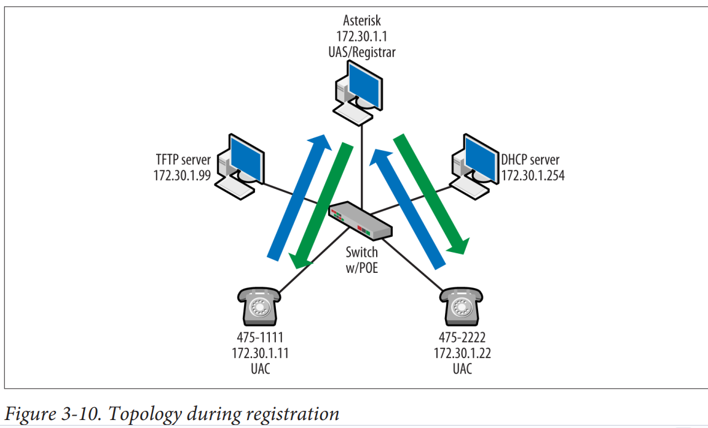

## SIP Messages and Message Structure
در SIP در یک RFC طولانی توصیف شده است، که بخشی از آن به دلیل تعداد پیام‌هایی است که تعریف می‌کند. مانند سایر پروتکل‌های سیگنال‌دهی، SIP دارای پیام‌هایی است که مخصوص عملیات‌های خاص هستند، اگرچه بسیاری از آنها زمینه‌های مشابهی دارند. RFC مربوط به SIP همچنین از اصطلاح METHOD استفاده می‌کند. یک METHOD یک عملکرد است و این عملکردها در یک نوع پیام بسته‌بندی می‌شوند. گره‌های SIP برای هر روش قوانینی دارند، اگرچه برخی از قوانین برای همه آنها مشترک است. به عنوان مثال، تمام درخواست‌های SIP باید شامل فیلدهای To، From، CSeq، Call-ID، Max-Forwards و Via باشند. این فیلدها در ادامه این فصل توضیح داده خواهند شد. این بخش اجزای مشترک را پوشش می‌دهد و پیام‌هایی که در یک دنباله تماس استاندارد دیده می‌شوند را مورد بحث قرار می‌دهد. یکی از دلایلی که باعث شده SIP یک هدر آشنا داشته باشد، این است که بر اساس RFC 3261، پیام‌های SIP از فرمت کلی مشخص شده برای پیام‌های اینترنتی که در RFC 5322 توصیف شده است، پیروی می‌کنند. این امر هم برای درخواست‌ها و هم برای پاسخ‌ها صادق است. RFC 5322 بر ارتباطات مبتنی بر متن متمرکز است و بنابراین SIP شامل مواردی شده است که در RFC 5322 مشخص نشده‌اند.

فرمت کلی پیام‌های SIP شامل یک خط شروع، هدرهای پیام و سپس یک خط خالی است که با یک کاراکتر برگشت خط و تغذیه خط پایان می‌یابد. خطوط شروع چند نوع دارند؛ برای پیام‌های درخواست، آنها خطوط درخواست هستند و برای پاسخ‌ها، آنها وضعیت‌ها هستند. شکل 3-9 خط شروع را نشان می‌دهد که یک خط درخواست است زیرا این یک پیام REGISTER است. بعد از خط شروع، هدرهای پیام می‌آیند که با توجه به نوع پیام متفاوت هستند. آخرین آیتم‌هایی که قابل مشاهده هستند، حداقل به صورت هگزادسیمال، کاراکترهای CR LF هستند.

شکل 3-11 همان پیام REGISTER را نشان می‌دهد با فیلدهایی که برای راحتی مشاهده اجزای اصلی پیام فشرده شده‌اند. دو پیکان به خط شروع و هدرهای پیام اشاره می‌کنند. اولین دایره مقادیر هگزادسیمال برای کاراکتر برگشت خط و تغذیه خط (0d 0a) را نشان می‌دهد، در حالی که دایره دوم اثرات آنها را نشان می‌دهد.


## Requests
برای روشن‌تر کردن موضوع، برای یک پیام درخواست SIP، خط شروع در واقع خط درخواست نامیده می‌شود. خط درخواست شامل URI و نسخه SIP است و با کاراکترهای CR LF پایان می‌یابد، همان‌طور که در شکل 3-12 نشان داده شده است. در تصویر، خط درخواست برجسته شده است.

درخواست‌های SIP حداقل باید شامل فیلدهای هدر زیر باشند: Via، From، To، Call-ID، CSeq و Max-Forwards. این فیلدها حاوی اطلاعات لازم برای مسیریابی، شناسایی و ترتیب‌بندی هستند.


## Responses
پاسخ‌های SIP مانند مورد نشان داده شده در شکل 3-13، دارای یک خط وضعیت برای شروع و یک کد وضعیت برای تراکنش هستند. در این مورد، سرور (172.30.1.1) کد وضعیت 200 را به تلفن VoIP بازمی‌گرداند، که نشان‌دهنده موفقیت است.

اگرچه این مورد موفقیت‌آمیز بود، کدهای متنوعی وجود دارند که می‌توانند بازگردانده شوند و هر کدام یک سناریوی کلی متفاوت را مدیریت می‌کنند. از RFC 3261:

- 1xx: موقت
  درخواست دریافت شد، پردازش درخواست ادامه دارد.
- 2xx: موفقیت
  عمل به‌طور موفقیت‌آمیز دریافت، درک و پذیرفته شد.
- 3xx: تغییر مسیر
  اقدام بیشتری لازم است تا درخواست تکمیل شود.
- 4xx: خطای مشتری
  درخواست حاوی نحو اشتباه است یا نمی‌تواند در این سرور انجام شود.
- 5xx: خطای سرور
  سرور نتوانست درخواست معتبر را انجام دهد.
- 6xx: شکست جهانی
  درخواست نمی‌تواند در هیچ سروری انجام شود.

بسته‌های پاسخ نیز برای کاراکترهای CR LF استفاده خاصی دارند، و همان‌طور که در شکل‌های 3-12 و 3-13 دیده می‌شود، هر دو درخواست‌ها و پاسخ‌ها شامل نسخه SIP در خط شروع هستند. خطوط هدر با نام فیلد شروع می‌شوند که با یک کولن و سپس مقدار آن دنبال می‌شود. برای مثال، در شکل 3-13، اولین فیلد با "Via: SIP/2.0/UDP 172.30.1.11:5060" شروع می‌شود.


---

کاراکترهای CR LF مخفف عبارت‌های "Carriage Return" و "Line Feed" هستند. این دو کاراکتر به ترتیب نمایانگر بازگشت به ابتدای خط و رفتن به خط جدید در سیستم‌های کامپیوتری هستند. این کاراکترها معمولاً به صورت جفت (CR LF) استفاده می‌شوند تا پایان یک خط و شروع خط جدید را نشان دهند.

### جزئیات بیشتر

- **Carriage Return (CR):** این کاراکتر به معنای بازگشت مکان‌نما به ابتدای خط جاری است. کد ASCII آن 13 است.
- **Line Feed (LF):** این کاراکتر به معنای انتقال مکان‌نما به خط بعدی است. کد ASCII آن 10 است.

### کاربرد در پروتکل‌ها و قالب‌های متن

در بسیاری از پروتکل‌ها و قالب‌های متن (مانند HTTP، SMTP و SIP)، از ترکیب CR LF برای پایان دادن به یک خط و شروع خط جدید استفاده می‌شود. به طور مثال، در SIP، هر خط از پیام با این کاراکترها پایان می‌یابد تا مرز بین خطوط مشخص شود.

### مثال

اگر بخواهیم یک پیام SIP را به صورت ساده نشان دهیم، می‌توانیم چیزی شبیه به این را ببینیم:

```
REGISTER sip:example.com SIP/2.0
Via: SIP/2.0/UDP 192.0.2.1:5060
From: <sip:user@example.com>
To: <sip:user@example.com>
Call-ID: 1234567890@example.com
CSeq: 1 REGISTER
Max-Forwards: 70
Content-Length: 0

```

در این مثال، هر خط با کاراکترهای CR LF پایان می‌یابد که باعث می‌شود سرور SIP بتواند خطوط را از هم جدا کرده و پیام را به درستی پردازش کند.

---

## Header Fields
همانطور که در توضیحات درخواست SIP ذکر شده است، برخی فیلدها در بخش بعدی بسته اجباری هستند. تعاریف زیر کلی هستند، زیرا فیلدها شرایط خاصی دارند یا رفتارشان وابسته به شرایط است. شکل 3-14 می‌تواند برای مقایسه بسته‌ها و کشف مقادیر فیلدهای سربرگ استفاده شود. این تصویر مقایسه‌ای از بسته‌های 112 و 114 از شکل 3-8 است.

### Via
این فیلد به نودهای درگیر اطلاع می‌دهد که بسته SIP را به کجا ارسال کنند. این فیلد دارای تعدادی قوانین است، که با نیاز به شروع با SIP/2.0 و جزئیات ارتباطی پشته آغاز می‌شود. بر اساس RFC، پارامتر شاخه "باید منحصر به فرد در طول زمان و مکان باشد" به جز در مورد ACK، CANCEL، یا پاسخ‌های غیر-2xx. علاوه بر این، پارامتر شاخه باید با "z9hG4bk" به عنوان یک کوکی جادویی هفت‌کاراکتری آغاز شود تا اطمینان حاصل شود که پیاده‌سازی‌های قدیمی‌تر که از RFC 2543 استفاده می‌کنند، از این مقادیر استفاده نخواهند کرد. این نشان می‌دهد که RFC 3261 برای انتقال استفاده شده است.


The "branch" parameter in the Via header of a SIP (Session Initiation Protocol) message is a unique identifier that helps to track the SIP requests and their corresponding responses. It is used to uniquely identify the transaction created by that request. Here's a more detailed explanation:

1. **Purpose**: The branch parameter is critical for identifying the transaction associated with a particular SIP message. This allows SIP entities (like proxies, UAs (User Agents), and registrars) to match responses to the correct requests, even when multiple transactions are ongoing simultaneously.

2. **Format**: The branch parameter is typically a globally unique identifier. For instance, it is common to see the branch parameter prefixed with the magic cookie "z9hG4bK-" followed by a unique string. The "z9hG4bK-" prefix helps ensure backward compatibility and uniqueness.

   Example:
   ```
   Via: SIP/2.0/UDP server10.example.com:5060;branch=z9hG4bK776asdhds
   ```

3. **Usage**:
   - When a SIP request is sent, the sender includes a Via header with a branch parameter.
   - Each SIP hop (like a proxy server) may add its own Via header with a unique branch parameter.
   - When a response is sent, it traverses the same path in reverse, matching the branch parameters in the Via headers to ensure that the response is correctly routed back to the original sender.

4. **Transaction Matching**: SIP entities use the branch parameter to match incoming responses to the original requests. This matching process is crucial for maintaining the correct state and processing of SIP dialogs and transactions.

In summary, the branch parameter in the Via header is essential for managing and correlating SIP transactions, ensuring the proper routing of responses in a SIP network.


Certainly! Let's break down the concept of the "branch" parameter in the Via header of SIP (Session Initiation Protocol) messages.

### What is SIP?

SIP is a protocol used for initiating, maintaining, and terminating real-time sessions that include voice, video, and messaging applications.

### What is the Via Header?

The Via header field in SIP is used to track the path taken by a request or a response through the SIP network. Each SIP entity that handles the message adds its own information to the Via header.

### What is the "branch" parameter?

The "branch" parameter in the Via header is used to identify each individual branch in a SIP transaction. This parameter helps distinguish between different transactions and different paths that a request might take.

### Example Explained

Let’s walk through an example where a SIP INVITE request is sent from one user agent (UA) to another through a SIP proxy.

1. **Initial INVITE Request**:
   - User A wants to call User B.
   - User A's SIP client (UA A) sends an INVITE request to User B via a SIP proxy.

2. **Via Header Added by User A**:
   - User A's SIP client will add a Via header with its own address and a unique branch parameter.
   ```plaintext
   Via: SIP/2.0/UDP userA.example.com;branch=z9hG4bK776asdhds
   ```

3. **Proxy Receives the Request**:
   - The SIP proxy receives the INVITE request.
   - The proxy adds its own Via header with a new branch parameter before forwarding the request to User B.
   ```plaintext
   Via: SIP/2.0/UDP proxy.example.com;branch=z9hG4bK1234567890
   Via: SIP/2.0/UDP userA.example.com;branch=z9hG4bK776asdhds
   ```

4. **User B Receives the Request**:
   - User B receives the INVITE request with both Via headers.
   - The branch parameter helps User B (and the proxy) keep track of the transaction.

### Importance of the Branch Parameter

- **Uniqueness**: The branch parameter must be unique for each transaction to ensure that responses are correctly matched to the original request.
- **Loop Detection**: It helps in detecting loops within the SIP network. If a request with the same branch parameter is received again, it indicates a loop.
- **Response Routing**: When User B sends a response (e.g., 200 OK), it will include the Via headers from the original request. Each SIP entity will use these headers to route the response back to the original sender.

### Example Scenario with Response

1. **User B Responds**:
   - User B sends a 200 OK response to the INVITE request.
   - The response includes the Via headers from the request.
   ```plaintext
   Via: SIP/2.0/UDP proxy.example.com;branch=z9hG4bK1234567890
   Via: SIP/2.0/UDP userA.example.com;branch=z9hG4bK776asdhds
   ```

2. **Proxy Receives the Response**:
   - The proxy receives the 200 OK response and sees its own Via header.
   - The proxy removes its Via header and forwards the response to User A.
   ```plaintext
   Via: SIP/2.0/UDP userA.example.com;branch=z9hG4bK776asdhds
   ```

3. **User A Receives the Response**:
   - User A receives the 200 OK response, matching it with the original request using the branch parameter.


### Summary

- **Via Header**: Used to record the path of a SIP message.
- **Branch Parameter**: A unique identifier in the Via header to track and distinguish SIP transactions.
- **Use Cases**: Ensures proper routing of responses, loop detection, and transaction matching.

By understanding the branch parameter, you can see how SIP messages are tracked and managed across a network, ensuring reliable communication between users.

The branch parameter exists in the SIP Via header for several critical reasons related to transaction identification, loop detection, and proper routing of messages. Let's dive deeper into each of these reasons:

### 1. Unique Transaction Identification

SIP transactions involve sending a request and receiving a corresponding response. To manage these transactions correctly, especially in environments where multiple requests and responses are being processed simultaneously, it's essential to uniquely identify each transaction.

- **Example**:
  - User A sends an INVITE request to User B.
  - The INVITE request might pass through multiple SIP proxies.
  - Each entity (UA, proxy, etc.) adds a Via header with a unique branch parameter.
  - The branch parameter ensures that when User B responds, the response can be correctly matched to the original INVITE request, even if multiple transactions are in progress.

### 2. Loop Detection

In a SIP network, it’s possible for requests to loop unintentionally, potentially causing infinite loops and network congestion. The branch parameter helps detect such loops.

- **Example**:
  - User A sends an INVITE request.
  - The request accidentally loops back to User A.
  - User A sees the same branch parameter it used initially.
  - Recognizing this, User A can determine a loop has occurred and take corrective action, such as terminating the looped request.

### 3. Response Routing

SIP responses must be routed back through the same path as the corresponding request to ensure they reach the originating user agent. The branch parameter plays a crucial role in this.

- **Example**:
  - User A sends an INVITE request through Proxy 1 to Proxy 2, and then to User B.
  - Each proxy adds its own Via header with a branch parameter.
  - When User B sends a response (like 200 OK), it includes all the Via headers.
  - Proxies use the branch parameters to route the response back along the same path.

### 4. Handling Forked Requests

In SIP, a single request can be forked to multiple destinations. The branch parameter helps manage the different branches of a forked request.

- **Example**:
  - User A sends an INVITE request to a proxy, which forks it to User B and User C.
  - The proxy creates two branches with different branch parameters.
  - Each forked request carries a unique branch parameter to distinguish the different responses from User B and User C.

### Real-world Scenario

Consider a SIP network with multiple proxies and user agents. Here’s a more detailed breakdown:

1. **User A Initiates a Call**:
   - User A sends an INVITE to User B.
   - Via header added by User A:
     ```plaintext
     Via: SIP/2.0/UDP ua.example.com;branch=z9hG4bK123456
     ```

2. **Request Passes Through Proxy 1**:
   - Proxy 1 forwards the request, adding its own Via header:
     ```plaintext
     Via: SIP/2.0/UDP proxy1.example.com;branch=z9hG4bKabcdef
     Via: SIP/2.0/UDP ua.example.com;branch=z9hG4bK123456
     ```

3. **Request Passes Through Proxy 2**:
   - Proxy 2 forwards the request, adding its own Via header:
     ```plaintext
     Via: SIP/2.0/UDP proxy2.example.com;branch=z9hG4bK987654
     Via: SIP/2.0/UDP proxy1.example.com;branch=z9hG4bKabcdef
     Via: SIP/2.0/UDP ua.example.com;branch=z9hG4bK123456
     ```

4. **User B Receives the Request**:
   - User B gets the INVITE with all Via headers.
   - User B responds with 200 OK, including all Via headers to ensure the response follows the same path back:
     ```plaintext
     Via: SIP/2.0/UDP proxy2.example.com;branch=z9hG4bK987654
     Via: SIP/2.0/UDP proxy1.example.com;branch=z9hG4bKabcdef
     Via: SIP/2.0/UDP ua.example.com;branch=z9hG4bK123456
     ```

5. **Proxies Route the Response Back**:
   - Proxy 2 sees its branch parameter, removes its Via header, and forwards the response to Proxy 1.
   - Proxy 1 does the same, eventually routing the response back to User A.

### Conclusion

The branch parameter is a fundamental part of the SIP protocol's Via header, serving multiple essential functions:

- **Unique Transaction Identification**: Ensures each transaction can be uniquely identified.
- **Loop Detection**: Helps detect and prevent loops in the SIP network.
- **Response Routing**: Ensures responses are correctly routed back through the same path as the request.
- **Forked Requests Management**: Distinguishes different branches of forked requests.

By understanding the role of the branch parameter, you can appreciate how SIP maintains efficient, reliable, and loop-free communication in complex networks.


### From
این فیلد هویت آغازگر درخواست را در قالب URI نشان می‌دهد. به طور معمول، این فیلد توسط ورودی از کاربر یا اطلاعات پیکربندی پر می‌شود. به عنوان مثال، تلفن‌ها آدرس IP سرور تماس را می‌دانند و از این طریق با آن‌ها تماس گرفته می‌شود. علاوه بر این، کاربر با نام کاربری یا شماره تلفن وارد تلفن می‌شود.

تگ‌ها برای مشخص کردن یک دیالوگ استفاده می‌شوند. شناسه منحصر به فرد در واقع ترکیبی از Call-ID و دو تگ در فیلدهای "To" و "From" است. به عنوان مثال، تگ‌های "From" برای هر دو درخواست ثبت‌نام (بسته 112) و پاسخ مربوطه (بسته 114) دارای مقدار afec0e2ffae8169 و همان Call-ID طولانی هستند. پاسخ در بسته 114 نیمی دوم تگ‌گذاری را فراهم می‌کند. تگ‌ها باید منحصر به فرد باشند، با 32 بیت تصادفی، و نباید دوباره استفاده شوند.

Call-ID یک مقداری است که تمام پیام‌ها از یک دیالوگ را با هم گروه‌بندی می‌کند. RFC 3261 بیان می‌کند که تمام درخواست‌ها و پاسخ‌ها در یک دیالوگ باید همان مقدار را داشته باشند. این امر در بسته‌های نشان داده شده در شکل 3-14 نیز صادق است. این فیلد همان نگرانی‌های یکتایی را مانند پارامتر شاخه دارد.

Certainly! The `tag` parameter in the `From` and `To` headers of SIP messages plays an essential role in uniquely identifying and managing SIP dialogs (sessions). Let's break down its purpose, how it works, and see some examples.

### Purpose of the Tag Parameter

1. **Dialog Identification**: The `tag` parameter helps uniquely identify the participants in a SIP dialog. A dialog is a peer-to-peer SIP relationship between two user agents that persists for some time.
2. **Differentiating Multiple Calls**: It helps differentiate between multiple calls or sessions from the same user agent.
3. **Matching Responses with Requests**: It aids in correctly matching responses with the original requests, especially when there are multiple dialogs between the same SIP endpoints.

### Where the Tag Appears

- **From Header**: The `tag` in the `From` header is set by the sender of the SIP request.
- **To Header**: The `tag` in the `To` header is set by the recipient of the SIP request.

### Example Breakdown

#### INVITE Request from User A to User B

1. **Initial INVITE Request**:
   - User A sends an INVITE request to User B to initiate a call.
   - The `From` header includes a `tag` parameter to uniquely identify this particular call session from User A's side.

```plaintext
INVITE sip:userB@example.com SIP/2.0
Via: SIP/2.0/UDP ua1.example.com;branch=z9hG4bK776asdhds
Max-Forwards: 70
To: <sip:userB@example.com>
From: <sip:userA@example.com>;tag=12345
Call-ID: a84b4c76e66710@pc33.example.com
CSeq: 1 INVITE
Contact: <sip:userA@ua1.example.com>
Content-Type: application/sdp
Content-Length: 0
```

2. **180 Ringing Response from User B**:
   - User B receives the INVITE and responds with a 180 Ringing message.
   - User B adds a `tag` parameter to the `To` header to uniquely identify this call session from User B's side.

```plaintext
SIP/2.0 180 Ringing
Via: SIP/2.0/UDP ua1.example.com;branch=z9hG4bK776asdhds
To: <sip:userB@example.com>;tag=54321
From: <sip:userA@example.com>;tag=12345
Call-ID: a84b4c76e66710@pc33.example.com
CSeq: 1 INVITE
Contact: <sip:userB@ua2.example.com>
Content-Length: 0
```

3. **200 OK Response from User B**:
   - The 200 OK response confirms the establishment of the call.
   - It includes the same `tag` parameters in the `To` and `From` headers to maintain dialog consistency.

```plaintext
SIP/2.0 200 OK
Via: SIP/2.0/UDP ua1.example.com;branch=z9hG4bK776asdhds
To: <sip:userB@example.com>;tag=54321
From: <sip:userA@example.com>;tag=12345
Call-ID: a84b4c76e66710@pc33.example.com
CSeq: 1 INVITE
Contact: <sip:userB@ua2.example.com>
Content-Type: application/sdp
Content-Length: 0
```

4. **ACK from User A**:
   - User A acknowledges the 200 OK response with an ACK message.
   - The `ACK` includes the same `tag` parameters to indicate it’s part of the same dialog.

```plaintext
ACK sip:userB@example.com SIP/2.0
Via: SIP/2.0/UDP ua1.example.com;branch=z9hG4bK776asdhds
Max-Forwards: 70
To: <sip:userB@example.com>;tag=54321
From: <sip:userA@example.com>;tag=12345
Call-ID: a84b4c76e66710@pc33.example.com
CSeq: 1 ACK
Contact: <sip:userA@ua1.example.com>
Content-Length: 0
```

### Why Tags are Important

1. **Uniqueness**: The `tag` parameter helps ensure that each dialog can be uniquely identified. Even if multiple dialogs exist between the same two user agents, the combination of `Call-ID`, `From tag`, and `To tag` ensures uniqueness.
2. **Transaction Management**: It assists in managing and correlating transactions within a dialog. This is crucial for SIP proxies and user agents to handle multiple ongoing dialogs correctly.
3. **Robust Communication**: By uniquely identifying each side of the dialog, SIP can maintain robust and accurate communication sessions, reducing the risk of cross-dialog interference or misrouting of messages.

### Real-World Scenarios

#### Scenario 1: Multiple Calls from the Same User Agent

- User A makes two simultaneous calls to User B.
- Each call will have a different `tag` in the `From` header, ensuring they are treated as separate dialogs.

#### Scenario 2: Call Transfer

- During a call transfer, the new dialog will have its own `tags` to distinguish it from the original dialog.

#### Scenario 3: Forking Proxies

- When a SIP proxy forks a request to multiple endpoints, each endpoint will generate a unique `tag` in the `To` header, allowing the responses to be correctly matched to the original request.

### Conclusion

The `tag` parameter in the `From` and `To` headers of SIP messages is crucial for:

- **Uniquely Identifying SIP Dialogs**: Ensuring each dialog is unique and correctly managed.
- **Differentiating Multiple Dialogs**: Handling multiple simultaneous sessions between the same user agents.
- **Ensuring Robust Transaction Management**: Facilitating accurate message routing and response matching.

By understanding the role of `tags`, SIP users and administrators can better manage and troubleshoot SIP-based communications.

The `Call-ID` header in SIP (Session Initiation Protocol) is a globally unique identifier for a particular SIP session. It is used to uniquely identify and track a SIP session across all messages within that session, regardless of the SIP entities involved.

### Purpose of the Call-ID Header

1. **Unique Session Identification**: The `Call-ID` ensures that all messages related to a specific SIP session (like an INVITE, BYE, or ACK) can be correlated and recognized as part of the same session.
2. **Transaction Management**: Helps SIP proxies, registrars, and user agents to manage and track ongoing transactions and sessions.
3. **State Maintenance**: Facilitates the maintenance of session state across different SIP messages.

### Structure of Call-ID

The `Call-ID` header is typically a random string generated by the user agent initiating the SIP request. It is globally unique to avoid collisions with other SIP sessions. The format generally looks like this:

```plaintext
Call-ID: uniqueid@domain
```

- `uniqueid`: A unique string, often generated randomly or based on a timestamp.
- `domain`: The domain name of the SIP user agent or server generating the `Call-ID`.

### Example

Let's look at a SIP message example with the `Call-ID` header included:

#### INVITE Request from User A to User B

```plaintext
INVITE sip:userB@example.com SIP/2.0
Via: SIP/2.0/UDP ua1.example.com;branch=z9hG4bK776asdhds
Max-Forwards: 70
To: <sip:userB@example.com>
From: <sip:userA@example.com>;tag=12345
Call-ID: abcd1234@ua1.example.com
CSeq: 1 INVITE
Contact: <sip:userA@ua1.example.com>
Content-Type: application/sdp
Content-Length: 0
```

- The `Call-ID` here is `abcd1234@ua1.example.com`.

#### Response from User B

When User B responds to this INVITE, the `Call-ID` in the response will be the same, indicating that the response is part of the same session:

```plaintext
SIP/2.0 200 OK
Via: SIP/2.0/UDP ua1.example.com;branch=z9hG4bK776asdhds
To: <sip:userB@example.com>;tag=54321
From: <sip:userA@example.com>;tag=12345
Call-ID: abcd1234@ua1.example.com
CSeq: 1 INVITE
Contact: <sip:userB@ua2.example.com>
Content-Type: application/sdp
Content-Length: 0
```

### Why Call-ID is Important

1. **Session Correlation**: All SIP messages (requests and responses) that are part of the same session will have the same `Call-ID`. This allows all parties (including proxies and user agents) to correlate the messages.
2. **Error Handling**: Helps in debugging and troubleshooting SIP sessions by providing a unique identifier to reference.
3. **Forking and Merging**: In scenarios where requests are forked to multiple destinations, the `Call-ID` ensures that responses can be correctly merged back into the single session.

### Generating Call-ID

The process of generating a `Call-ID` typically involves:

1. **Randomness**: Including a random or pseudo-random component to ensure uniqueness.
2. **Domain Information**: Appending the domain or IP address of the originating user agent to further ensure global uniqueness.

#### Example Code to Generate Call-ID (in Python)

```python
import uuid

def generate_call_id(domain):
    unique_id = uuid.uuid4()
    return f"{unique_id}@{domain}"

# Example usage
domain = "example.com"
call_id = generate_call_id(domain)
print(f"Call-ID: {call_id}")
```

This code snippet generates a unique `Call-ID` by using Python's `uuid` module, which ensures the uniqueness of the identifier.

### Summary

The `Call-ID` header in SIP is a critical element for:

- Uniquely identifying SIP sessions.
- Managing and correlating transactions.
- Ensuring proper session tracking across multiple SIP messages.

By maintaining consistency of the `Call-ID` across all messages in a session, SIP entities can effectively manage and troubleshoot communications.

### To
این (tag) گیرنده‌ی درخواست را مشخص می‌کند و همچنین به فرمت URI می‌باشد. لزوماً نباید نام یا URI گیرنده‌ی نهایی باشد. همچنین به نام نمایشی (display name) نیز مرتبط است.

### CSeq
این فیلد مقداری را فراهم می‌کند تا به شناسایی تراکنش‌ها و ترتیب‌بندی آن‌ها کمک کند. از شکل 3-14 می‌توانیم ببینیم که شماره‌های CSeq یکسان هستند. با این حال، بسته بعدی (113) یک تراکنش متفاوت است، بنابراین مقادیر استفاده‌شده برای این بسته تغییر کرده‌اند. شکل 3-15 پیام SIP OPTIONS از سرور تماس به تلفن VoIP را نشان می‌دهد. CSeq نه تنها شامل شماره ترتیب (یک عدد صحیح بدون علامت 32 بیتی کمتر از 2^31) بلکه شامل روش (OPTIONS) نیز می‌باشد.

### What is CSeq in SIP Header?

The `CSeq` (Sequence) header field in SIP (Session Initiation Protocol) is used to identify and order transactions within a SIP session. Each SIP request within a session is assigned a unique sequence number, ensuring that requests and responses can be matched correctly and in order.


به طور خلاصه زمانی که یک درخواست ارسال میشود (invite, ack, bye) یک cseq ساخته میشود که جواب آن درخواست با همان cseq  ارسال میشود

### Purpose of CSeq

1. **Order Requests**: Ensures that SIP requests are processed in the correct sequence.
2. **Match Responses**: Helps match responses to their corresponding requests.
3. **Handle Retries**: Used to distinguish between new requests and retransmissions of the same request.

### Structure of CSeq

The `CSeq` header consists of two parts:
- **Sequence Number**: An incrementing integer starting from 1.
- **Method**: The SIP method (e.g., INVITE, ACK, BYE).

```plaintext
CSeq: <sequence number> <method>
```

### Example of CSeq in SIP Messages

#### 1. Initial INVITE Request from User A to User B

User A sends an INVITE request to initiate a call with User B. The `CSeq` header includes the sequence number and the method `INVITE`.

```plaintext
INVITE sip:userB@example.com SIP/2.0
Via: SIP/2.0/UDP ua1.example.com;branch=z9hG4bK776asdhds
Max-Forwards: 70
To: <sip:userB@example.com>
From: <sip:userA@example.com>;tag=12345
Call-ID: a84b4c76e66710@pc33.example.com
CSeq: 1 INVITE
Contact: <sip:userA@ua1.example.com>
Content-Type: application/sdp
Content-Length: 0
```

#### 2. 180 Ringing Response from User B

User B receives the INVITE request and responds with a 180 Ringing message. The `CSeq` header in the response matches the `CSeq` in the INVITE request.

```plaintext
SIP/2.0 180 Ringing
Via: SIP/2.0/UDP ua1.example.com;branch=z9hG4bK776asdhds
To: <sip:userB@example.com>;tag=54321
From: <sip:userA@example.com>;tag=12345
Call-ID: a84b4c76e66710@pc33.example.com
CSeq: 1 INVITE
Content-Length: 0
```

#### 3. 200 OK Response from User B

User B then responds with a 200 OK message to accept the call. The `CSeq` header matches the original INVITE request.

```plaintext
SIP/2.0 200 OK
Via: SIP/2.0/UDP ua1.example.com;branch=z9hG4bK776asdhds
To: <sip:userB@example.com>;tag=54321
From: <sip:userA@example.com>;tag=12345
Call-ID: a84b4c76e66710@pc33.example.com
CSeq: 1 INVITE
Content-Type: application/sdp
Content-Length: 0
```

#### 4. ACK from User A

User A acknowledges the 200 OK response with an ACK message. The `CSeq` header includes a new method `ACK`, but the same sequence number as the INVITE.

```plaintext
ACK sip:userB@example.com SIP/2.0
Via: SIP/2.0/UDP ua1.example.com;branch=z9hG4bK776asdhds
Max-Forwards: 70
To: <sip:userB@example.com>;tag=54321
From: <sip:userA@example.com>;tag=12345
Call-ID: a84b4c76e66710@pc33.example.com
CSeq: 1 ACK
Content-Length: 0
```

#### 5. BYE Request from User A

When User A wants to end the call, they send a BYE request. The `CSeq` header now has a new sequence number and the method `BYE`.

```plaintext
BYE sip:userB@example.com SIP/2.0
Via: SIP/2.0/UDP ua1.example.com;branch=z9hG4bK776asdhds
Max-Forwards: 70
To: <sip:userB@example.com>;tag=54321
From: <sip:userA@example.com>;tag=12345
Call-ID: a84b4c76e66710@pc33.example.com
CSeq: 2 BYE
Content-Length: 0
```

### Importance of CSeq

1. **Ensures Proper Ordering**: By using sequence numbers, the SIP protocol can ensure that requests are processed in the correct order, avoiding confusion or errors.
2. **Distinguishes Requests and Retransmissions**: Retransmitted requests use the same sequence number, so they can be identified and handled appropriately.
3. **Facilitates Dialog Management**: Helps SIP entities manage and maintain the state of a dialog by ensuring that all requests and responses within the dialog are correctly ordered and matched.

### Conclusion

The `CSeq` header in SIP is a critical component for managing the sequence and matching of SIP transactions. By incrementing sequence numbers and specifying the method, SIP can maintain the order of requests and ensure that responses are correctly matched, leading to reliable and orderly communication sessions. Understanding and correctly implementing the `CSeq` header is essential for anyone working with SIP-based communication systems.


## **Max-Forwards**
این مقدار تعداد هاب‌هایی (مرحله‌هایی) که یک پیام می‌تواند در مسیر خود به مقصد طی کند را محدود می‌کند. اگر این فیلد به صفر برسد، پیام تحویل داده نمی‌شود و یک کد خطا (وضعیت) 483 تولید می‌شود. این فیلد در درخواست‌ها استفاده می‌شود و توصیه می‌شود که مقدار آن 70 تنظیم شود. از بررسی بسته‌های تا کنون، می‌توانیم ببینیم که شبکه SIP فعلی قوانین را رعایت می‌کند.

## **Contact**
این فیلد باید در درخواست حضور داشته باشد. باید یک URI منفرد مطابق با فرمت استفاده شده در بخش‌های قبلی هدر را شامل شود. با بررسی هدر شکل 3-15، می‌توانیم ببینیم که بین فیلدها از نظر ساختار URI سازگاری وجود دارد. "Unknown" به عنوان نام کاربری ذکر شده است، زیرا هیچ کاربری به این شماره تلفن متصل نبوده است؛ فقط یک آدرس IP.

## **Allow**
این فهرستی از متدهایی است که توسط کاربر ایجادکننده پیام پشتیبانی می‌شود. همانطور که قبلاً ذکر شد، متدها عملکردهایی هستند که توسط UAC یا UAS در SIP انجام می‌شوند. معمولاً پیام OPTIONS برای این منظور استفاده می‌شود. به طور عملی، پیام‌های SIP ممکن است شامل فیلدهای Allow باشند تا تعداد کلی پیام‌های مورد نیاز را کاهش دهند. به عنوان مثال، در تبادل مورد استفاده در اینجا، پیام REGISTER شامل همان فیلدها است. شکل 3-15 نشان می‌دهد که تنوع وسیعی از متدها (و بنابراین پیام‌ها) پشتیبانی می‌شوند.

## Basic Operation Continued
در این مرحله از توپولوژی ما، تلفن‌های VoIP روشن شده‌اند، با سرور DHCP ارتباط برقرار کرده‌اند، به سرور TFTP متصل شده‌اند و در سرور تماس ثبت‌نام کرده‌اند. این بخش تراکنش‌هایی را که در هنگام برقراری تماس بین دو نقطه انتهایی SIP اتفاق می‌افتد، پوشش می‌دهد. باید به خاطر داشته باشیم که برای تجزیه و تحلیل یک تماس، باید از هر دو طرف بررسی شود. در این مورد، تلفن با آدرس IP 172.30.1.11 (شماره 475-1111) با شماره 475-2222 تماس می‌گیرد که تلفنی با آدرس IP 172.30.1.22 است. این موضوع در شکل 3-16 نشان داده شده است. مانند ثبت‌نام، این پیام‌ها به سرور تماس ارسال و از آن دریافت می‌شوند (شکل 3-17). 

با بررسی این پیام‌ها، می‌توانیم ببینیم که بسته‌ها به سمت سرور تماس ارسال و از آن دریافت می‌شوند. علاوه بر این، تمام مقادیر (برچسب‌ها، CSeq، شاخه) متفاوت هستند، که نشان می‌دهد این پیام‌ها به عنوان گروه‌های مختلفی از پیام‌ها در نظر گرفته می‌شوند. در نهایت، محتوای دایره شده به ما می‌گوید که SDP (پروتکل توصیف جلسه) درون بدنه پیام قرار دارد.


## Session Description Protocol (SDP)
پروتکل توصیف جلسه (SDP) در RFC 4566 استاندارد شده است که جایگزین RFC 3266 شده است. هدف این پروتکل ارائه یک پروتکل عمومی است که محتوای رسانه‌ای برای انتقال را توصیف می‌کند. در مثال‌هایی که تا کنون استفاده شده‌اند، نوع محتوای رسانه‌ای صدا است. از RFC 4566.


در RFC 3261 (SIP) به استفاده از SDP اشاره می‌کند اما آن را تعریف نمی‌کند. اطلاعات مهم درون فیلدهای SDP شامل دلیل جلسه، مدت زمان، نوع رسانه و اطلاعاتی درباره جریان رسانه مانند پورت خواهد بود. شکل 3-18 نگاهی دوباره به همان پیام‌های INVITE دیده شده در شکل 3-17 می‌اندازد، اما این بار سرصفحه‌های پیام را جمع کرده و بخش SDP را گسترش می‌دهد. پورت‌های UDP که در جریان داده صوتی بعدی استفاده خواهند شد، دایره شده‌اند.


در Wireshark گاهی اوقات به بسته‌ها اضافه‌هایی می‌کند تا محتوای یک فیلد را توصیف کند. برخی از این توضیحات مفید هستند و برخی دیگر گیج‌کننده. با SIP، این تفاوت‌ها می‌توانند تأثیری بر درک ما از ساختار پیام SIP بگذارند. به همین دلیل، گاهی اوقات مناسب است که پیام‌ها را در قالب خام مشاهده کنیم. شکل 3-19 همان پیامی را نشان می‌دهد که در نیمه بالایی شکل 3-18 نشان داده شده است. به دلیل محدودیت فضا، فقط یکی از پیام‌ها نشان داده شده است. شکل 3-19 تفاوت مشخص بین این دو را نشان می‌دهد. من علاقه‌مندم بگویم "هرگاه شک داشتی، به بسته‌ها مراجعه کن." شاید باید اضافه کنم "اگر شک همچنان باقی بود، به بسته خام مراجعه کن."

یک سرصفحه SDP ممکن است شامل نه تنها فیلدهای اجباری مانند نسخه، مبدأ و شناسه جلسه باشد، بلکه برخی موارد اختیاری را نیز شامل شود. یکی از موارد مهم، شماره پورت مورد استفاده در جریان رسانه است که در شکل 3-18 دایره شده است. از آنجا که ما در حال بازنویسی RFC نیستیم، این بخش فیلدهایی را که توسط بسته‌های نشان داده شده در شکل‌ها استفاده شده‌اند، پوشش می‌دهد.

**نسخه**
این نسخه‌ی SDP است. RFC 4566 نسخه 0 است.

**مبدأ (مالک)**
این فیلد در واقع شامل چندین زیر فیلد است، همان‌طور که در شکل 3-20 نشان داده شده است. در این مورد، فیلدها از پیام INVITE که مستقیماً از تلفن Avaya با آدرس 172.30.1.11 ارسال شده بود، استخراج شدند.


در این مورد، نام کاربری وجود نداشت و فقط خود تلفن حضور داشت. شناسه جلسه دایره شده یک جفت از زیر فیلدها است. نسخه توسط نقطه انتهایی ایجاد می‌شود با توصیه‌ای که از فرمت زمان شبکه استفاده شود. نوع شبکه (IN) تقریباً همیشه نشان می‌دهد که این نوعی اینترنت است. نوع آدرس نیز به صورت متنی است. این مقدار معمولاً IP4 یا IP6 خواهد بود. آدرس مالک منبع پیام INVITE است.


In the context of the Session Description Protocol (SDP), the term "Originator" (or "owner") refers to the entity that initiates a multimedia session. SDP is a format for describing multimedia communication sessions for the purposes of session announcement, session invitation, and other forms of multimedia session initiation.

### SDP Overview

SDP is primarily used to convey information about media streams in multimedia sessions to help participants agree on a common set of parameters for the session. This includes information such as:

- The type of media (audio, video, etc.)
- The codec to be used
- Network information (IP address, port numbers)
- Timing information for when the session is active

### Originator/Owner in SDP

In an SDP message, the originator (or owner) is described using the `o=` line. This line provides information about the session originator and serves as a unique identifier for the session. Here is a breakdown of the `o=` line format:

#### `o=` Line Format

The format of the `o=` line is as follows:

```
o=<username> <session-id> <session-version> <nettype> <addrtype> <unicast-address>
```

- **<username>**: The username of the session originator. In many cases, this might be set to a hyphen ("-") if the originating user is not important for the session identification.
- **<session-id>**: A numeric identifier for the session that is unique within the context of the originator's username. This ID is used to uniquely identify the session.
- **<session-version>**: A version number for this session description. This number is increased when the session description is modified.
- **<nettype>**: The type of network. Commonly, this is "IN" for Internet.
- **<addrtype>**: The address type. Commonly, this is "IP4" for IPv4 addresses or "IP6" for IPv6 addresses.
- **<unicast-address>**: The IP address of the machine from which the session was created.

#### Example `o=` Line

Here is an example of an `o=` line in an SDP message:

```
o=jdoe 2890844526 2890842807 IN IP4 192.168.1.1
```

Breaking down this example:

- `jdoe`: The username of the session originator (John Doe).
- `2890844526`: The session ID, which is unique for this user's sessions.
- `2890842807`: The session version, indicating this is the initial version of the session description.
- `IN`: The network type, indicating the Internet.
- `IP4`: The address type, indicating an IPv4 address.
- `192.168.1.1`: The IP address of the originator's machine.

### Role of the Originator

The originator is essentially the creator of the session description and plays a crucial role in establishing and modifying multimedia sessions. The `o=` line ensures that each session description can be uniquely identified and versioned, which is vital for managing changes and updates to the session parameters.

In summary, the originator (owner) in SDP is denoted by the `o=` line, which provides essential information about the entity that created the session, including a unique identifier and network information. This helps ensure that the session can be correctly identified and managed throughout its lifecycle.

Sure! Let's break down the concept of the originator (owner) in the Session Description Protocol (SDP) with a simpler explanation and a detailed example.

### What is SDP?

The Session Description Protocol (SDP) is used to describe multimedia communication sessions. It's like a blueprint that tells devices how to set up a call or video chat, including details like what type of media (audio, video), codecs, and network information.

### What is the Originator (Owner)?

In SDP, the originator (or owner) is the entity that creates the session description. This information is included in the `o=` line of the SDP message. The `o=` line provides crucial details to uniquely identify the session.

### `o=` Line Format

The `o=` line in SDP has the following format:

```
o=<username> <session-id> <session-version> <nettype> <addrtype> <unicast-address>
```

Let's break down each part:

- **<username>**: The name of the person or entity who created the session.
- **<session-id>**: A unique identifier for this session.
- **<session-version>**: The version of this session description. This increases if the description changes.
- **<nettype>**: The type of network (usually "IN" for Internet).
- **<addrtype>**: The type of address (usually "IP4" for IPv4 or "IP6" for IPv6).
- **<unicast-address>**: The IP address of the session originator's machine.

### Example

Let's create a simple example to make it clearer.

Imagine you have a user named Alice who wants to start a video call. Her computer's IP address is `203.0.113.1`. She creates a session description, and the `o=` line in her SDP message might look like this:

```
o=alice 123456 1 IN IP4 203.0.113.1
```

Here's what each part means:

- **alice**: Alice is the username of the person who created the session.
- **123456**: This is the unique session ID for this call. It's a number that helps to identify this particular session.
- **1**: This is the session version. Since this is the first version, it's set to 1. If Alice updates the session, this number will increase.
- **IN**: This indicates that the session is using the Internet.
- **IP4**: This specifies that the address type is IPv4.
- **203.0.113.1**: This is Alice's computer's IP address.

### Why is the `o=` Line Important?

The `o=` line is crucial because it uniquely identifies the session and helps manage any changes. For example, if Alice needs to update the session (maybe she changes the video codec), she would send a new SDP message with the same session ID but a higher session version number.

### A Complete Example SDP Message

Here’s what a more complete SDP message might look like with the `o=` line included:

```
v=0
o=alice 123456 1 IN IP4 203.0.113.1
s=Video Call
c=IN IP4 203.0.113.1
t=0 0
m=video 49170 RTP/AVP 31
a=rtpmap:31 H261/90000
```

- `v=0`: Version of SDP.
- `o=alice 123456 1 IN IP4 203.0.113.1`: Originator line as explained.
- `s=Video Call`: Session name.
- `c=IN IP4 203.0.113.1`: Connection information (network type and address).
- `t=0 0`: Time the session is active (0 means it is always active).
- `m=video 49170 RTP/AVP 31`: Media description (video on port 49170 using RTP/AVP profile and payload type 31).
- `a=rtpmap:31 H261/90000`: Attribute line mapping payload type 31 to codec H261 with a clock rate of 90000 Hz.

### Summary

The `o=` line in SDP is essential for identifying the session and the originator. It helps manage session versions and ensures that participants are correctly informed about the session details. This way, devices can properly set up and manage multimedia communications like video calls.

**نام جلسه (ها)**
این به سادگی یک نام معنادار برای تبادل است. نباید خالی باشد، بنابراین حداقل حاوی کاراکترهای "s=" خواهد بود. کاراکترها باید از ISO 10646 باشند، که مجموعه کاراکتر جهانی را تعریف می‌کند.

In the Session Description Protocol (SDP), the session name is specified by the `s=` line. This line is mandatory in an SDP description and provides a human-readable name for the session. The session name helps participants understand the purpose or nature of the session at a glance.

### Format of the `s=` Line

The `s=` line has a simple format:

```
s=<session name>
```

- **<session name>**: A descriptive name for the session. This is a text string that describes what the session is about.

### Example

Let's consider a few examples to illustrate how the `s=` line is used.

#### Example 1: Video Conference

Imagine a company organizing a video conference. The session name could be "Company Video Conference":

```
v=0
o=alice 123456 1 IN IP4 203.0.113.1
s=Company Video Conference
c=IN IP4 203.0.113.1
t=0 0
m=video 49170 RTP/AVP 31
a=rtpmap:31 H261/90000
```

Here, `s=Company Video Conference` indicates that the session is for a company video conference.

#### Example 2: Music Streaming Session

For a session intended to stream music, the session name might be "Live Music Streaming":

```
v=0
o=bob 789012 1 IN IP4 192.0.2.2
s=Live Music Streaming
c=IN IP4 192.0.2.2
t=0 0
m=audio 49172 RTP/AVP 0
a=rtpmap:0 PCMU/8000
```

Here, `s=Live Music Streaming` indicates that the session is for live music streaming.

### Important Points about the `s=` Line

1. **Mandatory Field**: The `s=` line must always be present in an SDP description. If there is no meaningful name to provide, it should at least contain a single space or a dash (`-`).

2. **Human-Readable**: The session name is intended to be human-readable. It helps participants quickly understand the purpose of the session.

3. **Not Used by Protocol**: The session name is not used by the protocol itself to make decisions. It is purely for informational purposes.

### Complete Example with `s=` Line

Here's a complete example of an SDP message that includes an `s=` line:

```
v=0
o=carol 654321 1 IN IP4 198.51.100.1
s=Team Meeting
c=IN IP4 198.51.100.1
t=0 0
m=audio 49170 RTP/AVP 0
a=rtpmap:0 PCMU/8000
m=video 51372 RTP/AVP 31
a=rtpmap:31 H261/90000
```

In this example:
- `v=0`: Version of SDP.
- `o=carol 654321 1 IN IP4 198.51.100.1`: Originator line.
- `s=Team Meeting`: The session name indicating this session is for a team meeting.
- `c=IN IP4 198.51.100.1`: Connection information.
- `t=0 0`: Time the session is active.
- `m=audio 49170 RTP/AVP 0`: Audio media description.
- `a=rtpmap:0 PCMU/8000`: Attribute mapping for audio codec.
- `m=video 51372 RTP/AVP 31`: Video media description.
- `a=rtpmap:31 H261/90000`: Attribute mapping for video codec.

### Summary

The `s=` line in an SDP message specifies the session name, providing a human-readable description of the session's purpose. This line is mandatory and helps participants quickly understand the nature of the session.

**اطلاعات اتصال (c)**
فیلد اطلاعات اتصال باید حضور داشته باشد. مانند مبدأ، از زیر فیلدها تشکیل شده است: نوع شبکه اتصال (IN)، نوع آدرس اتصال (IP4) و آدرس IP اتصال. یک نمونه از شکل 3-18 عبارت است از IN IP4 172.30.1.11.

In the Session Description Protocol (SDP), the `c=` line specifies the connection information for the session. This line provides details about how participants can connect to the session, including the network type, address type, and connection address. This is crucial for multimedia sessions as it tells the participants where to send and receive media streams.

### Format of the `c=` Line

The format of the `c=` line is as follows:

```
c=<nettype> <addrtype> <connection-address>
```

Here's a breakdown of each part:

- **<nettype>**: Network type. Typically "IN" for Internet.
- **<addrtype>**: Address type. Commonly "IP4" for IPv4 addresses or "IP6" for IPv6 addresses.
- **<connection-address>**: The IP address or network address where the media streams should be sent or received.

### Example of a `c=` Line

Let's go through a few examples to illustrate how the `c=` line is used in SDP.

#### Example 1: Basic IPv4 Address

If the session is using an IPv4 address on the Internet, the `c=` line might look like this:

```
c=IN IP4 192.0.2.1
```

- **IN**: The network type is Internet.
- **IP4**: The address type is IPv4.
- **192.0.2.1**: The connection address where media should be sent or received.

#### Example 2: IPv6 Address

For a session using an IPv6 address, the `c=` line would be:

```
c=IN IP6 2001:db8::1
```

- **IN**: The network type is Internet.
- **IP6**: The address type is IPv6.
- **2001:db8::1**: The connection address in IPv6 format.

#### Example 3: Multicast Address

If the session uses multicast, the `c=` line might specify a multicast address:

```
c=IN IP4 224.2.0.1/127
```

- **IN**: The network type is Internet.
- **IP4**: The address type is IPv4.
- **224.2.0.1/127**: The multicast address and TTL (Time-To-Live) value. The `/127` indicates the TTL for the multicast stream.

### Complete Example SDP Message

Here’s a complete SDP example that includes the `c=` line:

```
v=0
o=alice 123456 1 IN IP4 203.0.113.1
s=Example Session
c=IN IP4 203.0.113.1
t=0 0
m=audio 49170 RTP/AVP 0
a=rtpmap:0 PCMU/8000
m=video 51372 RTP/AVP 31
a=rtpmap:31 H261/90000
```

In this example:
- `v=0`: Version of SDP.
- `o=alice 123456 1 IN IP4 203.0.113.1`: Originator line.
- `s=Example Session`: Session name.
- `c=IN IP4 203.0.113.1`: Connection information indicating that the media should be sent to and received from the IPv4 address `203.0.113.1`.
- `t=0 0`: Time the session is active.
- `m=audio 49170 RTP/AVP 0`: Audio media description.
- `a=rtpmap:0 PCMU/8000`: Attribute mapping for audio codec.
- `m=video 51372 RTP/AVP 31`: Video media description.
- `a=rtpmap:31 H261/90000`: Attribute mapping for video codec.

### Summary

The `c=` line in SDP specifies the connection information, including the network type, address type, and connection address. This information tells participants where to send and receive the media streams for the session. It is essential for ensuring that multimedia communication can be properly set up and maintained.

**توضیحات زمان**
این فیلد زمان شروع و پایان برای جلسه رسانه را مشخص می‌کند. مقدار به صورت ثانیه داده می‌شود. این فیلد دارای مقدار شروع و پایان است. مقدار پایان صفر به این معنا است که جلسه محدود نیست، و مقدار شروع صفر به این معنا است که جلسه دائمی در نظر گرفته می‌شود. جلسات نامحدود می‌توانند مشکلات بهره‌برداری ایجاد کنند.

In the Session Description Protocol (SDP), the `t=` line specifies the time description for the session. This line indicates when the session is active and can be used to define the start and end times for the session. 

### Format of the `t=` Line

The `t=` line follows this format:

```
t=<start-time> <stop-time>
```

Here's a breakdown of each part:

- **<start-time>**: The start time of the session in seconds since the epoch (1970-01-01 00:00:00 UTC). This is a UNIX timestamp.
- **<stop-time>**: The end time of the session in seconds since the epoch. If the session is indefinite, this value can be set to `0` or omitted.

### Time Description Examples

#### Example 1: Session with Defined Start and End Times

Let's say a conference call is scheduled to start at `2024-08-01 10:00:00 UTC` and end at `2024-08-01 11:00:00 UTC`. The UNIX timestamps for these times are `1719890400` (start) and `1719894000` (end). The `t=` line would look like this:

```
t=1719890400 1719894000
```

#### Example 2: Session with an Indefinite Duration

If the session is intended to be active indefinitely, you can use `0` for the stop time to indicate no end time. For example, if the session starts at `2024-08-01 10:00:00 UTC` (timestamp `1719890400`), the `t=` line would be:

```
t=1719890400 0
```

Alternatively, if the `stop-time` field is omitted, it is interpreted as `0` by default, indicating that the session does not have a predefined end time:

```
t=1719890400 0
```

#### Example 3: Session with Multiple Time Intervals

A session might have multiple active intervals. In this case, multiple `t=` lines can be included, each describing a different time interval. For example, if a session is active from `2024-08-01 10:00:00 UTC` to `2024-08-01 12:00:00 UTC` and then again from `2024-08-02 14:00:00 UTC` to `2024-08-02 16:00:00 UTC`, you would use:

```
t=1719890400 1719897600
t=1719976800 1719984000
```

### Complete SDP Example with `t=` Line

Here’s a complete SDP example including the `t=` line:

```
v=0
o=johndoe 123456 1 IN IP4 192.0.2.1
s=Project Meeting
c=IN IP4 192.0.2.1
t=1719890400 1719894000
m=audio 49170 RTP/AVP 0
a=rtpmap:0 PCMU/8000
m=video 51372 RTP/AVP 31
a=rtpmap:31 H261/90000
```

In this example:
- `v=0`: SDP version.
- `o=johndoe 123456 1 IN IP4 192.0.2.1`: Originator line.
- `s=Project Meeting`: Session name.
- `c=IN IP4 192.0.2.1`: Connection information.
- `t=1719890400 1719894000`: Time the session is active, from `2024-08-01 10:00:00 UTC` to `2024-08-01 11:00:00 UTC`.
- `m=audio 49170 RTP/AVP 0`: Audio media description.
- `a=rtpmap:0 PCMU/8000`: Audio codec information.
- `m=video 51372 RTP/AVP 31`: Video media description.
- `a=rtpmap:31 H261/90000`: Video codec information.

### Summary

The `t=` line in SDP specifies the time intervals when the session is active. It can define a start and end time, or indicate an indefinite duration by using `0` as the end time. For sessions with multiple active periods, multiple `t=` lines can be included. This helps ensure that participants are aware of the exact timing for the session's availability.

**توضیحات رسانه**
این فیلد دقیقاً مشخص می‌کند که چه چیزی در جریان رسانه از نظر پورت‌ها و کدک‌ها استفاده می‌شود. فرم کلی آن m=VALUE است، که VALUE با شماره‌های اختصاص داده شده توسط IANA ثبت شده و معمولاً در RFC ها مستند شده است. در شکل 3-21، توضیحات رسانه‌ای "m=audio 34008 RTP/AVP 0 8 18 2 127" (به همراه CR و LF) قابل خواندن است. هگز در اینجا درج شده تا بتوانیم به طور کامل خط را درک کنیم. به استفاده از علامت مساوی و فاصله‌ها (کاراکتر هگز 20) در خط توجه کنید. علامت دو نقطه در پنجره decode می‌تواند گیج‌کننده باشد؛ این موضوع در نمای خام مانند تغییر خروجی در شکل‌های 3-18 و 3-19 روشن‌تر خواهد شد.
این خط به ما می‌گوید که جریان صوتی از پورت 34008 در جریان RTP استفاده خواهد کرد. مکانیزم انتقال RTP خواهد بود. از پروفایل‌های A/V RTP (RFC 3551)، شماره‌های 0، 8، 18، 2 و 127 را دریافت می‌کنیم. در یک جلسه رسانه‌ای فقط صوتی مانند این، معمولاً یک کدک تنها استفاده می‌شود. بنابراین، این خط یک کدک تنها را لیست خواهد کرد. جایی که کدک‌های متعدد قابل استفاده و پشتیبانی هستند، ممکن است بیشتر لیست شوند.

In the Session Description Protocol (SDP), the media description is specified using the `m=` line. This line describes the media types and their associated details for a multimedia session, such as audio, video, or data. It indicates how and where media streams are transmitted, including port numbers, transport protocols, and media formats.

### Format of the `m=` Line

The format of the `m=` line is:

```
m=<media> <port> <proto> <fmt>
```

Here's a breakdown of each part:

- **<media>**: The type of media being described. Common values include `audio`, `video`, `text`, `application`, etc.
- **<port>**: The port number on which the media will be transmitted or received.
- **<proto>**: The transport protocol used for the media. Common values include `RTP/AVP` (RTP with the Audio/Video Profile), `RTP/SAVP` (RTP with Secure Audio/Video Profile), and `UDP` (User Datagram Protocol).
- **<fmt>**: The format(s) used for the media. These are typically payload types or media formats supported by the codec.

### Example of the `m=` Line

Let's go through a few examples to clarify how the `m=` line is used.

#### Example 1: Audio Media Description

For an audio stream using RTP with the Audio/Video Profile, the `m=` line might look like this:

```
m=audio 49170 RTP/AVP 0 8 97
```

- **audio**: The type of media is audio.
- **49170**: The port number where the audio media will be sent or received.
- **RTP/AVP**: The transport protocol is RTP with the Audio/Video Profile.
- **0 8 97**: These are the payload types for different audio codecs. Payload type `0` might represent PCMU, `8` might represent PCMA, and `97` might represent a custom or dynamic codec.

#### Example 2: Video Media Description

For a video stream, the `m=` line might be:

```
m=video 51372 RTP/AVP 31 32
```

- **video**: The type of media is video.
- **51372**: The port number for the video stream.
- **RTP/AVP**: The transport protocol is RTP with the Audio/Video Profile.
- **31 32**: Payload types for different video codecs. For example, `31` might represent H.261, and `32` might represent MPV.

#### Example 3: Data Media Description

For a data stream, the `m=` line could look like:

```
m=application 49180 UDP 96
```

- **application**: The type of media is application data.
- **49180**: The port number for the data stream.
- **UDP**: The transport protocol is UDP.
- **96**: The payload type for the application data.

### Complete SDP Example

Here’s a complete SDP example including multiple media descriptions:

```
v=0
o=johndoe 123456 1 IN IP4 192.0.2.1
s=Sample Session
c=IN IP4 192.0.2.1
t=0 0
m=audio 49170 RTP/AVP 0 8 96
a=rtpmap:0 PCMU/8000
a=rtpmap:8 PCMA/8000
a=rtpmap:96 opus/48000
m=video 51372 RTP/AVP 31 32
a=rtpmap:31 H261/90000
a=rtpmap:32 MPV/90000
```

In this example:
- `v=0`: SDP version.
- `o=johndoe 123456 1 IN IP4 192.0.2.1`: Originator line.
- `s=Sample Session`: Session name.
- `c=IN IP4 192.0.2.1`: Connection information.
- `t=0 0`: Time description.
- `m=audio 49170 RTP/AVP 0 8 96`: Audio media description with port `49170` and supported codecs.
- `a=rtpmap:0 PCMU/8000`: Mapping for payload type `0`.
- `a=rtpmap:8 PCMA/8000`: Mapping for payload type `8`.
- `a=rtpmap:96 opus/48000`: Mapping for payload type `96`.
- `m=video 51372 RTP/AVP 31 32`: Video media description with port `51372` and supported codecs.
- `a=rtpmap:31 H261/90000`: Mapping for payload type `31`.
- `a=rtpmap:32 MPV/90000`: Mapping for payload type `32`.

### Summary

The `m=` line in SDP describes the media streams within the session, specifying the type of media (e.g., audio, video), the port number, transport protocol, and the media formats or payload types. This information helps participants understand how to handle the media streams and which formats and codecs are supported.


**ویژگی‌های رسانه‌ای (Media Attributes)**

ویژگی‌ها مشخصات بالقوه‌ای از جریان رسانه‌ای هستند که به‌طور کامل‌تری ویژگی‌های ذکر شده در توصیف رسانه را توضیح می‌دهند. ویژگی‌ها می‌توانند به رسانه‌های فردی یا به کل جلسه اعمال شوند. مثال ذکر شده در RFC مربوط به یک اتصال واحد به یک کنفرانس یا کل کنفرانس است. فرم کلی آن به صورت `a=VALUE` است.

به عنوان مثال، ویژگی `a=rtpmap:0 PCMU/8000` در یکی از پیام‌های INVITE نشان داده شده است. این ویژگی به کدک G.711 اشاره دارد که از مدولاسیون کد پالس (PCM) با نرخ نمونه‌برداری 8000 نمونه در ثانیه استفاده می‌کند. مقدار rtpmap صفر در اینجا استفاده شده است زیرا استاندارد است. فصول 4 و 5 به طور عمیق به RTP و کدک‌ها می‌پردازند.

در قسمت‌های قبلی این بسته‌ها، ویژگی `a=sendrecv` مشاهده شد. این ویژگی نشان‌دهنده جهت‌های مشخص شده توسط ویژگی‌ها است. یکی دیگر از ویژگی‌هایی که در این INVITE وجود دارد، `a=ptime` است. این ویژگی نشان‌دهنده زمان به میلی‌ثانیه است که رسانه در بسته استفاده می‌کند. این ویژگی ممکن است در کدگذاری کمک کند، هرچند ضروری نیست. در این حالت، مقدار آن 20 میلی‌ثانیه است. کدک‌ها نیاز به مقدار مشخصی از زمان برای تولید یک بسته صوتی دارند و بسته صوتی دارای طول مشخصی است.


پس از ارسال دعوتنامه SIP (SIP INVITE)، تلفن VoIP مقصد (با شماره 475-2222 و آدرس IP 172.20.1.22) با پیام TRYING و سپس با پیام RINGING به سرور تماس پاسخ می‌دهد. سرور تماس نیز پیام‌های TRYING و RINGING را به تلفن مبدا (با شماره 475-1111 و آدرس IP 172.30.1.11) ارسال می‌کند. توالی بسته‌ها تا این نقطه در شکل 3-23 نشان داده شده است. 

یک روش مفید دیگر برای بررسی ارتباطات هر نوعی، استفاده از نمودار جریان یا نمودار نردبانی است. این نمودارها مکالمه را از نظر جهت، آدرس‌های IP، شماره‌های پورت، زمان‌بندی‌ها و نوع پیام‌ها نمایش می‌دهند. شکل 3-24 مکالمه را از شکل 3-23 در این فرمت نشان می‌دهد.


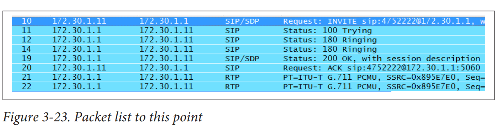


توجه داشته باشید که این نمودار جریان، هر دو طرف مکالمه را نشان نمی‌دهد. از آنجا که سرور تماس بین دو نقطه انتهایی قرار دارد، این نمودار فقط نیمی از انتقال را نشان می‌دهد.

نمونه‌هایی از پیام‌های TRYING و RINGING در شکل 3-25 و شکل 3-26 نشان داده شده‌اند.


توجه داشته باشید که پیام SIP TRYING دارای کد موقتی 100 است. این کد و پیام باعث جلوگیری از ارسال مجدد دعوتنامه (INVITE) از UAC مبدأ می‌شوند—در این مورد، تلفن VoIP با شماره 475-1111 و آدرس IP 172.30.1.11. علاوه بر این، این پیام TRYING نباید توسط پراکسی‌ها ارسال شود. کد موقتی 100 نشان می‌دهد که سرور در حال انجام عملی به نمایندگی از درخواست اولیه است. از آنجا که TRYING دارای کد موقتی است، به همان روش مورد استفاده قرار می‌گیرد.


پیام RINGING از نقطه انتهایی SIP که دعوتنامه (INVITE) را دریافت کرده، ارسال می‌شود. کد وضعیت 180 استاندارد است. این کد نشان می‌دهد که کلاینت در تلاش است تا به کاربر اطلاع دهد که یک درخواست ورودی وجود دارد. در مورد ما، تلفن زنگ می‌زند. بسته بعدی که مشاهده می‌شود پاسخ به پیام INVITE است. به یاد داشته باشید که INVITE شامل بسته SDP بود. توجه داشته باشید که وقتی پاسخ برمی‌گردد (که توسط UAC گیرنده تولید شده است)، کد وضعیت 200 است که نشان‌دهنده موفقیت است (شکل 3-27).


The last SIP packet prior to the exchange of RTP data is the SIP ACK message, like the
one shown in Figure 3-28.


بازگشت به لیست بسته‌ها که در شکل 3-23 نشان داده شده است، می‌بینیم که به محض اینکه ACK برگردانده می‌شود، جریان RTP شروع می‌شود. جریان RTP ادامه دارد تا زمانی که یک طرف اتصال، جلسه را خاتمه دهد. در مثال ما، شماره 475-2222 گوشی را قطع می‌کند و ارتباط را قطع می‌کند. این کار از طریق پیام SIP BYE که در شکل 3-29 نشان داده شده است، انجام می‌شود.


پس از دریافت پیام SIP BYE، نقطه انتهایی دریافت‌کننده (شماره 475-1111) پاسخی با کد وضعیت 200 بازمی‌گرداند. به خاطر داشته باشید که پیام SIP BYE در واقع درخواستی برای قطع ارتباط است. پاسخ در شکل 3-30 نشان داده شده است.


قطع یک تماس تنها ارسال پیام BYE نیست. یک جلسه (نه تنها یک ارتباط) بین دو نقطه انتهایی با دریافت پاسخ (کد وضعیت 200) به INVITE برقرار شده است. بنابراین، یک Call-ID با جلسه یا تبادل داده مرتبط است. پیام BYE به یک INVITE و جلسه خاص اشاره دارد. در RFC، ایده قطع تماس برای SIP به‌خوبی تعریف نشده است، هرچند هدف واضح است. اما چون نمی‌دانیم که طرف تماس گیرنده یا دریافت‌کننده تماس دقیقاً چه زمانی تماس را قطع می‌کند، همچنین مطمئن نیستیم که آیا پیام‌های وضعیت یا ACK مناسب دریافت شده‌اند یا خیر. بنابراین، اغلب به عهده توسعه‌دهنده است که اطمینان حاصل کند که UAC با این موارد برخورد می‌کند. امید این است که وقتی کاربر یا دستگاه با گذاشتن گوشی روی پایه یا با کلیک بر روی دکمه‌ای که تماس را قطع می‌کند، تماس را قطع می‌کند، UAC یک درخواست SIP BYE تولید کند که به Call-ID اشاره می‌کند.

با الزام اینکه پیام SIP BYE به یک جلسه خاص اشاره کند، از ارسال دعوت‌نامه‌های اضافی (INVITE) به آن جلسه جلوگیری می‌شود زیرا شناسه‌های Call-ID متفاوت خواهند بود. پیامی که به BYE مرتبط است، پیام CANCEL است، اما استفاده از آن کمی متفاوت است.

### توضیحات بیشتر

1. **پیام BYE و Call-ID**: هر جلسه در پروتکل SIP با یک Call-ID منحصر به فرد مشخص می‌شود. وقتی پیام BYE ارسال می‌شود، باید به این Call-ID خاص اشاره کند. این امر باعث می‌شود که نتوان دعوت‌نامه‌های اضافی (INVITEs) به همان جلسه ارسال کرد زیرا Call-ID آنها متفاوت خواهد بود. به عبارت دیگر، پیام BYE اطمینان می‌دهد که جلسه خاتمه یافته و دیگر نمی‌توان به آن دعوت‌نامه‌ای ارسال کرد.

2. **پیام CANCEL**: پیام CANCEL نیز برای لغو یک درخواست INVITE استفاده می‌شود، اما تفاوت‌هایی با پیام BYE دارد. پیام CANCEL زمانی استفاده می‌شود که تماس هنوز برقرار نشده است و هدف آن لغو فرآیند برقراری تماس است. به عنوان مثال، اگر یک درخواست INVITE ارسال شده و هنوز پاسخی دریافت نشده است، ارسال پیام CANCEL باعث می‌شود که فرآیند برقراری تماس متوقف شود. از سوی دیگر، پیام BYE برای خاتمه یک جلسه فعال استفاده می‌شود.

### خلاصه
- **پیام BYE**: برای خاتمه یک جلسه خاص که با یک Call-ID منحصر به فرد مشخص شده است استفاده می‌شود. این پیام از ارسال دعوت‌نامه‌های اضافی به همان جلسه جلوگیری می‌کند.
- **پیام CANCEL**: برای لغو یک درخواست INVITE استفاده می‌شود زمانی که تماس هنوز برقرار نشده است. هدف آن متوقف کردن فرآیند برقراری تماس است.

این تفاوت‌ها به شما کمک می‌کند تا بهتر بفهمید چگونه پیام‌های BYE و CANCEL در پروتکل SIP استفاده می‌شوند و چگونه هر کدام نقش خود را در مدیریت تماس‌ها ایفا می‌کنند.


این ما را به پایان مکالمه SIP می‌رساند. اگر این پیام‌ها را بررسی کنید، چه در این فصل یا با استفاده از فایل‌های ضبط شده که در وب‌سایت کتاب قرار داده شده‌اند، باید به یاد داشته باشید که مکالمه را می‌توان با استفاده از تگ‌ها و فیلدهای Call-ID پیگیری کرد. در این مورد، سرور تماس بین دو نقطه انتهایی برای تبادل‌ها قرار دارد، و به طور مؤثری دو مجموعه پیام مختلف را تنظیم می‌کند. این بدان معناست که مقادیر برای دو اتصال متفاوت هستند.

نکته جالب دیگر جریان پیام‌های RTP است. این فصل یکی از دو پیکربندی ممکن برای جریان‌های صوتی را نشان می‌دهد. مسیرها در شکل ۳-۳۱ نشان داده شده‌اند.

این رایج است که سرور تماس دو نقطه انتهایی را متصل کند و سپس از مکالمه کنار برود. در این نقطه، پیام‌های RTP مستقیماً بین تلفن‌ها جریان پیدا می‌کنند، همانطور که در سمت راست نشان داده شده است. بنابراین، بسته‌ها آدرس‌های ۱۷۲.۳۰.۱.۱۱ و ۱۷۲.۳۰.۱.۲۲ را به عنوان آدرس‌های مبدأ و مقصد خواهند داشت. با این حال، با این توپولوژی کوچک و پیکربندی پیش‌فرض AsteriskNOW، سرور تماس برای کل تماس، از ابتدا تا انتها، می‌ماند، همانطور که در سمت چپ نشان داده شده است.


In SIP (Session Initiation Protocol), tags are used to uniquely identify different participants in a session or call. There are two primary tags commonly used in SIP: the **To-tag** and the **From-tag**.

### What are Tags in SIP?

1. **From-tag**: This tag is included in the "From" header field of a SIP message. It uniquely identifies the caller (the sender of the message).

2. **To-tag**: This tag is included in the "To" header field of a SIP message. It uniquely identifies the callee (the receiver of the message).

### Why are Tags Used in SIP?

Tags serve several crucial purposes in SIP communications:

1. **Uniqueness**: Tags help ensure that each SIP dialog (a session between two endpoints) is uniquely identified. This prevents confusion when multiple dialogs are established between the same endpoints. For example, if two users are engaged in multiple calls at the same time, tags help distinguish between these different calls.

2. **Dialog Identification**: A combination of the Call-ID, To-tag, and From-tag uniquely identifies a dialog. This combination allows SIP devices and servers to track and manage the state of each dialog independently.

3. **Handling Forking**: SIP allows forking, where a single SIP request can be sent to multiple destinations, and each destination might generate a response. Tags help in correlating the responses to the correct dialog. For instance, if a SIP INVITE request is forked to multiple recipients, each recipient's response will have a unique To-tag, allowing the initiator to manage each response separately.

4. **State Management**: Tags assist in maintaining the state of a session. When an initial INVITE is sent, the To-tag in the 1xx (provisional) and 2xx (successful) responses ensures that the subsequent requests (like ACK, BYE) are associated with the correct session.

### Example Scenario

Consider a scenario where Alice (the caller) initiates a call to Bob (the callee):

1. **Alice sends an INVITE**:
   - From: Alice's SIP URI with a From-tag.
   - To: Bob's SIP URI without a To-tag (initial INVITE).

2. **Bob responds with a 200 OK**:
   - From: Bob's SIP URI with a To-tag.
   - To: Alice's SIP URI with Alice's From-tag.

3. **Alice sends an ACK**:
   - From: Alice's SIP URI with the same From-tag.
   - To: Bob's SIP URI with Bob's To-tag.

Throughout this call setup, the tags ensure that both Alice and Bob (and any intermediaries) can correctly associate these messages with the ongoing dialog.

In summary, tags in SIP are essential for managing and identifying dialogs uniquely, ensuring proper session handling, especially in scenarios involving forking and multiple concurrent sessions.

In SIP (Session Initiation Protocol), both Call-ID and tags (From-tag and To-tag) are essential components used to uniquely identify and manage SIP sessions. However, they serve different purposes and function at different levels of the protocol's operation. Here is a detailed comparison between Call-ID and tags:

### Call-ID
- **Definition**: The Call-ID is a globally unique identifier for a SIP call. It is a unique string generated by the user agent (UA) initiating the call and included in all SIP messages within that call.
- **Scope**: The Call-ID is the same for all messages within the same call or session, regardless of the direction of the message or the endpoints involved.
- **Usage**: It is used to uniquely identify a particular SIP session across all SIP devices and servers involved in the call. 
- **Persistence**: The Call-ID remains constant throughout the entire duration of the call, from the initial INVITE message until the call is terminated.
- **Generation**: Typically, the user agent creates the Call-ID using a combination of random or sequential numbers and possibly some other unique data to ensure global uniqueness.

### Tags
- **Definition**: Tags are unique identifiers appended to the From and To headers in SIP messages. They help to uniquely identify participants within a session.
- **Scope**: Tags are specific to the endpoints involved in the session. The From-tag identifies the caller, and the To-tag identifies the callee.
- **Usage**: Tags are used in combination with the Call-ID to uniquely identify a dialog (a session between two

## Trunks
درSIP ترانک‌ها به نظر می‌رسد که در حال حاضر بسیار پرطرفدار هستند و فروشندگان خدمات مختلفی را ارائه می‌دهند. یکی از چالش‌ها برای کسانی که سعی در یادگیری در مورد آن‌ها دارند این است که فروشندگان و ارائه‌دهندگان خدمات تعاریف متفاوتی برای یک ترانک دارند. همچنین، کلمه "ترانک" در هیچ کجای RFC 3261 ذکر نشده است. در مقاله پیشنویس IETF با عنوان "SIP ترانک چیست؟" نوشته J. Rosenberg از شرکت Cisco، پیشنهاد زیر به کارگروه مهندسی اینترنت ارائه شده است:

یک SIP ترانک یک موجودیت مجازی SIP بر روی یک سرور (UAS، UAC یا پراکسی) است که توسط مجموعه‌ای از سیاست‌ها و قواعد از پیش تعریف شده محدود می‌شود که تعیین می‌کنند چگونه درخواست‌ها پردازش شوند.
رفتار ترانک بر اساس یک قرارداد مشروط است—توافقی بین مشتری و سرور که تا زمانی که درخواست‌ها بر اساس ماهیت قرارداد قالب‌بندی شوند، درخواست مشخص شده دریافت خواهد شد.

علاوه بر این، این پیشنهاد اشاره می‌کند که ترانک به عنوان یک نمونه بر روی سرور وجود دارد و نه به عنوان یک لینک تعریف شده بین سوئیچ‌ها یا دفاتر. از Microsoft، تعریف و قابلیت زیر ارائه شده است:
یک SIP ترانک یک اتصال مستقیم بین سازمان شما و یک ارائه‌دهنده خدمات تلفن اینترنتی (ITSP) است. این امکان را به شما می‌دهد تا تلفن VoIP را فراتر از دیواره آتش سازمان خود گسترش دهید بدون نیاز به یک دروازه IP-PSTN. علاوه بر تماس‌های VoIP، SIP ترانک‌ها می‌توانند پیام‌های فوری، کنفرانس‌های چندرسانه‌ای، اطلاعات حضور کاربر، تماس‌های اضطراری E9-1-1 و سایر خدمات ارتباطات لحظه‌ای مبتنی بر SIP را نیز حمل کنند.

آنچه که این تعاریف (و بسیاری دیگر) به اشتراک می‌گذارند این است که یک SIP ترانک یک اتصال فیزیکی مانند لینک‌هایی که خارج از سایت اجرا می‌شوند نیست بلکه یک اتصال منطقی به یک نقطه انتهایی است که یک مجموعه خاص از برنامه‌ها را مدیریت می‌کند. این رابطه در شکل ۳-۳۲ نشان داده شده است. در حالی که این تصویر نشان می‌دهد که ارائه‌دهندگان خدمات تلفنی و اینترنتی نهادهای متفاوتی هستند، این لزوماً همیشه درست نیست. به عنوان مثال، Time Warner هم اتصال و هم یک سرویس VoIP را ارائه می‌دهد.

در حالی که SIP ترانک‌ها ممکن است در ابتدا به عنوان تونل‌های صوتی در نظر گرفته شده باشند، اکنون بخشی از یک پلتفرم یکپارچه بزرگتر هستند. اگر شما به یک ارائه‌دهنده برای خدمات VoIP پول پرداخت می‌کنید، احتمال زیادی وجود دارد که از طریق یک SIP ترانک انجام شود.


A SIP trunk (Session Initiation Protocol trunk) is a method of delivering telephone and other unified communications services over the Internet. Instead of using traditional phone lines, SIP trunks utilize VoIP (Voice over Internet Protocol) technology to connect a business's private branch exchange (PBX) to the Internet, allowing for voice, video, and messaging services. Here’s a breakdown of key components and benefits:

### Key Components
1. **PBX (Private Branch Exchange):** A private telephone network used within a company.
2. **Internet Connection:** A high-quality, reliable Internet connection is essential for SIP trunking.
3. **SIP Trunk Provider:** The service provider that offers SIP trunking services, often offering features like call management, disaster recovery, and enhanced security.

### Benefits
1. **Cost Savings:** SIP trunking can reduce costs associated with traditional phone lines and long-distance calls.
2. **Scalability:** Easily add or remove lines without the need for physical infrastructure changes.
3. **Flexibility:** SIP trunks support not just voice, but also video calls, messaging, and other real-time communications.
4. **Global Reach:** Facilitate communication across different locations and countries with a single infrastructure.
5. **Disaster Recovery:** Enhanced reliability and disaster recovery options compared to traditional phone lines.

### How It Works
1. **Call Initiation:** When a call is made, the PBX routes the call to the SIP trunk.
2. **Data Conversion:** The SIP trunk converts the call into data packets for transmission over the Internet.
3. **Delivery:** These data packets are sent to the destination (another SIP trunk or a traditional phone line).
4. **Call Management:** The SIP trunk provider manages the call setup, maintenance, and teardown.

### Use Cases
- **Businesses:** SIP trunks are popular in corporate environments for their cost efficiency and scalability.
- **Call Centers:** They provide reliable and flexible solutions for high-volume call handling.
- **Remote Work:** Support for remote workforces with seamless communication capabilities.

### Considerations
- **Quality of Service (QoS):** Ensuring the Internet connection is capable of handling VoIP traffic with high quality.
- **Security:** Implementing robust security measures to protect against VoIP-related threats.
- **Compatibility:** Ensuring that existing PBX systems are compatible with SIP trunking services.

SIP trunking represents a modern, efficient way for businesses to handle their communication needs by leveraging the power of the Internet.

حتماً! اجازه دهید جزئیات بیشتری را درباره SIP ترانک‌ها و مفاهیم مرتبط با آن‌ها توضیح دهم.

### SIP ترانک چیست؟
SIP ترانک‌ها (Session Initiation Protocol Trunks) به معنای یک مسیر یا کانال ارتباطی منطقی برای انتقال تماس‌های صوتی و داده‌های مرتبط از طریق اینترنت است. برخلاف سیستم‌های تلفنی سنتی که از خطوط فیزیکی مانند خطوط تلفن آنالوگ یا دیجیتال (PSTN) استفاده می‌کنند، SIP ترانک‌ها از پروتکل اینترنت (IP) برای انتقال داده‌ها استفاده می‌کنند.

### چگونه کار می‌کنند؟
SIP ترانک‌ها بر اساس پروتکل SIP کار می‌کنند که یک پروتکل استاندارد برای شروع، نگهداری و پایان دادن به جلسات ارتباطی چندرسانه‌ای است. این جلسات می‌توانند شامل تماس‌های صوتی، ویدئویی، پیام‌های فوری، و دیگر انواع داده‌های چندرسانه‌ای باشند.

1. **اتصال به ISP یا ITSP**: سازمان‌ها از طریق یک SIP ترانک به ارائه‌دهنده خدمات تلفن اینترنتی (Internet Telephony Service Provider - ITSP) متصل می‌شوند. این اتصال از طریق اینترنت برقرار می‌شود.

2. **تبدیل تماس‌ها**: زمانی که یک تماس ورودی یا خروجی برقرار می‌شود، SIP ترانک این تماس‌ها را به سیگنال‌های داده تبدیل کرده و آن‌ها را از طریق شبکه IP ارسال می‌کند.

3. **مدیریت تماس‌ها**: سرورهای SIP در سمت ارائه‌دهنده خدمات، تماس‌ها را مدیریت کرده و آن‌ها را به مقصد نهایی هدایت می‌کنند. این مدیریت شامل احراز هویت، مسیریابی، و تضمین کیفیت خدمات (QoS) می‌شود.

### مزایای SIP ترانک‌ها

1. **کاهش هزینه‌ها**: یکی از بزرگ‌ترین مزایای استفاده از SIP ترانک‌ها، کاهش هزینه‌های ارتباطی است. با حذف نیاز به خطوط تلفن فیزیکی، هزینه‌های نگهداری و ارتباطات به‌طور قابل توجهی کاهش می‌یابد.

2. **مقیاس‌پذیری**: SIP ترانک‌ها به راحتی قابل تنظیم و مقیاس‌پذیر هستند. سازمان‌ها می‌توانند بر اساس نیازهای خود، تعداد کانال‌های ترانک را افزایش یا کاهش دهند.

3. **انعطاف‌پذیری**: با استفاده از SIP ترانک‌ها، سازمان‌ها می‌توانند از یک زیرساخت یکپارچه برای تمام انواع ارتباطات (صوتی، تصویری، پیام‌های فوری و ...) استفاده کنند.

4. **تجمیع ارتباطات**: با استفاده از یک SIP ترانک، می‌توان تمامی ارتباطات را از طریق یک کانال واحد مدیریت کرد که باعث ساده‌تر شدن مدیریت و کنترل ارتباطات می‌شود.

### تفاوت‌های کلیدی در تعاریف

تعاریف مختلفی که از SIP ترانک‌ها ارائه می‌شود، ناشی از دیدگاه‌های مختلف فروشندگان و ارائه‌دهندگان خدمات است:

- **دیدگاه فنی**: از دیدگاه فنی، SIP ترانک یک موجودیت منطقی است که توسط سرورهای SIP مدیریت می‌شود. این تعریف بیشتر بر روی نحوه کارکرد و مدیریت تماس‌ها تمرکز دارد.

- **دیدگاه تجاری**: از دیدگاه تجاری، SIP ترانک به عنوان یک سرویس ارائه می‌شود که به سازمان‌ها امکان ارتباطات تلفنی و چندرسانه‌ای را از طریق اینترنت فراهم می‌کند. این تعریف بیشتر بر روی مزایا و کاربردهای تجاری تمرکز دارد.

### نتیجه‌گیری

SIP ترانک‌ها به عنوان یک فناوری نوین در ارتباطات، امکانات و مزایای فراوانی را به سازمان‌ها ارائه می‌دهند. با توجه به اینکه این ترانک‌ها به صورت منطقی و نه فیزیکی عمل می‌کنند، انعطاف‌پذیری و قابلیت تنظیم بالایی دارند که باعث می‌شود برای بسیاری از سازمان‌ها یک گزینه جذاب و اقتصادی باشند.

## Security
مشکل امنیت VoIP به طور کلی و امنیت SIP به طور خاص، همانطور که VoIP-info.org به درستی بیان می‌کند:

امنیت SIP یک حوزه گسترده و تا حدودی چالش‌برانگیز است. اما اگر بخواهیم موضوع را ساده کنیم و هر چیزی که به VoIP مربوط نمی‌شود را نادیده بگیریم، امنیت VoIP دو جزء کلی دارد: ایمن‌سازی ترافیک سیگنالینگ و ایمن‌سازی داده‌های صوتی. در ایمن‌سازی ترافیک سیگنالینگ، هدف ما قفل کردن ثبت‌ها، دعوت‌نامه‌ها، خاتمه‌ها و غیره است. هنگامی که هدف ما حفاظت از داده‌های صوتی است، واقعاً به دنبال محافظت از جریان RTP به عنوان عبور آن از شبکه هستیم؛ این کار به ویژه برای شبکه‌های بی‌سیم چالش‌برانگیز است. اما حتی تمرکز بر این دو زمینه نیز بدون دشواری نیست. پشتیبانی و سازگاری فروشندگان تضمین‌شده نیست و گاهی اوقات ایمن‌سازی اجزای VoIP ممکن است باعث جلوگیری از عملکرد آنها شود.

بخشی از مشکل از سادگی و خوانایی SIP ناشی می‌شود. همانطور که در این فصل اشاره شد، SIP شباهت زیادی به HTTP دارد و با استفاده از بسیاری از همان قوانین قالب‌بندی شده است. بنابراین، پیام‌ها و جریان آنها ساده هستند. حملات رایج امنیتی بر روی SIP شامل موارد زیر می‌شوند:

**ثبت‌نام**
مهاجمان به راحتی می‌توانند هویت یک کاربر معتبر را جعل کنند. در تماس‌هایی که برای این فصل ثبت شده‌اند، در هیچ نقطه‌ای نیاز به احراز هویت وجود نداشت.

**قطع تماس‌ها و انکار سرویس**
یک حمله تخریب SIP نمونه‌ای از روشی است که برای قطع یک کاربر معتبر استفاده می‌شود. مهاجم به سادگی یک بسته BYE با شناسه‌های صحیح ارسال می‌کند.

**حمله مرد میانی**
حملات مرد میانی، حملات همه منظوره‌ای هستند که برای دستگیری ترافیک و اعتبارنامه‌های گره‌های معتبر شبکه استفاده می‌شوند. اشکال مختلفی از این حمله وجود دارد (مثلاً مسمومیت ARP، تغییر مسیر ICMP، AP های نادرست)، و استراتژی مشترک بین اشکال مختلف این است که مهاجم را بین گره و سرور یا شبکه قرار دهد. مهاجم مشتری را فریب می‌دهد تا ترافیک را به آن ارسال کند. پس از دریافت ترافیک از گره معتبر، مهاجم ترافیک را به سرور ارسال می‌کند. این فرآیند برای ترافیک در جهت مخالف نیز تکرار می‌شود. به این ترتیب، نقاط انتهایی آگاه نمی‌شوند که مهاجم آنجا حضور دارد و همه داده‌ها را می‌خواند.

راهکار مقابله با این حملات شامل ترکیبی از مکانیسم‌های احراز هویت و رمزنگاری ارائه شده توسط SIP امن و RTP امن می‌شود.

مشکلات امنیتی VoIP و SIP را می‌توان در چندین لایه مختلف بررسی کرد. در ادامه به تفصیل بیشتری درباره این مشکلات و راه‌حل‌های ممکن برای آن‌ها می‌پردازیم:


```‍‍‍‍‍‍‍
??? There are several forms of this attack (e.g., ARP poisoning, ICMP redirect, rogue APs ???
```

در SIP امن یک URI امن (SIPS URI) را ارائه می‌دهد و به جای پورت 5060 از پورت 5061 استفاده می‌کند. فرمتی مشابه آدرسی که در ابتدای این فصل شناسایی شد دارد، اما به جای شروع با sip، با sips شروع می‌شود. به عنوان مثال، sips:4751111@172.30.1.1. ایده این است که یک تماس با استفاده از SIPS URI با استفاده از امنیت لایه انتقال (TLS) ایمن می‌شود. TLS در RFC 5246 توضیح داده شده است. اگر TLS استفاده شود، کل ارتباط از طریق گواهینامه‌ها ایمن می‌شود. اما مدیریت این گواهینامه‌ها، به‌ویژه در بستر یک شبکه بزرگتر که ممکن است زیرساخت‌های امنیتی اضافی داشته باشد، همیشه کار ساده‌ای نیست. عنصر دیگر برای کاهش حملات، رمزگذاری داده‌های صوتی با استفاده از RTP امن (SRTP) است که ترافیک سیگنالینگ را نادیده می‌گیرد و در RFC 5506 پوشش داده شده است. اگرچه دو مؤلفه در RFCهای مختلف توصیف شده‌اند، اما معمولاً دست در دست هم می‌آیند. با این حال، پیاده‌سازی‌ها اغلب به شرکت‌های خاص بستگی دارند و چالش‌های قابل توجهی در تعامل وجود دارد.

اما رمزگذاری باید کجا پیاده‌سازی شود؟ اگر کاربران از طریق شبکه سیمی متصل می‌شوند، می‌توان ادعا کرد که نیازی به رمزگذاری نیست. حفاظت از کاربران بی‌سیم یک وظیفه مهم است، اما آیا آن‌ها قبلاً از رمزگذاری قوی‌تر (یا برابر) از طریق چیزی مانند 802.1x استفاده نمی‌کنند؟ اتصال خارجی اغلب از طریق یک شبکه خصوصی مجازی (VPN) برقرار می‌شود و بنابراین رمزگذاری جریان صوتی ممکن است غیرضروری باشد، به ذکر تخریب بالقوه عملکرد. بنابراین، گزینه‌هایی برای ایمن‌سازی ترافیک صوتی وجود دارد، اما مهم است که دقیقاً مشخص شود چه چیزی باید محافظت شود و چرا.


# Chapter 4
## The Real-Time Transport Protocol and the Real-Time Control Protocol

ثبت، تنظیم، شماره‌گیری، جلسات رسانه‌ای و ویژگی‌های نقطه پایانی VoIP همگی توسط پروتکل سیگنالینگ VoIP مدیریت می‌شوند. احتمالاً رایج‌ترین پروتکل‌های سیگنالینگ مورد استفاده امروز، پروتکل شروع جلسه (SIP)، H.323 از اتحادیه بین‌المللی مخابرات–تلکام (ITU-T)، و پروتکل کنترل مشتری لاغر (Skinny) از سیسکو هستند. این سه پروتکل نمی‌توانستند بیشتر از این با هم تفاوت داشته باشند. اما با وجود این تفاوت‌ها، همگی نیاز به انتقال داده‌های صوتی از یک تلفن به تلفن دیگر دارند و همه از یک روش استفاده می‌کنند – پروتکل انتقال بلادرنگ (RTP). در حالی که RTP تقریباً در هر استقرار استاندارد VoIP مورد استفاده قرار می‌گیرد، طبیعت انعطاف‌پذیر آن اجازه می‌دهد که برای جریانات رسانه‌ای و کدک‌های آینده گسترش یا اصلاح شود.

این فصل عملکرد RTP را توصیف می‌کند و چندین مثال از بسته‌های گرفته شده در یک شبکه VoIP عملیاتی ارائه می‌دهد. در میان بسته‌های RTP، پروتکل دیگری را نیز مشاهده خواهیم کرد – پروتکل کنترل بلادرنگ (RTCP) که بازخوردی در مورد کیفیت یا عملکرد جریان RTP فراهم می‌کند. یکی از چالش‌ها در نوشتن فصلی مانند این، این است که فروشندگان این پروتکل‌ها را به یک شکل پیاده‌سازی نمی‌کنند، بنابراین این فصل بررسی‌هایی از کپچرهای گرفته شده از استقرارهای مختلف برای توضیح ایده‌ها خواهد داشت. به این ترتیب، بسته‌های نشان داده شده در این فصل از مجموعه‌ای از توپولوژی‌های سیسکو، آوایا، و پلی‌کام خواهند بود. RTP و RTCP ابتدا در RFC 1889 تعریف شدند. این RFC توسط RFC 3550 منسوخ شد. این فصل از دومی به عنوان منبع اصلی استفاده خواهد کرد. سند همراه RFC 3550، RFC 3551 است (RFC 3551 جایگزین RFC 1890 شده است) که پروفایل RTP برای کنفرانس صوتی و تصویری را تعریف می‌کند. بخش زیادی از اطلاعات مورد نیاز برای درک کامل عملکرد RTP (و انعطاف‌پذیری آن) نیز در RFC 3551 موجود است، بنابراین این بخش مهمی از بحث خواهد بود.


## Protocol Description
اگر فصل‌های قبلی را خوانده باشید، می‌دانید که برای پشتیبانی از استقرار VoIP، اجزای بسیاری مورد نیاز است، مانند پروتکل سیگنالینگ و زیرساخت‌هایی مانند سرور پروتکل انتقال فایل ساده (TFTP) و پیکربندی پویا میزبان، یا DHCP. این گفتگوها قبل از شروع جریان RTP اتفاق می‌افتند. پروتکل سیگنالینگ فقط برای خاتمه دادن به تماس بازمی‌گردد. بنابراین، پروتکل سیگنالینگ (H.323، SIP، Skinny) و پروتکل انتقال (RTP) جنبه‌های مختلف ارتباط را مدیریت می‌کنند. بر اساس RFC 3550، RTP کارهای زیر را انجام می‌دهد:
خدمات تحویل نقطه به نقطه برای داده‌هایی با ویژگی‌های بلادرنگ، مانند صدا و ویدیوی تعاملی فراهم می‌کند.
در این زمینه، خدمت تحویل به این معنی است که RTP به عنوان ظرفی برای داده‌های صوتی یا تصویری یا هر دو عمل می‌کند. این داده‌ها نتیجه عملیات کدک هستند. بنابراین، صدا و/یا ویدیو بر اساس کدک نمونه‌برداری شده و سپس در یک بسته RTP قرار می‌گیرد. نمونه‌ای از این موضوع در شکل 4-1 نشان داده شده است.


این بسته نشان می‌دهد که محموله توسط کدک G.711 ایجاد شده است، همان‌طور که توسط فلش بالا نشان داده شده است. G.711 یک کدک صوتی است که برای تولید فریم‌های صوتی استفاده می‌شود (فرآیند آن در فصل 5 توضیح داده شده است) که محموله را تشکیل می‌دهند؛ این موضوع توسط فلش پایین نشان داده شده است. دریافت‌کننده داده‌های صوتی باید دقیقاً بداند که از چه کدکی برای ایجاد بسته استفاده شده و چگونه باید جریان را دوباره به هم متصل کند. در حالی که چندین فیلد در یک بسته RTP وجود دارد، پروتکل دارای دو نقطه تمرکز اصلی است: شناسایی محموله و ترتیب‌دهی.

در لایه 4 مدل‌های شبکه ما، RTP در یک هدر UDP کپسوله می‌شود. UDP در زمینه مدیریت اولویت یا ترتیب‌دهی بسیار کم عمل می‌کند. این امر برای داده‌های بلادرنگ معمول است، زیرا از دست دادن یا تأخیر زیاد بسته‌ها ممکن است مشکلاتی ایجاد کند اگر برنامه در مقصد مجبور باشد برای آنها منتظر بماند. اما این امر در مورد پروتکل سیگنالینگ مبتنی بر TCP صادق نیست. پروتکل سیگنالینگ دیگر عملیات‌ها، مانند ثبت و تنظیم تماس را مدیریت می‌کند. اما، زمانی که داده‌ها شروع به جریان می‌کنند، در یک بسته‌بندی RTP قرار می‌گیرند. بنابراین، RTP اغلب در یک برنامه جاسازی می‌شود. یکی دیگر از ویژگی‌های RTP این است که قابل گسترش و انعطاف‌پذیر است. برای مثال، نوع‌های محموله می‌توانند به RFC اضافه شوند و افزودنی‌های امنیتی مانند RTP امن نیاز به بازنویسی کامل هدر ندارند.

در حالی که RFC 3550 جایگزین RFC 1889 شده است، به این معنی نیست که تغییرات عمده‌ای در ساختار یا عملکرد ایجاد شده است. جنبه‌های اصلی RTP و RTCP در واقع تغییرات بسیار کمی داشته‌اند. از RFC 3550:
بیشتر متن این یادداشت مشابه RFC 1889 است که جایگزین آن شده است. تغییراتی در قالب بسته‌ها روی سیم وجود ندارد، فقط تغییراتی در قوانین و الگوریتم‌هایی که نحوه استفاده از پروتکل را تنظیم می‌کنند.
بنابراین، هنگام بررسی بسته‌های RTP، ممکن است انتظار داشته باشیم که هدرها توسط جدیدترین RFC تعریف شده باشند. با این حال، بیشتر انتقال‌ها از RFC 1889 استفاده می‌کنند.


In the Session Initiation Protocol (SIP), the `Contact` header field plays a crucial role. It is used to specify the SIP URI (Uniform Resource Identifier) where the user or service can be directly contacted for subsequent requests or sessions. The `Contact` header field is found in various SIP messages, such as `INVITE`, `REGISTER`, `200 OK`, etc., and its role can vary slightly depending on the context in which it's used.

### Key Points of the `Contact` Header

1. **URI for Direct Contact:**
   - The `Contact` header contains a SIP or SIPS URI that specifies where the user can be reached. For example, in an `INVITE` request, the `Contact` header indicates the address where the caller expects to receive responses.

   Example:
   ```
   Contact: <sip:alice@example.com>
   ```

2. **Use in `REGISTER` Requests:**
   - In a `REGISTER` request, the `Contact` header specifies the address of record (AOR) that should be associated with the registering user. This tells the SIP registrar where future SIP requests intended for the user should be sent.

   Example:
   ```
   REGISTER sip:example.com SIP/2.0
   Contact: <sip:alice@client.example.com>
   ```

   This example tells the SIP registrar that requests for `alice@example.com` should be forwarded to `alice@client.example.com`.

3. **Use in `INVITE` Requests:**
   - When a `Contact` header is present in an `INVITE` request, it identifies the address where the caller wants to receive future requests related to the session, like ACKs or BYEs.

   Example:
   ```
   INVITE sip:bob@example.com SIP/2.0
   Contact: <sip:alice@client.example.com>
   ```

   This means that Bob's SIP server should send the response to `alice@client.example.com`.

4. **Use in Responses (e.g., `200 OK`):**
   - In responses, such as `200 OK` to an `INVITE`, the `Contact` header tells the sender of the request where to send subsequent requests (e.g., ACK, BYE) related to that session.

   Example:
   ```
   SIP/2.0 200 OK
   Contact: <sip:bob@server.example.com>
   ```

   This indicates that subsequent requests for this session should be sent to `bob@server.example.com`.

5. **Expiration of Contact Information:**
   - The `Contact` header may also include an `expires` parameter that indicates the duration in seconds for which the contact address is valid.

   Example:
   ```
   Contact: <sip:alice@client.example.com>;expires=3600
   ```

   This means the contact information is valid for one hour.

### Example SIP Message with `Contact` Header

Here's a simplified example of a SIP `INVITE` request with a `Contact` header:

```
INVITE sip:bob@example.com SIP/2.0
Via: SIP/2.0/UDP client.example.com;branch=z9hG4bK776asdhds
Max-Forwards: 70
To: Bob <sip:bob@example.com>
From: Alice <sip:alice@example.com>;tag=1928301774
Call-ID: a84b4c76e66710@client.example.com
CSeq: 314159 INVITE
Contact: <sip:alice@client.example.com>
Content-Type: application/sdp
Content-Length: 142

v=0
o=alice 2890844526 2890844526 IN IP4 client.example.com
s=
c=IN IP4 client.example.com
t=0 0
m=audio 49170 RTP/AVP 0
a=rtpmap:0 PCMU/8000
```

In this `INVITE` request, the `Contact` header specifies that Alice can be contacted at `sip:alice@client.example.com`.

### Summary

- The `Contact` header in SIP is essential for specifying where future SIP requests related to the session should be sent.
- It can appear in requests (e.g., `INVITE`, `REGISTER`) and responses (e.g., `200 OK`), serving different purposes depending on the message type.
- It ensures that subsequent communications within a SIP session are routed to the correct address.


Sure! Let's break it down in a simpler way.

### What is SIP?

First, understand that **SIP (Session Initiation Protocol)** is a protocol used for initiating, maintaining, and ending communication sessions like voice calls or video calls over the internet.

### What is the `Contact` Header?

In SIP, the `Contact` header is like a **"return address"** on a letter. It tells the person or device you're communicating with where they can reach you next.

### How is the `Contact` Header Used?

1. **When You Make a Call (INVITE):**
   - Imagine you're calling someone. When you send the `INVITE` to start the call, you include your "return address" in the `Contact` header. This tells the other person, "Hey, if you need to send something back to me during this call, use this address."
   - Example:
     ```
     Contact: <sip:alice@phone.example.com>
     ```
     This means, "Reach me at `alice@phone.example.com` during this call."

2. **When You Register (REGISTER):**
   - When you turn on your SIP phone or app, it registers with a server to let it know where you can be found. You use the `REGISTER` message, and in the `Contact` header, you provide the address where you want to receive calls.
   - Example:
     ```
     Contact: <sip:alice@home.example.com>
     ```
     This tells the server, "Send all my calls to `alice@home.example.com`."

3. **When the Call is Accepted (200 OK):**
   - When the person you're calling answers, they send a `200 OK` message back. In that message, their `Contact` header tells you where to send further messages related to this call.
   - Example:
     ```
     Contact: <sip:bob@phone.example.com>
     ```
     This means, "Now that I've answered, you can reach me at `bob@phone.example.com`."

### Why is the `Contact` Header Important?

- **Routing:** It ensures that all the messages during the call or session go to the correct address, like voice packets or call hang-up signals.
- **Updating Location:** If you move to a new device or network, the `Contact` header tells everyone else where to find you.
- **Session Continuity:** Even if your IP address or network changes, the `Contact` header helps maintain the session.

### A Simple Example

Let's say Alice is calling Bob. Here’s how it might look:

1. **Alice sends an `INVITE`:**
   - **Message:**
     ```
     INVITE sip:bob@example.com SIP/2.0
     Contact: <sip:alice@phone.example.com>
     ```
   - **Meaning:** "Hi Bob, I'm Alice. If you want to reach me during this call, use `alice@phone.example.com`."

2. **Bob sends a `200 OK`:**
   - **Message:**
     ```
     SIP/2.0 200 OK
     Contact: <sip:bob@phone.example.com>
     ```
   - **Meaning:** "Hi Alice, I’ve answered. If you want to send me anything during this call, use `bob@phone.example.com`."

### Summary

The `Contact` header in SIP is like giving someone your phone number or email. It tells them where to reach you for that specific call or session, making sure that all communication during that session goes smoothly to the right place.


## Profiles
ایده‌ی یک پروفایل اکنون باید معرفی شود. در حالی که RFC 3550 ساختار و عملکرد کلی هر دو پروتکل RTP و RTCP را توصیف می‌کند، برخی موارد هستند که می‌توانند از طریق استفاده از یک پروفایل تغییر یابند. ممکن است نوعی از انتقال به عملکرد اضافی خارج از هدر ثابت تعریف شده در RFC نیاز داشته باشد. هر دو فیلد نشانگر (marker) و payload (که بعداً در این فصل تعریف خواهند شد) می‌توانند برای برآورده کردن این نیازها کمی تغییر یابند. علاوه بر این، مجموعه‌ای از فیلدهای ثابت می‌توانند بلافاصله قبل از فیلد payload اضافه شوند. این موضوع توسط یک افزونه به هدر توصیف می‌شود.

بخش 5.3 از RFC 3550 اطلاعات بیشتری درباره تغییرات پروفایل و افزونه‌های هدر ارائه می‌دهد. RFC 3551 حاوی پروفایل برای صدا و تصویر در یک برنامه کنفرانسی است. مهم‌تر از همه، این RFC شامل مقادیر فیلد payload در RTP است که توسط کدک‌های رایج صدا و تصویر استفاده می‌شوند.

## Basic Operation
در RTP برای انتقال داده‌های بلادرنگ استفاده می‌شود. معمولاً این داده‌ها شامل صدا و/یا تصویر خواهند بود. بنابراین، پروتکل سیگنالینگ (مانند H.323، Skinny یا SIP) برای مدیریت پیام‌هایی که برای برقراری تماس‌ها یا اتصالات استفاده می‌شوند، به کار می‌رود. بخشی از این فرآیند شامل مذاکره درباره روشی است که برای کدگذاری داده‌ها استفاده می‌شود. فصل‌های 3، 6 و 7 نشان می‌دهند که چگونه SIP، H.323 و Skinny این فرآیند را مدیریت می‌کنند. پس از برقراری یک جلسه رسانه‌ای، بسته‌های RTP بین نقاط پایانی در هر دو جهت شروع به جریان می‌کنند. بسته‌ها از هر منبع از طریق یک شماره شناسایی به هم مرتبط می‌شوند.

از آنجا که عملکرد داده‌های بلادرنگ بسیار حیاتی است و تأخیر، از دست دادن بسته‌ها و نوسانات (jitter) می‌توانند باعث کاهش کیفیت تماس شوند، RTP یک پروتکل کنترلی به نام RTCP دارد که برای اندازه‌گیری برخی از این مقادیر استفاده می‌شود. بنابراین، بسته‌های RTCP نیز همراه با جریان RTP ارسال می‌شوند، اگرچه تعداد آن‌ها بسیار کمتر است. هدف RTCP این است که جریان RTP را پیگیری کرده و این اطلاعات را به نقاط پایانی ارائه دهد. به‌طور خاص، RTCP تعداد بسته‌ها و بایت‌های ارسال‌شده را شمارش می‌کند. همچنین زمان‌های ارسال بسته‌های RTP را اندازه‌گیری می‌کند. هنگامی که RTP و RTCP با هم استفاده می‌شوند، پورت UDP که توسط RTCP استفاده می‌شود، باید پورت فرد بعدی باشد.

برای کمک به توضیح این ایده‌ها، از توپولوژی نشان داده شده در شکل 4-2 استفاده خواهیم کرد. یک شاسی Avaya G700 به‌عنوان سرور تماس ما عمل خواهد کرد. این توپولوژی از مجموعه پروتکل‌های H.323 استفاده می‌کند. مانند سایر توپولوژی‌هایی که در این کتاب مورد بحث قرار گرفته‌اند، یک سرور پروتکل پیکربندی پویا (DHCP) و سرورهای پروتکل انتقال فایل بی‌اهمیت (TFTP) نیز حضور خواهند داشت. دو تلفن VoIP شماره‌های 111-1111 (192.168.16.23) و 111-2222 (192.168.16.24) را دریافت کرده‌اند، و ایستگاه‌های مدیریت در حال مشاهده ترافیک جاری به دو تلفن و از آن‌ها از طریق جلسات مانیتورینگ در حال اجرا بر روی سوییچ هستند. بخش‌های زیر ساختار پروتکل‌های RTP و RTCP را با استفاده از این توپولوژی توصیف خواهند کرد.


## Protocol Structure
نکته جالب درباره RTP این است که پروتکلی نسبتاً ساده با مجموعه‌ای کوچک از فیلدهای هدر است. در این بخش، به بررسی آنچه "فیلدهای هدر ثابت" نامیده می‌شوند، خواهیم پرداخت. نسخه متنی این هدر از RFC 1889 گرفته شده و در شکل 4-3 قابل مشاهده است. بخش بعدی جزئیات را ارائه خواهد داد، اما ابتدا بیایید هدر RFC در شکل 4-3 را با یک بسته واقعی RTP که در شکل 4-4 نشان داده شده است، مقایسه کنیم. اولین فیلدها بسیار کوچک هستند و شامل اطلاعاتی در مورد محتوای بسته می‌شوند. اما برخی از مهم‌ترین فیلدها عبارتند از PT یا نوع payload (مانند G.711)، شماره ترتیب (11639)، timestamp (998248329) و SSRC یا شناسه منبع همزمانی. در حالی که فیلدها تعریف می‌شوند، بخش بعدی برای روشن شدن موضوع به هر دو نمودار ارجاع خواهد داد.


## Header first octet
اولین اکتت (Octet) از هدر RTP مجموعه‌ای از فیلدهای کوچک است. مقدار باینری 1000 0000 (که در مبنای شانزده برابر با 80 است) به راحتی می‌تواند به این زیرمجموعه‌ها تقسیم شود. خط برجسته شده در شکل 4-5 نشان‌دهنده شروع اولین اکتت است و این در مقدار هگزادسیمال در پایین نمودار منعکس شده است. این بسته خاص فقط قسمتی از بسته‌ای است که در این بخش استفاده کرده‌ایم. این بسته برای کاهش فضای اشغال شده ویرایش شده است، اما محتوای آن تغییر نکرده است. سه نقطه در انتهای بخش رمزگشایی شده (3f4a...) صرفاً نشان می‌دهد که payload بیشتری وجود دارد که بر روی صفحه جا نمی‌شود.


## Subfield Descriptions
### Version (V)
This is a 2-bit field indicating the protocol variant. Possible values include:
* 0 : Pre-RTP; indicates the vat audio tool
* 1 : First draft version of RTP
* 2 : Current version of RTP

یک نکته جالب این است که هر دو RFC 1889 و 3550 از عبارت "نسخه تعریف‌شده توسط این مشخصات" استفاده می‌کنند وقتی مقدار این فیلد برابر با دو است. این که هر دو RFC از همان مقدار در این فیلد استفاده می‌کنند، نشان‌دهنده این است که تفاوت زیادی بین آن‌ها وجود ندارد. از شکل 4-5 می‌توانیم ببینیم که مقدار در این فیلد به صورت 10 در مبنای باینری است و Wireshark این را مطابق با RFC 1889 می‌داند.

## Padding (P)
این فیلد تک‌بیتی به ما می‌گوید که آیا بسته حاوی اکتت‌هایی است که بخشی از محتوای صوتی یا تصویری تشکیل‌دهنده جریان نیستند یا خیر. مقدار صفر نشان می‌دهد که این پدینگ (padding) وجود ندارد. اگر پدینگ بخشی از بسته باشد، آخرین اکتت از پدینگ تعداد اکتت‌های پدینگ را مشخص می‌کند. برخی از پیاده‌سازی‌ها از اندازه بلوک‌های ثابت استفاده می‌کنند که ممکن است توسط نمونه‌ها پر نشوند و به همین دلیل نیاز به پدینگ داشته باشند.

### RTP Header Padding Explained in Simple Terms

**RTP** (Real-time Transport Protocol) is a protocol used for delivering audio and video over networks, like in video calls or streaming. The RTP packet has a header, which is like the packet's "cover page" containing essential information about the data being sent. 

**Padding** in the RTP header is an optional feature that ensures the packet length is a multiple of a specific size, typically for encryption or other alignment purposes.

### Why Use Padding?

1. **Encryption Requirements**: Some encryption methods require the data to be in blocks of a specific size, like 8 or 16 bytes. If the data doesn’t naturally fit, padding is added to fill up the extra space.

2. **Network Requirements**: Sometimes, network protocols or devices work better with data packets of certain sizes, so padding is added to make the packet fit the desired size.

### How Padding Works in RTP

1. **Padding Flag**: The first thing to know is that the RTP header has a **Padding (P) bit**. This is a single bit in the header that, when set to `1`, indicates that padding is present at the end of the RTP packet.

2. **Padding Bytes**: If the padding bit is set, the last byte of the RTP packet specifies how many padding bytes have been added at the end of the packet. These padding bytes are not part of the actual data; they’re just fillers.

### Example 1: Basic RTP Packet without Padding

- **Original Data**: 48 bytes of audio data.
- **RTP Header**: 12 bytes.
- **Total Packet Size**: 60 bytes (48 bytes data + 12 bytes header).

In this example, the RTP packet is exactly 60 bytes long, and no padding is needed.

### Example 2: RTP Packet with Padding for Encryption

- **Original Data**: 50 bytes of audio data.
- **RTP Header**: 12 bytes.
- **Total Packet Size Without Padding**: 62 bytes.

If encryption requires a block size of 8 bytes:
- **Next Multiple of 8**: The packet should be 64 bytes.
- **Padding Needed**: 64 - 62 = 2 bytes.

So, 2 bytes of padding are added. The **Padding bit** in the header is set to `1`, and the last byte of the packet is set to `2`, indicating the amount of padding.

### Example 3: RTP Packet with Padding for Network Alignment

- **Original Data**: 100 bytes of video data.
- **RTP Header**: 12 bytes.
- **Total Packet Size Without Padding**: 112 bytes.

If the network prefers packets in multiples of 16 bytes:
- **Next Multiple of 16**: The packet should be 112 bytes already, so no padding is needed.
- **Padding Needed**: 0 bytes.

Here, no padding is necessary because the total packet size already aligns with the required multiple.

### Summary

- **Padding** is used to align the RTP packet to specific sizes, often for encryption or network requirements.
- The **Padding (P) bit** in the RTP header indicates if padding is present.
- The **last byte** of the packet tells you how many padding bytes are included.
- Padding is not part of the actual data but helps meet size requirements.

This feature ensures smooth data transmission and proper encryption, making RTP packets more reliable and secure.


## Extension (X)
این یک بیت واحد دیگر است که وضعیت بسته فعلی را نشان می‌دهد. همانطور که قبلاً ذکر شد، RTP یک پروتکل قابل توسعه است؛ این ویژگی اجازه می‌دهد تا قابلیت‌هایی که پس از RFCهای فعلی تعریف شده‌اند، به راحتی به پروتکل اضافه شوند. در صورت نیاز به یک افزونه، هدر (header) یکبار بزرگتر خواهد شد تا عملکردی که توسط افزونه تعریف شده است را در بر گیرد، که این فرایند به صورت ثابت و مطابق با RFC 3550 انجام می‌شود.

The Real-time Transport Protocol (RTP) is a protocol used for delivering audio and video over IP networks. RTP packets contain various fields in their headers, one of which is the "Extension" (X) field. The extension mechanism allows additional data to be added to the RTP header that isn't defined by the standard RTP header format.

### RTP Header Overview

An RTP packet typically consists of:

1. **RTP Header**: 12 bytes long by default, with optional extensions.
2. **Payload**: The actual data (e.g., audio, video).

### RTP Header Structure

Here’s the structure of a basic RTP header (without the extension):

- **Version (V)**: 2 bits
- **Padding (P)**: 1 bit
- **Extension (X)**: 1 bit (if set to 1, there is an extension header)
- **CSRC Count (CC)**: 4 bits
- **Marker (M)**: 1 bit
- **Payload Type (PT)**: 7 bits
- **Sequence Number**: 16 bits
- **Timestamp**: 32 bits
- **SSRC Identifier**: 32 bits
- **CSRC List**: 0 to 15 items, each 32 bits (optional, depends on CC value)

### Extension Mechanism (X Bit)

When the **X** bit is set to 1, an RTP header extension is present. The extension header follows the standard header and provides a way to include additional information. 

The extension header is structured as follows:

- **Extension Header**: 
  - **Profile-specific identifier**: 16 bits (defines the type of the extension)
  - **Length**: 16 bits (the number of 32-bit words in the extension data)
  
- **Extension Data**: The actual data defined by the extension.

### Example of an RTP Packet with Extension (Human-Readable)

Let's break down a simplified, human-readable RTP packet example with an extension:

```
RTP Packet:

- Version: 2
- Padding: 0
- Extension: 1  (indicates the presence of an extension header)
- CSRC Count: 0
- Marker: 0
- Payload Type: 96 (dynamic payload type, often used for video codecs)
- Sequence Number: 34567
- Timestamp: 1234567890
- SSRC: 0xABCDEF01

Extension Header:

- Profile-specific identifier: 0x1001  (custom-defined extension)
- Length: 2  (extension data is 2 * 32-bit words = 8 bytes)

Extension Data:

- Custom Field 1: 0x12345678
- Custom Field 2: 0x9ABCDEF0

Payload: (e.g., H.264 video frame data)

```

### Detailed Breakdown

1. **RTP Header**:
   - **Version (V)**: 2 (standard version of RTP)
   - **Padding (P)**: 0 (no padding)
   - **Extension (X)**: 1 (extension header is present)
   - **CSRC Count (CC)**: 0 (no CSRC identifiers present)
   - **Marker (M)**: 0 (not the last packet in a frame)
   - **Payload Type (PT)**: 96 (commonly used for dynamic RTP payloads like video)
   - **Sequence Number**: 34567 (used for packet ordering)
   - **Timestamp**: 1234567890 (timestamp for synchronization)
   - **SSRC**: 0xABCDEF01 (unique identifier for the stream)

2. **Extension Header**:
   - **Profile-specific identifier**: 0x1001 (indicates the type of extension)
   - **Length**: 2 (means there are 8 bytes of extension data following)

3. **Extension Data**:
   - **Custom Field 1**: 0x12345678
   - **Custom Field 2**: 0x9ABCDEF0

4. **Payload**:
   - The actual data being transported, such as part of a video frame encoded in H.264.

This example demonstrates how the RTP extension mechanism allows you to include additional custom information in the RTP header, which can be useful for various purposes such as signaling, additional metadata, or other control information.


## Contributing Source Identifiers Count (CC)
در RTP قابلیت حمل چندین نمونه را دارد و این نمونه‌ها ممکن است از منابع مختلفی باشند، همان‌طور که در تماس‌های کنفرانسی با چندین شرکت‌کننده اتفاق می‌افتد. برای مدیریت این حالت، RTP باید روشی ارائه دهد تا نمونه‌ها و منبع هر یک از آنها را جدا کند تا جریان‌ها در سمت گیرنده بتوانند بازسازی شوند. اگر مقدار این فیلد ۴ بیتی به صفر تنظیم شود (۰۰۰۰ در باینری)، آنگاه تنها یک منبع به این بسته مرتبط است. اگر مقدار غیر صفر باشد، تعداد منابع دیگر موجود را نشان می‌دهد.

The **Contributing Source (CSRC) Count (CC)** field in the RTP header is a 4-bit field that indicates the number of Contributing Source (CSRC) identifiers included in the RTP header. These CSRC identifiers are used in situations where an RTP packet is generated from multiple sources, such as when audio or video streams from multiple participants are mixed into a single stream.

### RTP Header Structure with CSRC

Here’s how the CSRC Count (CC) field fits into the RTP header:

- **Version (V)**: 2 bits
- **Padding (P)**: 1 bit
- **Extension (X)**: 1 bit
- **CSRC Count (CC)**: 4 bits
- **Marker (M)**: 1 bit
- **Payload Type (PT)**: 7 bits
- **Sequence Number**: 16 bits
- **Timestamp**: 32 bits
- **SSRC Identifier**: 32 bits
- **CSRC List**: 0 to 15 items, each 32 bits (optional, depends on CC value)

### Explanation of CSRC Count (CC) and CSRC List

- **CSRC Count (CC)**: This field indicates how many CSRC identifiers are present in the RTP header. The value can range from 0 to 15, meaning that up to 15 contributing sources can be listed.

- **CSRC List**: The CSRC list immediately follows the SSRC field in the RTP header. Each CSRC identifier is 32 bits long and represents a source that contributed to the payload.

### Example of an RTP Packet with CSRCs

Let’s consider a scenario where multiple audio sources are mixed into a single RTP stream, and we want to include the identifiers for these sources in the RTP header.

```
RTP Packet:

- Version: 2
- Padding: 0
- Extension: 0  (no extension header)
- CSRC Count: 2  (two contributing sources)
- Marker: 0
- Payload Type: 0 (typically for PCMU audio codec)
- Sequence Number: 4567
- Timestamp: 987654321
- SSRC: 0x12345678  (identifier for the RTP stream)
- CSRC List:
   - CSRC 1: 0xABCDEFFF  (identifier for the first contributing source)
   - CSRC 2: 0x98765432  (identifier for the second contributing source)

Payload: (e.g., mixed audio data)
```

### Detailed Breakdown

1. **RTP Header**:
   - **Version (V)**: 2 (standard version of RTP)
   - **Padding (P)**: 0 (no padding)
   - **Extension (X)**: 0 (no extension header)
   - **CSRC Count (CC)**: 2 (there are 2 CSRC identifiers in the list)
   - **Marker (M)**: 0 (not the last packet in a frame)
   - **Payload Type (PT)**: 0 (e.g., PCMU audio codec)
   - **Sequence Number**: 4567 (used for packet ordering)
   - **Timestamp**: 987654321 (timestamp for synchronization)
   - **SSRC**: 0x12345678 (unique identifier for the stream)

2. **CSRC List**:
   - **CSRC 1**: 0xABCDEFFF (first contributing source)
   - **CSRC 2**: 0x98765432 (second contributing source)

3. **Payload**:
   - The actual mixed audio data, which is contributed by the sources listed in the CSRC list.

### Use Cases for CSRC

The CSRC identifiers are particularly useful in scenarios such as:

- **Audio/Video Conferencing**: When an RTP mixer combines audio from multiple participants into a single stream, the CSRC list can identify each contributing participant.
- **Media Gateways**: In a network, where media from different sources is combined or passed through a gateway, the CSRC list can help trace the original sources.

By using the CSRC count and list, RTP can carry additional information about the sources contributing to a stream, which can be critical for applications that require understanding the origin of media content within a mixed stream.


-----------------
 
* CSRC Count (CC): 4 bits representing the number of CSRCs in the RTP header (0-15).

* Synchronization Source Identifier (SSRC): A 32-bit number that uniquely identifies the source of the packet stream within the session, which can be very necessary when demultiplexing, decrypting, or performing other operations. SSRCs should be generated randomly and each stream sent by a device should use a unique SSRC. Devices can change SSRCs at any time; receivers need to be able to cope (they are meant to send an RTCP BYE, covered in the later RTCP series, but do not always do so). Devices are also meant to change their SSRCs if they see that the far end is using the same SSRC, though not all implementations will do so – how important this is will depend on what SSRCs are being used for.

* Contributing Source Identifier (CSRC): Optionally, up to 15 different 32-bit values (signaled in the CC field) that identify the SSRCs of sources that have contributed to the stream. For instance, a mixed audio stream might use this to identify the SSRCs of the individual audio streams that were included in the mix. Generally only useful if the far end has access to some metadata that includes additional information about those source SSRCs (such as a roster list of participants that include this information).

## Header second octet
جمله زیر را ترجمه کرده‌ام:

هشت‌تایی بعدی نیز به دو زیرمیدان تقسیم می‌شود: نشانگر و نوع محموله. با کلیک بر روی بیت نشانگر، این هشت‌تایی دوم برای ما مشخص می‌شود. هشت‌تایی دوم از هدر با میدان مشخص شده در شکل 4-6 آغاز می‌شود.


## Marker (M)
تعریف ساده این فیلد تک‌بیتی این است که نشانگر اجازه می‌دهد رویدادهای مهمی مانند مرز یک فریم مشخص شوند. اما استفاده از یک نشانگر توسط یک پروفایل تعریف می‌شود. RFC 3551 راهنمایی زیر را ارائه می‌دهد:

برای برنامه‌هایی که در طول سکوت یا هیچ بسته‌ای نمی‌فرستند یا گاهی بسته‌های نویز راحتی ارسال می‌کنند، اولین بسته از یک دوره گفتار (talkspurt)، یعنی اولین بسته پس از یک دوره سکوت که در آن بسته‌ها به صورت پیوسته ارسال نشده‌اند، **باید** با تنظیم بیت نشانگر در هدر داده RTP به یک متمایز شود. بیت نشانگر در سایر بسته‌ها صفر است.

همان‌طور که قبلاً بحث شد، همه جنبه‌های پروتکل به یک شکل پیاده‌سازی نمی‌شوند. بنابراین، برخی از فروشندگان ممکن است دلیلی برای جداسازی جریان RTP با تنظیم بیت نشانگر به یک داشته باشند، اما معمولاً این بیت استفاده نمی‌شود و بنابراین روی صفر تنظیم می‌شود. مثال نشان‌داده‌شده در شکل 4-7 از یک توپولوژی سیسکو گرفته شده است. برای بسته‌هایی که مکالمه صوتی نمونه را آغاز می‌کنند، می‌توانیم ببینیم که هر دو "دوره‌های گفتار" بیت نشانگر را تنظیم کرده‌اند.


The RTP (Real-time Transport Protocol) header contains several fields that are important for the correct delivery and interpretation of real-time data like audio or video streams. One of these fields is the **Marker (M) bit**.

### Marker (M) Bit in RTP Header

**Purpose:**  
The Marker bit is used to mark significant events in the RTP stream, such as the start of a talkspurt in audio, the first packet of a video frame, or other events that may require special handling by the receiver.

**Position:**  
The Marker bit is the first bit in the second byte of the RTP header.

**Size:**  
It is a single bit (1 bit) field in the RTP header.

**Functionality:**
- **Marker Bit Set to 1 (M=1):** Indicates a significant event. The exact meaning can vary depending on the application, but common uses include:
  - The start of a new talkspurt in an audio stream (after a period of silence).
  - The beginning of a new video frame in a video stream.
  - An important control event, like a synchronization point in the stream.
  
- **Marker Bit Set to 0 (M=0):** Indicates that the packet does not represent a significant event. It is part of the continuous stream of data.

### RTP Header Structure (Simplified)
The RTP header is at least 12 bytes long and has the following structure:

```
0                   1                   2                   3
0 1 2 3 4 5 6 7 8 9 0 1 2 3 4 5 6 7 8 9 0 1 2 3 4 5 6 7 8 9 0 1
+-+-+-+-+-+-+-+-+-+-+-+-+-+-+-+-+-+-+-+-+-+-+-+-+-+-+-+-+-+-+-+-+
|V=2|P|X|  CC   |M|     PT      |       Sequence Number         |
+-+-+-+-+-+-+-+-+-+-+-+-+-+-+-+-+-+-+-+-+-+-+-+-+-+-+-+-+-+-+-+-+
|                           Timestamp                           |
+-+-+-+-+-+-+-+-+-+-+-+-+-+-+-+-+-+-+-+-+-+-+-+-+-+-+-+-+-+-+-+-+
|           Synchronization Source (SSRC) Identifier            |
+-+-+-+-+-+-+-+-+-+-+-+-+-+-+-+-+-+-+-+-+-+-+-+-+-+-+-+-+-+-+-+-+
|            Contributing Source (CSRC) Identifiers             | (optional)
|                              ....                             |
+-+-+-+-+-+-+-+-+-+-+-+-+-+-+-+-+-+-+-+-+-+-+-+-+-+-+-+-+-+-+-+-+
```

### Example Scenario

Let's say we are streaming video using RTP. Each packet carries part of a video frame. The application decides to mark the first packet of each new video frame.

**Example 1: Start of a Video Frame**
- The first packet of a new frame would have the Marker bit set to 1 (`M=1`).
- Following packets that are part of the same frame would have the Marker bit set to 0 (`M=0`).

This informs the receiver that the packet with `M=1` is the start of a new video frame, which can be useful for decoding or synchronization.

**Example 2: Start of a Talkspurt in Audio**
- During an audio call, periods of silence may not be transmitted (using silence suppression or Voice Activity Detection).
- When the user starts speaking again (a talkspurt), the first packet might have the Marker bit set to 1 (`M=1`), indicating the start of the new talkspurt.
- Subsequent packets in the same talkspurt would have `M=0`.

### Example in Hexadecimal
Consider a hexadecimal representation of an RTP header:

```
80E0 0001 00000001 00000001
```

Breaking it down:

- `80` in binary is `10000000`
  - **V=2** (Version 2)
  - **P=0** (No padding)
  - **X=0** (No extension)
  - **CC=0000** (No contributing sources)
  - **M=1** (Marker bit set)
  - **PT=1110000** (Payload type, e.g., dynamic video)

- The rest of the header includes:
  - **Sequence Number:** `0001`
  - **Timestamp:** `00000001`
  - **SSRC:** `00000001`

In this example, the marker bit is set (`M=1`), indicating the start of something significant, such as a new video frame.

### Conclusion
The Marker bit in the RTP header is a powerful tool for signaling important events in the media stream. Its meaning is application-dependent, but it generally serves to alert the receiver to key points in the stream, like the start of a new frame or talkspurt. Understanding and correctly interpreting this bit is crucial for the proper handling of real-time data.

## Payload Type (PT)
این یک فیلد ۷-بیتی است که به گیرنده اطلاع می‌دهد فرمت داده‌های موجود در بسته چیست. این مقدار به ما عددی از کدک منبع استفاده شده برای نمونه‌ها را می‌دهد. مقادیر پایین (۰-۲۳) برای کدک‌های صوتی هستند، و مقادیر بالاتر به طور معمول برای ویدیو استفاده می‌شوند، اگرچه ممکن است نوع‌های دیگری از بارگذاری نیز وجود داشته باشد. به عنوان مثال، RFC 4733 (RFC 2833) چندین بارگذاری DTMF را با استفاده از شناسه‌های مختلف توصیف می‌کند.

از مجموعه بسته‌ها در شکل ۴-۷ می‌توان مشاهده کرد که بسته‌های RTP داده‌ای را که با کدک G.729 کدگذاری شده است، حمل می‌کنند. بسته‌ای که در شکل ۴-۶ نشان داده شده است، با کدک G.711 کدگذاری شده است. RFC 3551 فهرستی از کدک‌های تعریف‌شده تا زمان نگارش آن ارائه می‌دهد. برخی از مثال‌ها از جدول ۴ RFC 3551 شامل موارد زیر است:

به عنوان مثال، PT ۰ (PCMU) برای کدک G.711 است که با مدولاسیون کد پالس μ (میولار) کدگذاری می‌شود و این‌ها در هر دو جدول و بسته‌های قبلی دیده می‌شود.

از جدول ۵ RFC 3551، ما لیست نوع‌های کدک ویدیویی را دریافت می‌کنیم:

مشخص کردن مقدار به گیرنده اطلاعات دقیقی درباره کدک استفاده شده می‌دهد. مقادیر دیگر می‌توانند برای کدک‌های دینامیک یا تعریف‌شده توسط منبع استفاده شوند. در پایین شکل ۴-۹، مقادیر اختصاص داده‌شده به کدک‌های دینامیک را می‌توان دید. البته، استفاده از مقدار بارگذاری RTP دینامیک مانند موردی که در شکل ۴-۱۰ از یک نقطه پایانی Polycom دیده می‌شود، می‌تواند کار را برای گیرنده دشوارتر کند زیرا باید کدک را بشناسد. این همچنین به این معنی است که این اطلاعات باید قبل از شروع جریان RTP مذاکره شود.


در این مورد، نوع بارگذاری از طریق پروتکل توصیف جلسه (SDP) مذاکره شده است، که بخشی از آن در شکل ۴-۱۱ نشان داده شده است. SDP بخشی از پروتکل SIP است و مقدار دایره‌گذاری شده ۹۹ به طرف‌های درگیر اطلاع می‌دهد که باید از کدک SIREN استفاده شود. در یک توپولوژی جداگانه، این مقدار ممکن است دوباره استفاده شود اما برای یک کدک کاملاً متفاوت.


In the RTP (Real-time Transport Protocol) header, the **Payload Type (PT)** field specifies the format of the RTP payload and indicates the type of media being carried in the RTP packet. This field helps the receiver understand how to interpret and process the data in the payload.

### Payload Type (PT) Field

**Purpose:**
- The Payload Type field informs the receiver about the encoding format of the media data. This could be audio or video encoding formats such as H.264 for video or G.711 for audio.
- It helps the receiver to use the appropriate codec to decode the payload correctly.

**Position:**
- The Payload Type field is 7 bits long and is located immediately after the Marker bit in the RTP header.

**Size:**
- 7 bits (in the RTP header)

### RTP Header Structure (Simplified)
Here's a simplified view of the RTP header showing the PT field:

```
0                   1                   2                   3
0 1 2 3 4 5 6 7 8 9 0 1 2 3 4 5 6 7 8 9 0 1 2 3 4 5 6 7 8 9 0 1
+-+-+-+-+-+-+-+-+-+-+-+-+-+-+-+-+-+-+-+-+-+-+-+-+-+-+-+-+-+-+-+-+
|V=2|P|X|  CC   |M|     PT      |       Sequence Number         |
+-+-+-+-+-+-+-+-+-+-+-+-+-+-+-+-+-+-+-+-+-+-+-+-+-+-+-+-+-+-+-+-+
|                           Timestamp                           |
+-+-+-+-+-+-+-+-+-+-+-+-+-+-+-+-+-+-+-+-+-+-+-+-+-+-+-+-+-+-+-+-+
|           Synchronization Source (SSRC) Identifier            |
+-+-+-+-+-+-+-+-+-+-+-+-+-+-+-+-+-+-+-+-+-+-+-+-+-+-+-+-+-+-+-+-+
|            Contributing Source (CSRC) Identifiers             | (optional)
|                              ....                             |
+-+-+-+-+-+-+-+-+-+-+-+-+-+-+-+-+-+-+-+-+-+-+-+-+-+-+-+-+-+-+-+-+
```

### Payload Type (PT) Field Values

**Static vs. Dynamic Payload Types:**
- **Static Payload Types:** Defined in the RTP specification or associated RFCs. For example, Payload Type 0 is often used for PCM encoding (G.711 audio).
- **Dynamic Payload Types:** Assigned by the RTP session at runtime. These are negotiated between the sender and receiver. They are used for newer or less common codecs.

**Examples:**

1. **Static Payload Type Example:**
   - **Payload Type 0:** Often used for PCMU audio (G.711 µ-law audio).
   - **Payload Type 8:** Often used for PCMA audio (G.711 A-law audio).
   - **Payload Type 96:** Often used for dynamic payload types assigned to video codecs like H.264.

2. **Dynamic Payload Type Example:**
   - When a video stream uses H.264 codec, the PT value might be dynamically assigned to `96`, indicating H.264 video.
   - During an RTP session setup, the sender and receiver agree that `96` will represent H.264 video. This is negotiated through SDP (Session Description Protocol) during session establishment.

### Example Scenario

Suppose you are streaming video using RTP and have the following RTP header:

```
80 60 00 01 00 00 00 01
```

Breaking this down:

- **80:** Represents RTP version 2, no padding, no extension, no contributing sources, Marker bit not set, Payload Type 96.
- **Sequence Number:** 0x0001
- **Timestamp:** 0x00000001
- **SSRC:** 0x00000001

In this case, the Payload Type field is `96`. You need to consult the session description or codec agreement to understand what `96` represents. Suppose `96` is assigned to H.264 video. Thus, this RTP packet is carrying H.264 encoded video data.

### Conclusion

The Payload Type (PT) field in the RTP header is crucial for identifying the format of the data payload. It helps the receiver know how to interpret the media data correctly. Static payload types are predefined and well-known, while dynamic payload types are negotiated during session setup and can represent a variety of media formats. Understanding the PT field is essential for proper RTP packet processing and media decoding.


## Packet fields beyond the first two octets
### Sequence numbers
این فیلد ۲ بایتی شامل عددی است که به یک بسته خاص اشاره می‌کند و می‌تواند در شناسایی بسته‌های گم‌شده و قرار دادن بسته‌ها در ترتیب صحیح کمک کند. با این حال، باید به یاد داشته باشیم که این بسته‌ها بخشی از جریان UDP هستند و بنابراین ترتیب آنها به دقت توسط میزبان کنترل نمی‌شود. این اعداد برای هر بسته ارسال‌شده توسط همان منبع به اندازه یک واحد افزایش می‌یابند. RFC 3550 توصیه می‌کند که این اعداد از یک مقدار تصادفی شروع شوند تا پیش‌بینی آنها کمتر شود. بسته‌های نشان‌داده‌شده در شکل ۴-۵ و شکل ۴-۶ بخشی از یک مجموعه بسیار بزرگ‌تر از بسته‌های موجود در جریان صوتی هستند و شماره‌های توالی را می‌توان با نگاه کردن به آنها به‌طور مشترک دنبال کرد.

برای آسان‌تر کردن این بحث، از همان سری بسته‌ها استفاده می‌کنم. به یاد داشته باشید که تماس از شماره ۱۱۱-۱۱۱۱ (۱۹۲.۱۶۸.۱۶.۲۳) به شماره ۱۱۱-۲۲۲۲ (۱۹۲.۱۶۸.۱۶.۲۴) گرفته شده است. شکل ۴-۱۲ ما را شروع می‌کند. شماره‌های توالی برای چهار بسته RTP اول با عدد تصادفی ۱۱۶۴۴ آغاز می‌شود و به ۱۱۶۴۷ پیش می‌رود. توجه داشته باشید که یک تماس صوتی شامل دو جریان یک‌طرفه است و شماره‌های توالی برای دو جریان دارای مقدار پایه متفاوتی هستند. آخرین بسته شماره توالی‌ای دارد که بخشی از جریانی است که در جهت مخالف حرکت می‌کند. همانطور که با بررسی ضبط‌های Polycom در شکل ۴-۱۳ مشاهده می‌شود، نه هر فروشنده‌ای قوانین تصادفی‌سازی را دنبال می‌کند، زیرا شماره‌های توالی در این جریان بسته خاص از صفر شروع می‌شود.


## Timestamp
زمان‌سنجی، مقدار ساعت در زمان نمونه‌برداری اولین هشت‌تایی بسته‌ها است. دقت این فیلد 32 بیتی کاملاً وابسته به ساعت است. ساعت مورد استفاده، ساعت سیستم نیست بلکه تابعی از نمونه‌برداری کدک است. نیازمندی‌ها برای ساعت بسیار سخت‌گیرانه است، زیرا در محاسبات مربوط به جریان داده، به ویژه بسته‌های داده صوتی (یا ویدیویی) و لرزش (Jitter) استفاده می‌شود. به عنوان مثال، طبق RFC 3551، یک فریم صوتی G.729 به مدت 10 میلی‌ثانیه است و شامل 80 بیت است. بسته‌بندی پیش‌فرض 20 میلی‌ثانیه است، یا دو فریم G.729 در هر بسته RTP. G.711 همیشه به صورت نمونه‌های 8 بیتی منتقل می‌شود که هرکدام معادل یک هشت‌هزارم ثانیه است. ساعت RTP بر اساس تعداد نمونه‌ها در هر ثانیه است. بنابراین، یک فریم 20 میلی‌ثانیه‌ای شامل 160 نمونه G.711 است. بررسی زمان‌سنجی‌ها برای بسته‌های مشابه، همانطور که در شکل 4-14 نشان داده شده است، نشان می‌دهد که زمان‌سنجی به تدریج افزایش می‌یابد. 

صرف‌نظر از روش، بسته‌ها یا دوره‌های زمانی، اندازه تکه‌های داده باید در payload جا شود و باید بر اساس عدد صحیح هشت‌تایی‌ها تقسیم شود. زمان‌سنجی همچنین می‌تواند برای محاسبه زمان‌های ورود استفاده شود. لرزش (Jitter) میزان تغییرات در زمان ورود را اندازه‌گیری می‌کند.


## Synchronization Source Identifier (SSRC)
**این فیلد یک شناسه تصادفی برای منبع جریان بلادرنگ است. این شناسه بر اساس آدرس شبکه نیست. این مقدار 4 بایتی بسته‌ها را برای پخش گروه‌بندی می‌کند. ایده این است که منابع درگیر در جریان‌های RTP مقدار یکسانی دریافت نخواهند کرد. RFC 3550 حتی یک الگوریتم نمونه را برای تولید عدد تصادفی ارائه می‌دهد. از همان لیست بسته‌ها، تمام بسته‌های مربوط به 192.168.16.23 شناسه منبع هم‌زمان‌سازی یکسانی دارند (شکل 4-15).**


The **SSRC (Synchronization Source)** field in the RTP (Real-time Transport Protocol) header is a crucial component that helps identify the source of a particular RTP stream within a session. This field is used to manage and synchronize multiple RTP streams, which can be essential in scenarios such as video conferencing where multiple streams (e.g., audio and video) may be transmitted simultaneously.

### SSRC Field in RTP Header

**Purpose:**
- **Unique Identification:** The SSRC field is a 32-bit identifier that uniquely identifies the source of the RTP stream within a particular RTP session. Each RTP stream should have a unique SSRC to avoid conflicts and ensure proper synchronization and processing of the media data.
- **Stream Synchronization:** It helps in managing and synchronizing multiple streams by differentiating between various sources in the same RTP session.

**Position:**
- The SSRC field is located in the RTP header, specifically after the timestamp and before any CSRC (Contributing Source) identifiers, if present.

**Size:**
- 32 bits (4 bytes)

### RTP Header Structure (Simplified)
Here’s a simplified view of the RTP header, highlighting the SSRC field:

```
0                   1                   2                   3
0 1 2 3 4 5 6 7 8 9 0 1 2 3 4 5 6 7 8 9 0 1 2 3 4 5 6 7 8 9 0 1
+-+-+-+-+-+-+-+-+-+-+-+-+-+-+-+-+-+-+-+-+-+-+-+-+-+-+-+-+-+-+-+-+
|V=2|P|X|  CC   |M|     PT      |       Sequence Number         |
+-+-+-+-+-+-+-+-+-+-+-+-+-+-+-+-+-+-+-+-+-+-+-+-+-+-+-+-+-+-+-+-+
|                           Timestamp                           |
+-+-+-+-+-+-+-+-+-+-+-+-+-+-+-+-+-+-+-+-+-+-+-+-+-+-+-+-+-+-+-+-+
|           Synchronization Source (SSRC) Identifier            |
+-+-+-+-+-+-+-+-+-+-+-+-+-+-+-+-+-+-+-+-+-+-+-+-+-+-+-+-+-+-+-+-+
|            Contributing Source (CSRC) Identifiers             | (optional)
|                              ....                             |
+-+-+-+-+-+-+-+-+-+-+-+-+-+-+-+-+-+-+-+-+-+-+-+-+-+-+-+-+-+-+-+-+
```

### How SSRC Works

- **Uniqueness:** Each RTP stream within a session is assigned a unique SSRC value by the source. This unique identifier ensures that the receiver can distinguish between different streams from different sources.
- **Synchronization:** SSRC is particularly useful in scenarios where multiple streams need to be synchronized, such as combining audio and video in a video conference. It helps the receiver match streams from the same source correctly.

### Example Scenario

Suppose you have a video conference with multiple participants, each sending audio and video streams. Each participant's device will assign a unique SSRC to its streams.

1. **Participant A:**
   - Audio Stream SSRC: `0x12345678`
   - Video Stream SSRC: `0x87654321`

2. **Participant B:**
   - Audio Stream SSRC: `0x11223344`
   - Video Stream SSRC: `0x44332211`

Here’s how an RTP packet from Participant A’s audio stream might look:

```
80 60 00 01 00 00 00 00 12 34 56 78
```

Breaking this down:

- **80:** RTP version 2, no padding, no extension, no contributing sources, Marker bit not set, Payload Type `96`.
- **Sequence Number:** `0x0001`
- **Timestamp:** `0x00000000`
- **SSRC:** `0x12345678`

### Handling SSRC

1. **Session Management:** 
   - In a multi-stream session, the receiver uses SSRC to differentiate between streams from different sources. This is crucial for correctly reassembling and synchronizing audio and video.

2. **Conflict Resolution:**
   - If two sources accidentally use the same SSRC, this can cause confusion. Most RTP implementations handle this by detecting and resolving conflicts, often by changing the SSRC.

3. **SDP Descriptions:**
   - The SSRC is not directly specified in SDP (Session Description Protocol) offers/answers but is dynamically assigned and included in RTP packets during the session.

### Conclusion

The SSRC (Synchronization Source) field in the RTP header plays a vital role in identifying and synchronizing RTP streams. By providing a unique identifier for each source, it enables the receiver to manage multiple streams effectively, ensuring proper synchronization and accurate media delivery. Understanding how SSRC works helps in setting up and troubleshooting RTP-based communication systems, especially in complex scenarios involving multiple media streams.


## Contributing Source Identifier (CSRC)
**اگر منابع داده دیگری در جریان RTP فعلی وجود داشته باشند، شناسه‌های آن‌ها در اینجا فهرست می‌شوند. در ابتدای این فصل، فیلد "تعداد شناسه‌های منابع مشارکت‌کننده" را مشاهده کردیم. با یک منبع، این فیلد صفر خواهد بود. منابع متعدد زمانی استفاده می‌شوند که جلسات ترکیب یا چندپخشی (multiplexing) وجود داشته باشد.**

**زمانی که صدا و ویدئو از یک گره (node) واحد می‌آیند، شناسه‌های منبع هم‌زمان‌سازی مختلفی برای جلوگیری از سردرگمی بین فرمت‌های داده استفاده می‌شود. این همچنین امکان تبدیل از یک کدک به کدک دیگر را فراهم می‌کند. بنابراین، حتی اگر دو گره از طریق جریان‌های صوتی و ویدیویی از طریق یک برنامه واحد ارتباط برقرار کنند، مانند زمانی که با وب‌کم و میکروفون در اسکایپ صحبت می‌کنید، احتمالاً شناسه‌های منابع هم‌زمان‌سازی مختلفی استفاده خواهد شد.**

**شکل 4-17 یک مثال را نشان می‌دهد. در شکل 4-17، بسته‌ها از یک کلاینت ویدئوکنفرانس Polycom می‌آیند و می‌بینیم که تمام این بسته‌ها از 192.168.16.112 آمده‌اند اما دو کدک مختلف استفاده می‌شود. بنابراین، دو شناسه منبع، زمان‌سنجی‌ها، و شماره‌های توالی (sequence numbers) جریان‌ها را از هم جدا می‌کنند.**


## RTP extension header
**همانطور که قبلاً در این فصل اشاره شد، هدر RTP دارای یک بیت گسترش (extension) است. اگر این بیت تنظیم شود، هدر RTP به گونه‌ای گسترش می‌یابد که شامل اطلاعات مورد نیاز برنامه باشد. تنها یک هدر گسترش مجاز است. هدر گسترش از RFC 3550 در شکل 4-18 نشان داده شده است.**

**با این حال، استفاده از این هدر گسترش غیرمعمول است، زیرا سند پروفایل (RFC 3551) روش‌هایی را ارائه می‌دهد که معمولاً برای دستکاری هدر بر اساس نیازهای برنامه استفاده می‌شود. در واقع، هیچ‌یک از توپولوژی‌هایی که در نوشتن این فصول استفاده شده‌اند، شامل هدر گسترش نبوده است. این به این معنا نیست که هدر ثابت RTP محدود به آنچه که تاکنون دیده‌ایم، است. اسناد دیگری مکانیزم‌های اضافی برای مدیریت سیگنال‌ها و صداهایی که ممکن است در سیستم‌های ارتباطی نیاز باشد، ارائه می‌دهند. به عنوان مثال، RFC 4733 آنچه باید برای ارسال سیگنال‌های دوپایه چندفرکانسی (DTMF) در سیستم‌های VoIP انجام شود را شرح می‌دهد. نمونه‌ای از این بسته‌بندی در شکل 4-19 نشان داده شده است.**


**این بسته به RFC 2833 اشاره می‌کند که توسط RFC 4733 جایگزین شده است. RFC 4733 نحوه حمل سیگنال‌های سنتی در بسته‌های RTP را توصیف می‌کند. به عنوان مثال، به جای ارسال یک بسته به سرور تماس که شامل شماره‌ای است که باید شماره‌گیری شود، یک تلفن ممکن است صداهای DTMF را گرفته و آن‌ها را به بسته‌های RTP تبدیل کند به همان روشی که صداها ضبط می‌شوند.**

The RTP (Real-time Transport Protocol) extension header is an optional part of the RTP header that allows for the inclusion of additional information beyond the standard RTP header fields. This extension mechanism provides flexibility for carrying extra data that can be useful for specific applications, quality of service (QoS) metrics, or enhanced functionality.

### RTP Extension Header

**Purpose:**
- **Additional Information:** The RTP extension header enables the inclusion of extra metadata or control information that is not covered by the standard RTP header fields.
- **Application-Specific Data:** It allows applications to insert data relevant to their specific needs, such as codec-specific parameters or synchronization information.

**Position:**
- The RTP extension header is placed immediately after the standard RTP header if the extension bit (X) is set. The presence of the extension header is indicated by the Extension (X) bit in the RTP header.

**Size:**
- The size of the RTP extension header is variable and depends on the number and size of the extension headers defined by the application.

### RTP Header with Extension

Here is a simplified view of the RTP header including the extension:

```
0                   1                   2                   3
0 1 2 3 4 5 6 7 8 9 0 1 2 3 4 5 6 7 8 9 0 1 2 3 4 5 6 7 8 9 0 1
+-+-+-+-+-+-+-+-+-+-+-+-+-+-+-+-+-+-+-+-+-+-+-+-+-+-+-+-+-+-+-+-+
|V=2|P|X|  CC   |M|     PT      |       Sequence Number         |
+-+-+-+-+-+-+-+-+-+-+-+-+-+-+-+-+-+-+-+-+-+-+-+-+-+-+-+-+-+-+-+-+
|                           Timestamp                           |
+-+-+-+-+-+-+-+-+-+-+-+-+-+-+-+-+-+-+-+-+-+-+-+-+-+-+-+-+-+-+-+-+
|           Synchronization Source (SSRC) Identifier            |
+-+-+-+-+-+-+-+-+-+-+-+-+-+-+-+-+-+-+-+-+-+-+-+-+-+-+-+-+-+-+-+-+
|            Contributing Source (CSRC) Identifiers             | (optional)
|                              ....                             |
+-+-+-+-+-+-+-+-+-+-+-+-+-+-+-+-+-+-+-+-+-+-+-+-+-+-+-+-+-+-+-+-+
|              Extension Header (if X == 1)                     |
| 0 1 2 3 4 5 6 7 8 9 0 1 2 3 4 5 6 7 8 9 0 1 2 3 4 5 6 7 8 9 0 1
|+-+-+-+-+-+-+-+-+-+-+-+-+-+-+-+-+-+-+-+-+-+-+-+-+-+-+-+-+-+-+-+-+
|  Extension Profile (16 bits) |  Extension Length (16 bits)    |
+-+-+-+-+-+-+-+-+-+-+-+-+-+-+-+-+-+-+-+-+-+-+-+-+-+-+-+-+-+-+-+-+
|      Header Extensions (variable length)                      |
|                              ....                             |
+-+-+-+-+-+-+-+-+-+-+-+-+-+-+-+-+-+-+-+-+-+-+-+-+-+-+-+-+-+-+-+-+
```

### Components of the RTP Extension Header

1. **Extension Bit (X):**
   - **Position:** 12th bit of the RTP header.
   - **Purpose:** Indicates whether the RTP packet includes an extension header (`X=1`) or not (`X=0`).

2. **Extension Profile:**
   - **Size:** 16 bits.
   - **Purpose:** Identifies the profile that defines the format and semantics of the extension header. It helps the receiver understand how to interpret the extension data.
   - **Example:** Common profiles include the RTP Header Extension for RTP Control Protocol (RTCP) or proprietary extensions defined by specific applications.

3. **Extension Length:**
   - **Size:** 16 bits.
   - **Purpose:** Indicates the length of the extension header in 32-bit words (excluding the 4 bytes for the profile and length fields). This tells the receiver how many 32-bit words follow the profile and length fields.
   - **Example:** If the extension length is `2`, it means there are `2` 32-bit words of extension data.

4. **Header Extensions:**
   - **Size:** Variable.
   - **Purpose:** Contains the actual extension data, which can vary in format and length depending on the profile and specific use case.

### Example Scenario

Imagine you are using RTP for a video conferencing application, and you want to include timestamp information for synchronization purposes. You decide to use an RTP extension header to include this additional metadata.

Assume the extension profile is `0xBEDE` (a hypothetical profile for video synchronization), and the extension length is `2` (indicating 2 32-bit words of extension data).

The RTP packet header might look like this:

```
80 60 00 01 00 00 00 01 BE DE 00 02 01 02 03 04
```

Breaking this down:

- **80:** RTP version 2, no padding, extension bit set, no contributing sources, Marker bit not set, Payload Type `96`.
- **Sequence Number:** `0x0001`
- **Timestamp:** `0x00000001`
- **SSRC:** `0x00000001`
- **Extension Profile:** `0xBEDE`
- **Extension Length:** `0x0002` (2 32-bit words of extension data)
- **Header Extensions:** `01 02 03 04` (actual extension data)

### Handling RTP Extension Headers

1. **Determine Profile and Length:**
   - Extract the profile and length fields from the extension header to interpret the extension data correctly.

2. **Process Extension Data:**
   - Use the profile information to understand the format and semantics of the extension data, which could be application-specific or standardized.

3. **Configure Applications:**
   - Ensure that both sending and receiving applications are configured to handle the specific RTP extension profiles and data formats.

### Conclusion

The RTP extension header provides a flexible mechanism for including additional information in RTP packets. By using the extension header, applications can transmit extra metadata or control information, enabling enhanced functionality and better synchronization. Understanding and correctly implementing RTP extensions require knowledge of the specific profiles and data formats used in the extension header.


## RTP Control Protocol
بسته‌های RTCP و شناسه‌های آن‌ها از مقادیر RTP جدا هستند زیرا شناسه‌های منبع همگام‌سازی RTP ممکن است تغییر کنند. به‌جای آن، RTCP از یک نام کانونی (CNAME) استفاده می‌کند. قرار است همه شرکت‌کنندگان بسته‌های RTCP ارسال کنند، اما اگر این کتاب را مطالعه کرده باشید، می‌دانید که این همیشه در واقعیت اتفاق نمی‌افتد. به‌عنوان مثال، استقرارهای مبتنی بر Skinny اصلاً از RTCP استفاده نمی‌کنند. علاوه بر این، فروشندگان RTP و RTCP را به‌صورت متفاوتی پیاده‌سازی می‌کنند و بنابراین رفتار شبکه به همان اندازه که می‌خواهیم قابل پیش‌بینی نیست.

پروتکل کنترل RTP (که گاهی به عنوان پروتکل کنترل زمان واقعی نیز شناخته می‌شود) هدف اصلی‌اش ارائه بازخورد در مورد کیفیت جریان RTP است. معمولاً VoIP به‌سادگی به عنوان یک برنامه دیگر که روی شبکه اجرا می‌شود، توصیف می‌شود. اما این یک برنامه حیاتی است و بنابراین تخصیص منابع شبکه برای مدیریت داده‌های زمان واقعی به همان اندازه معمول است. RTCP می‌تواند اطلاعاتی در مورد موفقیت این تنظیمات شبکه فراهم کند. ضبط بسته از تماس نشان می‌دهد که بسته‌های RTCP با بسته‌های RTP مخلوط شده‌اند، همان


ایده این است که ارسال‌کنندگان اطلاعات مربوط به جریان RTP را ارائه می‌دهند و دریافت‌کنندگان بازخوردی به ارسال‌کننده ارائه می‌دهند. این امر از طریق پیام‌های گزارش ارسال‌کننده و دریافت‌کننده انجام می‌شود که به دفعاتی که پهنای باند اجازه می‌دهد ارسال می‌شوند. هدف اصلی این تبادل، ارائه بازخورد درباره کیفیت تماس است. ارسال‌کنندگان و دریافت‌کنندگان می‌توانند تعداد بایت‌ها یا بسته‌ها را به همراه مقادیر زمانی مبادله کنند تا معیارهای عملکرد فعلی را به دست آورند.  
RTCP نیز در پروتکل UDP محصور شده است. پورتی که توسط RTCP استفاده می‌شود، وابسته به RTP است؛ به این صورت که این دو پروتکل باید از پورت‌های متوالی استفاده کنند، همانطور که در شکل 4-21 نشان داده شده است.


In RTP (Real-time Transport Protocol), **CNAME** stands for **Canonical Name**. It's a unique identifier used in the RTP Control Protocol (RTCP), which works alongside RTP to manage and monitor the transmission of data, typically in multimedia communication systems.

### Purpose of CNAME in RTP/RTCP:
- **Synchronization**: CNAME is used to link together multiple streams that belong to the same participant in a session, even if the streams use different SSRC (Synchronization Source) identifiers. For example, in a video conference, the audio and video streams might have different SSRCs but share the same CNAME, allowing receivers to associate them correctly as coming from the same source.
  
- **Uniqueness**: The CNAME is designed to be unique across all participants in the session. This uniqueness is essential because RTP sessions can involve multiple participants, and each needs a way to identify and distinguish between the different data streams.

- **Session Management**: RTCP uses CNAMEs in its reports (like Sender Reports and Receiver Reports) to identify the sources of RTP streams. This helps in managing and monitoring the session, ensuring that receivers can correctly associate streams with their respective sources.

### Format of CNAME:
- The CNAME is usually a string that can take various forms, such as an email address, a fully qualified domain name (FQDN), or any other identifier that can be guaranteed to be unique within the session's context. The format is often something like `user@host`, where `user` and `host` are designed to ensure the uniqueness of the identifier.

یکی از عملکردهای دیگر RTCP (پروتکل کنترلی زمان واقعی) این است که به هر شرکت‌کننده یک نام قانونی (CNAME) اختصاص دهد. این نام از شناسه منبع همگام‌سازی (SSRC) جدا است، زیرا SSRC می‌تواند در طول یک انتقال تغییر کند، اما CNAME تغییر نمی‌کند. پیام توضیحات منبع (Source Description) شامل CNAME است. به طور کلی، پنج نوع پیام RTCP مختلف وجود دارد: گزارش فرستنده (Sender Report)، گزارش گیرنده (Receiver Report)، توضیحات منبع (Source Description)، پیام خداحافظی (BYE) و پیام خاص کاربردی (Application Specific). طبق RFC (جدول 4-1):


Real-Time Control Protocol (RTCP) is a companion protocol to the Real-Time Protocol (RTP), used for monitoring the quality of service and conveying information about participants in a multimedia session over a network. RTCP messages are sent periodically during a session to provide feedback on the quality of data distribution, enable synchronization between media streams, and assist in session control.

RTCP message types include:

### 1. **Sender Report (SR)**
   - **Purpose**: Sent by active senders in an RTP session to report transmission and reception statistics.
   - **Content**: Includes a timestamp, the number of RTP packets sent, the number of bytes sent, and additional sender-specific statistics. It may also include reception statistics for other participants.

### 2. **Receiver Report (RR)**
   - **Purpose**: Sent by participants who are not actively sending RTP packets (i.e., receivers) to report on the quality of data received.
   - **Content**: Contains statistics such as the fraction of packets lost, cumulative number of packets lost, highest sequence number received, interarrival jitter, and the last SR timestamp and delay since the last SR.

### 3. **Source Description (SDES)**
   - **Purpose**: Provides information about the participants in the session, such as their canonical names (CNAME) and other optional information like the user name, email, or phone number.
   - **Content**: Includes a list of information (CNAME is mandatory, others are optional) about the participants.

### 4. **Goodbye (BYE)**
   - **Purpose**: Indicates that one or more participants are leaving the session.
   - **Content**: Contains the SSRC (Synchronization Source) identifiers of the leaving participants, and optionally a reason for leaving.

### 5. **Application-Defined (APP)**
   - **Purpose**: Allows application-specific functions and extensions to be implemented. This message type is intended for experimental or application-specific use.
   - **Content**: Defined by the application, allowing developers to create custom data formats to suit their specific needs.

### 6. **Extended Reports (XR)**
   - **Purpose**: Provides additional metrics and reports that are not included in the standard SR and RR reports.
   - **Content**: Can include metrics such as packet loss and discard counts, delay metrics, and other detailed information about the session.

These RTCP messages work together to manage the overall quality and synchronization of multimedia streams in real-time communication, enabling participants to receive feedback and make adjustments as necessary to ensure a smooth and coherent experience.


مانند RTP، پیام‌های RTCP با یک هدر ثابت آغاز می‌شوند. بسته‌های RTCP نیز قابل ترکیب هستند، که به آن‌ها اجازه می‌دهد که به صورت مرکب (compound) باشند. یک مثال از این ترکیب را می‌توان در بسته‌های گزارش فرستنده (Sender Report) دید که همچنین شامل توضیحات منبع (Source Description) می‌شوند. بر اساس نیاز به دانستن CNAMEها و به دست آوردن اطلاعات عملکرد، RFC 3550 الزام می‌کند که پیام‌های RTCP به صورت بسته‌های مرکب باشند. اولین بسته در بسته مرکب باید یک گزارش باشد. حالا بیایید نگاهی دقیق‌تر به پیام‌های فردی بیندازیم.


## Sender Report (SR) and Receiver Report (RR)
این پیام‌ها شامل آمارهای ارسال و دریافت از یک فرستنده فعال یا یک گیرنده غیرفعال هستند. نمونه‌هایی از این پیام‌ها را می‌توان در شکل 4-22 و شکل 4-23 مشاهده کرد. فلش‌ها در ضبط بسته نشان‌دهنده نوع بسته (200 برای گزارش فرستنده و 201 برای گزارش گیرنده) و همچنین شناسه منبع همگام‌سازی هستند. توجه داشته باشید که هر دو این بسته‌ها از یک آدرس IP یکسان آمده‌اند: 192.168.16.23. از آنجا که این یک مکالمه دوطرفه بود، هر دو گوشی به عنوان فرستنده و گیرنده عمل می‌کنند. هر یک از بسته‌های SR و RR شامل مقادیری هستند که برای تعیین کیفیت تماس مفیدند. زمان‌سنجی‌ها، تعداد بسته‌ها، تعداد بایت‌ها، بسته‌های گمشده و مقادیر jitter همگی در این بسته‌ها حضور دارند.


## Source Description Items (SDES)
بسته‌های نشان داده شده در شکل 4-22 و شکل 4-23 بسته‌های مرکب هستند. اگر هدرها را ندیده‌اید، شکل 4-24 به آن‌ها اشاره می‌کند. در مورد گزارش فرستنده (Sender Report)، بسته دوم شامل توضیحات منبع یا SDES است. شکل 4-24 همچنین توسعه این بخش را از همان پیامی که در شکل 4-22 دیده شده، نشان می‌دهد. این بار قسمت گزارش فرستنده جمع شده است. CNAME در این شکل دایره‌کشی شده است. با پیام SDES، همه گیرنده‌ها CNAME نقطه پایانی، شماره تلفن آن و واحد نقطه پایانی واقعی که در انتقال استفاده می‌شود را خواهند دانست. جدول 4-2 انواع SDES را طبق RFC فهرست می‌کند.


## BYE
شکل 4-23 همچنین شامل گزارش گیرنده (Receiver Report) همراه با پیام مرکب BYE (خداحافظی) است. در اینجا الزامی وجود دارد که پیام BYE آخرین پیامی باشد که با یک SSRC یا CSRC خاص ارسال می‌شود. پس از دریافت بسته BYE، شناسه منبع همگام‌سازی (SSRC) از لیست شرکت‌کنندگان حذف می‌شود.

## APP
این پیام خاص RTCP با نام بسته تعریف‌شده توسط برنامه (Application Defined packet) شناخته می‌شود. این پیام برای استفاده‌های آزمایشی در نظر گرفته شده است.

## Detailed Operation
در RFC 3550 زمان زیادی را به بحث در مورد نرخ مناسب تولید بسته‌های RTCP اختصاص می‌دهد. چالش‌های اضافی در انتخاب نرخ مناسب شامل مسائلی مانند تأثیرگذاری بر عملکرد جریان RTP، رساندن اطلاعات CNAME به همه شرکت‌کنندگان، مقیاس‌پذیری ارتباطات در صورت وجود کاربران زیاد و پخش چندگانه (multicasting) است. از RFC:

پیشنهاد می‌شود که بخش ثابتی از پهنای باند جلسه به RTCP اختصاص داده شود که برابر با 5٪ باشد. همچنین پیشنهاد می‌شود که یک‌چهارم از پهنای باند RTCP به شرکت‌کنندگانی اختصاص داده شود که داده‌ها را ارسال می‌کنند، به‌طوری‌که در جلساتی با تعداد زیادی گیرنده اما تعداد کمی فرستنده، شرکت‌کنندگان جدید بتوانند سریع‌تر CNAME سایت‌های فرستنده را دریافت کنند.

طبق گزارش فرستنده RTCP (شکل 4-22) از تلفن با آدرس IP 192.168.16.23 (شماره داخلی 111-1111)، مجموعاً 599 بسته RTP ارسال شده است. تلفن با آدرس IP 192.168.16.24 (شماره داخلی 111-2222) مجموعاً 427 بسته RTP ارسال کرده است؛ این بسته در اینجا نشان داده نشده است. در مقابل، هر گره تنها حدود 14 بسته RTCP ارسال کرده است که بسیار کمتر از توصیه‌های RFC 3550 است. با این حال، این تنها یک توپولوژی و یک توپولوژی کوچک است. RFC‌های 3550 و 3551 همچنین اجازه می‌دهند که پروفایل زمان‌بندی گزارش‌ها را مشخص کند. در یک سیستم Avaya مانند سیستمی که در این شبکه استفاده شده است، فاصله زمانی گزارش RTCP معمولاً به پنج ثانیه تنظیم می‌شود. به‌جز درصد پهنای باند جلسه که در بالا ذکر شد، نرخ ارسال توصیه‌شده توسط RFC حداقل هر پنج ثانیه است.